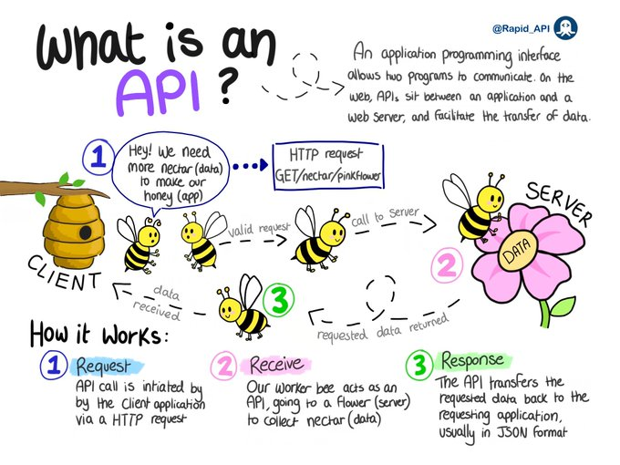

# api_basics

**Tweet URL:** [https://x.com/bytebytego/status/1878324550418714836](https://x.com/bytebytego/status/1878324550418714836)

**Tweet Text:** What is an API? 

A great illustration that explains: 
 What is it
 How it works
 Why is it so popular

By Rapid_API on Twitter

--
Subscribe to our weekly newsletter to get a Free System Design PDF (158 pages): [https://bit.ly/bbg-social](https://bit.ly/bbg-social)

**Image 1 Description:** The infographic, titled "What is an API?", provides a clear and concise explanation of how APIs function. The title is prominently displayed at the top left corner of the page.

**Key Points:**

* **API Functionality:** An application programming interface (API) enables two programs to communicate with each other, allowing one program to request data from another.
* **Client-Server Interaction:** The infographic illustrates a client-server interaction where the client requests data from the server. The server then processes the request and returns the requested data to the client.
* **Request Processing:**
	+ Step 1: A client initiates a request by sending an HTTP request to the server.
	+ Step 2: The server receives the request and processes it accordingly.
	+ Step 3: The server responds to the client with the requested data in JSON format (JavaScript Object Notation).
* **Visual Representation:** The infographic features a simple yet effective visual representation of the API process, using bees as a metaphor for requests and responses. This creative approach makes the concept more engaging and easy to understand.
* **Additional Information:**
	+ A small logo at the bottom left corner indicates that the infographic was created by RapidAPI.
	+ A brief description of the infographic's purpose is provided in the top right corner.

In summary, the infographic effectively explains how APIs work, highlighting their role in enabling communication between two programs. The use of a bee metaphor and clear step-by-step explanation makes the concept accessible to a wide range of audiences.

