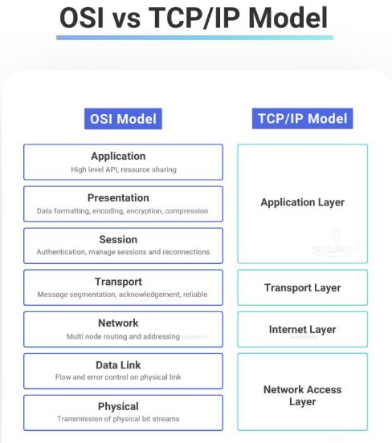

The OSI (Open Systems Interconnection) model and the TCP/IP (Transmission Control Protocol/Internet Protocol) model are two fundamental network architecture models used for designing and implementing computer networks. This entry provides a comprehensive overview of both models, highlighting their differences in structure and function.

## Technical Content
### Introduction to OSI Model
The OSI model is a 7-layered framework that provides a detailed breakdown of network functions. Each layer has a specific function:
1. **Physical Layer**: Defines the physical means of data transmission between devices.
2. **Data Link Layer**: Provides error-free transfer of data frames between two devices on the same network.
3. **Network Layer**: Routes data between different networks.
4. **Transport Layer**: Ensures reliable data transfer between devices.
5. **Session Layer**: Establishes, maintains, and terminates connections between applications.
6. **Presentation Layer**: Converts data into a format that can be understood by the receiving device.
7. **Application Layer**: Provides services to end-user applications.

### Introduction to TCP/IP Model
The TCP/IP model is a 4-layered framework that simplifies the network architecture:
1. **Application Layer**: Combines the functions of the OSI model's Session, Presentation, and Application layers.
2. **Transport Layer**: Similar to the OSI model's Transport layer, ensuring reliable data transfer.
3. **Internet Layer**: Routes data between different networks, similar to the OSI model's Network layer.
4. **Network Access Layer**: Combines the functions of the OSI model's Data Link and Physical layers.

### Comparison of OSI and TCP/IP Models
While both models are used for network architecture design, the key differences lie in their level of detail and focus:
* The OSI model provides a more detailed breakdown of network functions, making it easier to troubleshoot and maintain networks.
* The TCP/IP model is a simplified version that focuses on the essential components for internet communication, making it more suitable for real-world implementations.

## Key Takeaways and Best Practices
* Use the OSI model for detailed network design and troubleshooting.
* Use the TCP/IP model for simplified network architecture and internet communication.
* Understand the functions of each layer in both models to design and implement efficient networks.
* Familiarize yourself with the protocols used in each layer, such as HTTP (Hypertext Transfer Protocol) in the Application layer and TCP (Transmission Control Protocol) in the Transport layer.

## References
* [OSI Model](https://en.wikipedia.org/wiki/OSI_model)
* [TCP/IP Model](https://en.wikipedia.org/wiki/TCP/IP_model)
* [RFC 1122: Requirements for Internet Hosts - Communication Layers](https://tools.ietf.org/html/rfc1122)
* [RFC 1123: Requirements for Internet Hosts - Application and Support](https://tools.ietf.org/html/rfc1123)

Note: This technical knowledge base entry provides a comprehensive overview of the OSI and TCP/IP models, highlighting their differences in structure and function. It is intended to serve as a reference guide for network architects, designers, and administrators.
## Source

- Original Tweet: [https://twitter.com/i/web/status/1868264760254349383](https://twitter.com/i/web/status/1868264760254349383)
- Date: 2025-02-20 16:10:44

## Media

### Media 1

**Description:** The image presents a comparison between the OSI (Open Systems Interconnection) model and the TCP/IP (Transmission Control Protocol/Internet Protocol) model, highlighting their differences in structure and function.

* **OSI Model**
	+ The OSI model is depicted on the left side of the image.
	+ It consists of seven layers: Application, Presentation, Session, Transport, Network, Data Link, and Physical.
	+ Each layer has a specific function, such as data transmission, error detection, and routing.
* **TCP/IP Model**
	+ The TCP/IP model is shown on the right side of the image.
	+ It consists of four layers: Application, Transport, Internet, and Network Access.
	+ These layers are combined to form a protocol stack that enables communication between devices over the internet.

In summary, the OSI model provides a more detailed breakdown of network functions, while the TCP/IP model is a simplified version that focuses on the essential components for internet communication. The image effectively illustrates the differences between these two models, providing a clear understanding of their structures and functions.

*Last updated: 2025-02-20 16:10:44*