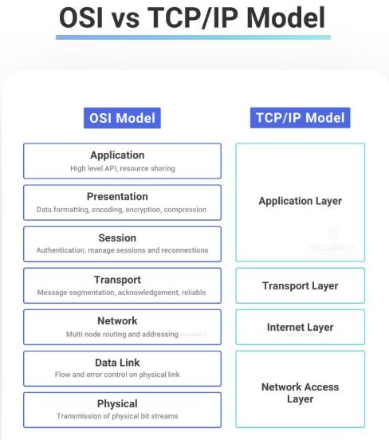

# Osi Vs Tcpip Models

## Description
OSI vs TCP IP...

## Content
OSI vs TCP IP

## Category Information

- Main Category: system_design
- Sub Category: architecture_patterns
- Item Name: osi_vs_tcpip_models

## Source

- Original Tweet: [https://twitter.com/i/web/status/1868264760254349383](https://twitter.com/i/web/status/1868264760254349383)
- Date: 2025-02-20 15:36:34

## Media

### Media 1

**Description:** The image presents a comparison between the OSI (Open Systems Interconnection) model and the TCP/IP (Transmission Control Protocol/Internet Protocol) model, highlighting their differences in structure and function.

* **OSI Model**
	+ The OSI model is depicted on the left side of the image.
	+ It consists of seven layers: Application, Presentation, Session, Transport, Network, Data Link, and Physical.
	+ Each layer has a specific function, such as data transmission, error detection, and routing.
* **TCP/IP Model**
	+ The TCP/IP model is shown on the right side of the image.
	+ It consists of four layers: Application, Transport, Internet, and Network Access.
	+ These layers are combined to form a protocol stack that enables communication between devices over the internet.

In summary, the OSI model provides a more detailed breakdown of network functions, while the TCP/IP model is a simplified version that focuses on the essential components for internet communication. The image effectively illustrates the differences between these two models, providing a clear understanding of their structures and functions.

*Last updated: 2025-02-20 15:36:34*