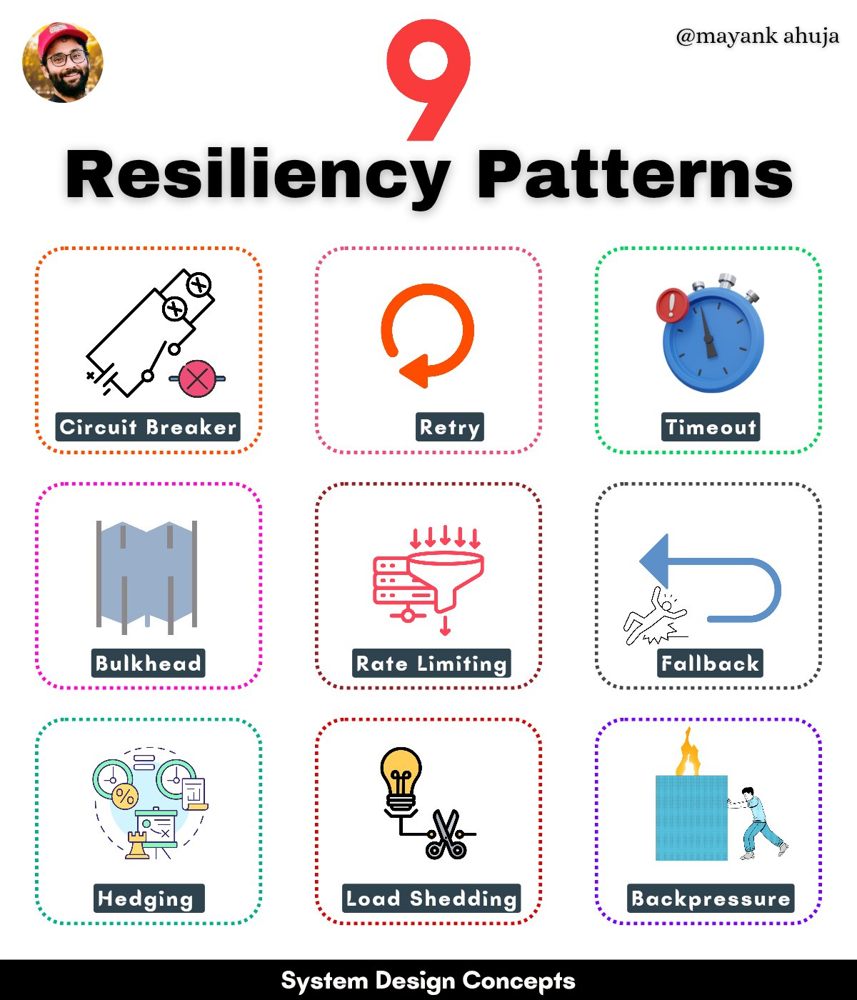

Resiliency patterns are design concepts used to build robust and fault-tolerant systems that can withstand failures, errors, and unexpected events. These patterns help ensure system availability, reliability, and performance by providing mechanisms for error handling, failure detection, and recovery.

## Technical Content
The following resiliency patterns are essential for building robust systems:

1. **Circuit Breaker**: Acts like an electrical circuit breaker, tripping when a service experiences repeated failures and stopping requests to that service for a period. This pattern has two main states: 
   * **Closed**: Requests are allowed to pass through.
   * **Open**: Requests are immediately rejected with an error.
   Circuit breakers protect against cascading failures and isolate problematic services.

2. **Retry**: Automatically retries failed requests a certain number of times before giving up. This pattern helps overcome transient errors like network glitches or temporary unavailability, improving system availability. However, be mindful of retry storms (excessive retries overloading the system) and implement exponential backoff (increasing time between retries).

3. **Timeout**: Sets a maximum time limit for a request. If a response is not received within the timeout period, the request is considered a failure.

4. **Bulkhead**: Isolates different parts of an application into pools or compartments, limiting the impact of failures or overload in one compartment and preventing it from affecting the entire system.

5. **Rate Limiting**: Controls the rate of incoming requests to protect a system from being overwhelmed, protecting against denial-of-service attacks, ensuring fair usage, and maintaining system stability.

6. **Fallback**: Provides an alternative (often less ideal) response or action when the primary one fails, improving system availability and user experience by providing some level of service even when the primary function is unavailable.

7. **Hedging (Redundancy)**: Sends duplicate requests to multiple identical services and uses the fastest response, mitigating the impact of slow responses and failures, and improving system responsiveness.

8. **Load Shedding**: Drops non-critical requests when a system is overloaded to protect its core functionality, helping maintain system stability and availability during peak loads.

9. **Backpressure**: Implements a feedback loop between the producer (sending data) and the consumer (receiving data), allowing the producer to adjust its output rate dynamically based on the consumer's capacity. Several backpressure strategies exist:
   * **Reactive Pull**: The consumer explicitly requests data from the producer, pulling data at its own pace.
   * **Rate Limiting**: The producer limits its output rate based on the consumer's feedback.
   * **Buffering**: A buffer is used to temporarily store data when the consumer is slow.

## Key Takeaways and Best Practices
- Implement circuit breakers to protect against cascading failures.
- Use retry mechanisms with exponential backoff to handle transient errors.
- Set appropriate timeouts for requests based on system requirements.
- Isolate components using bulkheads to limit failure impact.
- Apply rate limiting to prevent overload and denial-of-service attacks.
- Provide fallback options for improved user experience during failures.
- Utilize hedging for critical services that require high responsiveness.
- Implement load shedding to maintain core functionality under peak loads.
- Use backpressure strategies to balance producer and consumer capacities.

## References
For more detailed information on implementing these patterns, refer to system design and architecture resources. Tools like Netflix's Hystrix (for circuit breakers and bulkheads) and Apache Kafka (which supports backpressure) can be used in practice. Additionally, cloud providers such as AWS offer services with built-in resiliency features (e.g., AWS Lambda for rate limiting and fallback behaviors).

## Additional Resources
- [System Design Primer](https://github.com/donnemartin/system-design-primer)
- [Resilience Engineering](https://www.infoq.com/articles/resilience-engineering/)
- [Hystrix by Netflix](https://github.com/Netflix/Hystrix)
## Source

- Original Tweet: [https://twitter.com/i/web/status/1883731027442778402](https://twitter.com/i/web/status/1883731027442778402)
- Date: 2025-02-20 17:26:28

## Media

### Media 1

**Description:** The infographic, titled "9 Resiliency Patterns," presents a comprehensive overview of various resiliency patterns. The title is prominently displayed at the top, accompanied by a circular profile picture of Mayank Ahuja.

**Key Features:**

* **Title:** "9 Resiliency Patterns"
* **Subtitle:** "@mayankahuja"
* **Profile Picture:** Circular image of Mayank Ahuja

**Patterns:**

The infographic showcases nine distinct resiliency patterns, each represented by a unique icon and color scheme:

1. **Circuit Breaker**
2. **Retry**
3. **Timeout**
4. **Bulkhead**
5. **Rate Limiting**
6. **Fallback**
7. **Hedging**
8. **Load Shedding**
9. **Backpressure**

Each pattern is accompanied by a brief description, providing context and clarity for the viewer.

**Design Elements:**

The infographic features a clean and modern design aesthetic, with:

* A white background
* Black text
* Colorful icons and graphics

Overall, the infographic effectively communicates the concept of resiliency patterns in a visually appealing and easy-to-understand format.

*Last updated: 2025-02-20 17:26:28*