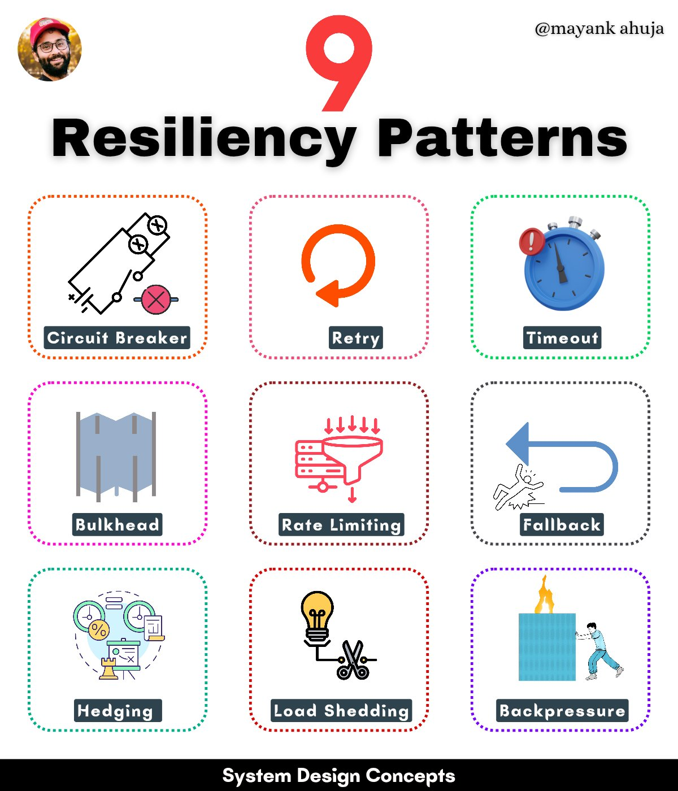

# Resiliency Patterns

## Description
System Design Concepts - Resiliency Patterns

Fall seven times, stand up eight.

[1.] Circuit Breaker
 Acts like an electrical circuit breaker.
 When a service experiences repeated failures, the circu...

## Content
System Design Concepts - Resiliency Patterns

Fall seven times, stand up eight.

[1.] Circuit Breaker
 Acts like an electrical circuit breaker.
 When a service experiences repeated failures, the circuit breaker 'trips' & stops sending requests to that service for a period of time.
 This allows the failing service to recover without being overwhelmed.

The main circuit breaker states -
 Closed: Requests are allowed to pass through.
 Open: Requests are immediately rejected with an error.

 effective for protecting against cascading failures & isolating problematic services.

[2.] Retry
 When a request fails, the system automatically retries it a certain number of times before giving up.
 This can help overcome transient errors like network glitches or temporary unavailability.
 Improves system availability and can mask transient errors.
 Be mindful of retry storms (where excessive retries overload the system) and implement exponential backoff (increasing the time between retries).

[3.] Timeout
 Sets a maximum time limit for a request.
 If a response is not received within the timeout period, the request is considered a failure.

[4.] Bulkhead
 The Bulkhead pattern isolates different parts of an application into pools or compartments.
 This isolation limits the impact of failures or overload in one compartment, preventing it from cascading and affecting the entire system.

[5.] Rate Limiting
 Controls the rate of incoming requests to protect a system from being overwhelmed.
 Protects against denial of service attacks, ensures fair usage and helps maintain system stability.

[6.] Fallback
 Provides an alternative (often less ideal) response or action when the primary one fails.
 Improves system availability and user experience by providing some level of service even when the primary function is unavailable.

[7.] Hedging (Redundancy)
 Sends duplicate requests to multiple identical services and uses the fastest response.
 Mitigates the impact of slow responses and failures, improving system responsiveness.

[8.] Load Shedding
 Drops non-critical requests when a system is overloaded to protect its core functionality.
 Helps maintain system stability and availability during peak loads.

[9.] Backpressure
** shares some similarities with other resilience patterns
 The core mechanism of backpressure is a feedback loop between the producer (sending data) and the consumer (receiving data).
 The consumer signals its capacity to the producer, allowing the producer to adjust its output rate dynamically.

Several backpressure strategies exist -
 Reactive Pull - The consumer explicitly requests data from the producer, pulling data at its own pace.
 Rate Limiting - The producer limits its output rate based on the consumer's feedback.
 Buffering - A buffer is used to temporarily store data when the consumer is slow.

## Category Information

- Main Category: system_design
- Sub Category: architecture_patterns
- Item Name: resiliency_patterns

## Source

- Original Tweet: [https://twitter.com/i/web/status/1883731027442778402](https://twitter.com/i/web/status/1883731027442778402)
- Date: 2025-02-20 15:36:34

## Media

### Media 1

**Description:** The infographic, titled "9 Resiliency Patterns," presents a comprehensive overview of various resiliency patterns. The title is prominently displayed at the top, accompanied by a circular profile picture of Mayank Ahuja.

**Key Features:**

* **Title:** "9 Resiliency Patterns"
* **Subtitle:** "@mayankahuja"
* **Profile Picture:** Circular image of Mayank Ahuja

**Patterns:**

The infographic showcases nine distinct resiliency patterns, each represented by a unique icon and color scheme:

1. **Circuit Breaker**
2. **Retry**
3. **Timeout**
4. **Bulkhead**
5. **Rate Limiting**
6. **Fallback**
7. **Hedging**
8. **Load Shedding**
9. **Backpressure**

Each pattern is accompanied by a brief description, providing context and clarity for the viewer.

**Design Elements:**

The infographic features a clean and modern design aesthetic, with:

* A white background
* Black text
* Colorful icons and graphics

Overall, the infographic effectively communicates the concept of resiliency patterns in a visually appealing and easy-to-understand format.

*Last updated: 2025-02-20 15:36:34*