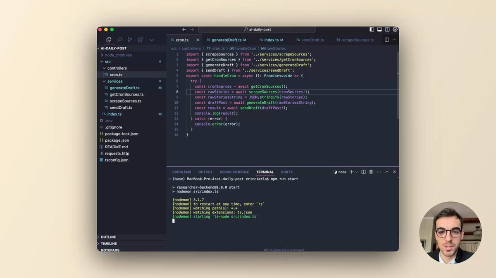

# introducing_o1_trend_finder

**Tweet URL:** [https://x.com/ericciarla/status/1874145916116222198](https://x.com/ericciarla/status/1874145916116222198)

**Tweet Text:** Introducing o1 Trend Finder 

Use o1 to monitor & notify you of trending topics on social media.

It gets posts from key influencers, finds any trends, then pings you in slack.

It's been game changer for marketing at 
@firecrawl_dev
 and will help us scale content in 2025.

**Image 1 Description:** The image presents a screenshot of a computer screen displaying code in a text editor, accompanied by a circular photo of a man in the bottom-right corner.

*   The code is written in a programming language and appears to be a complex algorithm or script.
    *   The code is organized into sections with clear headings and indentation, making it easier to read and understand.
    *   There are several lines of comments throughout the code, providing explanations for specific parts of the program.
*   In the bottom-right corner of the image, there is a circular photo of a man wearing glasses and a suit jacket. 
    *   The man's face is blurred out, so his identity cannot be determined.
    *   He appears to be looking directly at the camera with a neutral expression on his face.

Overall, the image suggests that the person who created this code is a professional software developer or programmer who has written a complex algorithm or script for a specific project. The presence of comments throughout the code indicates that they are trying to make their code easy to understand and maintain for others.

