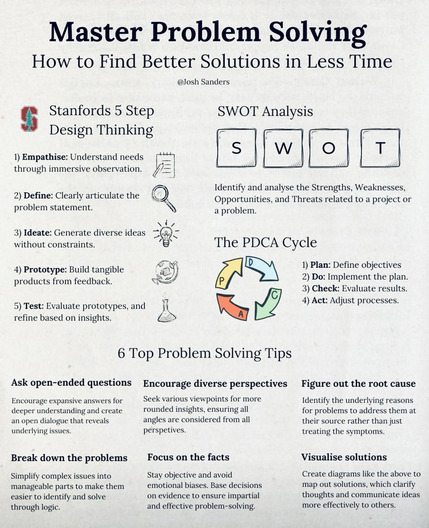

# tech_insight_20250114_18786554

**Tweet URL:** [https://x.com/readswithravi/status/1878655493683712098](https://x.com/readswithravi/status/1878655493683712098)

**Tweet Text:** Master Problem Solving 

**Image 1 Description:** The image presents a comprehensive guide to problem-solving, titled "Master Problem Solving" with the subtitle "How to Find Better Solutions in Less Time." The infographic is divided into three main sections: "Stanfords 5 Step Design Thinking," "SWOT Analysis," and "6 Top Problem-Solving Tips."

**Stanfords 5 Step Design Thinking**

* Empathize: Understand needs through immersive observation
* Define: Clearly articulate the problem statement
* Ideate: Generate diverse ideas without constraints
* Prototype: Build tangible products from feedback
* Test: Evaluate prototypes based on insights

**SWOT Analysis**

* Identify strengths, weaknesses, opportunities, and threats related to a project or problem

**6 Top Problem-Solving Tips**

1. Ask open-ended questions to encourage deeper understanding
2. Encourage diverse perspectives for more rounded insights
3. Figure out the root cause of problems rather than just treating symptoms
4. Break down complex issues into manageable parts
5. Focus on facts to avoid emotional biases
6. Visualize solutions to clarify thoughts and communicate effectively

The infographic provides a structured approach to problem-solving, combining design thinking principles with SWOT analysis and practical tips for effective decision-making. By following these steps, individuals can develop their critical thinking skills and improve their ability to find creative solutions to complex problems.

