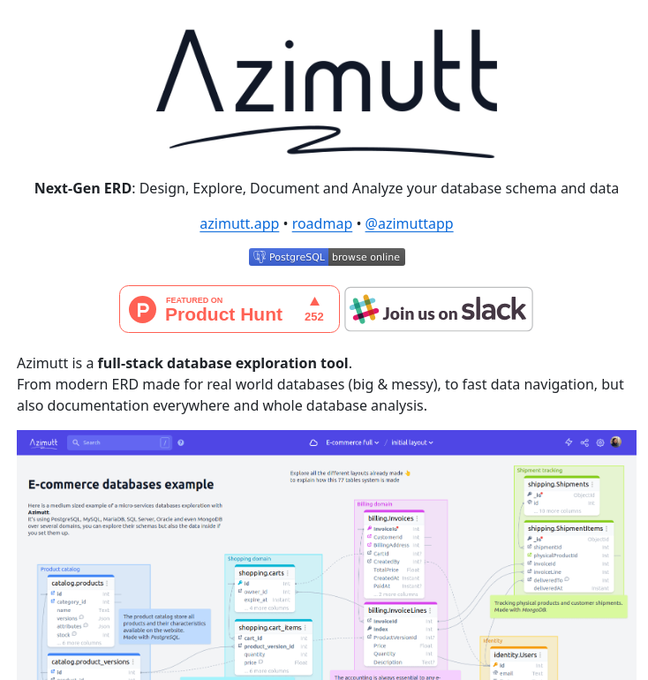

# tech_insight_20250114_18788029

**Tweet URL:** [https://x.com/tom_doerr/status/1878802958004957344](https://x.com/tom_doerr/status/1878802958004957344)

**Tweet Text:** Azimutt: Database schema explorer and analyzer

**Image 1 Description:** The image presents a screenshot of the Azimutt website, which is an open-source database schema design and analysis tool. The page features a clean white background with black text, accompanied by colorful graphics and images.

* **Header Section**
	+ Contains the logo "Azimutt" in large black font
	+ Subtitle: "Next-Gen ERD: Design, Explore, Document and Analyze your database schema and data"
	+ Tagline: "Next-Gen ERD: Design, Explore, Document and Analyze your database schema and data"
* **Call-to-Action Buttons**
	+ "PostgreSQL browse online" button
	+ "Slack Join us on Slack" button
* **Featured Article Section**
	+ Title: "Product Hunt featured article"
	+ Image: A screenshot of the Product Hunt website featuring Azimutt
	+ Text: Brief description of the article
* **E-commerce Database Example**
	+ Title: "E-commerce database example"
	+ Image: A table showing an example e-commerce database schema
	+ Text: Description of the example and its features
* **Call-to-Action Buttons (Again)**
	+ "PostgreSQL browse online" button
	+ "Slack Join us on Slack" button

Overall, the image showcases the Azimutt website's design and functionality, highlighting its key features and benefits. The use of a clean white background and black text makes the content easy to read, while the colorful graphics and images add visual interest.

