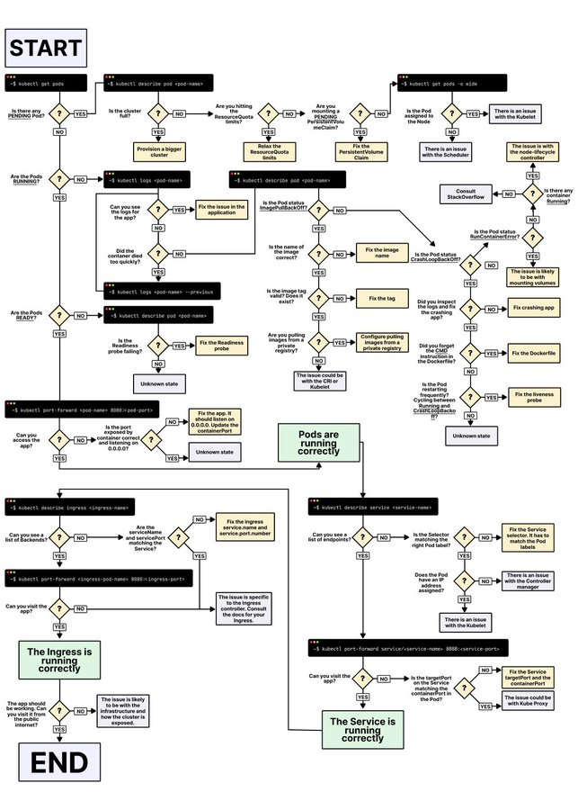

# troubleshooting_image_tweet_text

**Tweet URL:** [https://x.com/vishalsingh2972/status/1880897970193006833](https://x.com/vishalsingh2972/status/1880897970193006833)

**Tweet Text:** K8s troubleshooting in an image 

**Image 1 Description:** This flowchart, titled "START," provides a detailed guide to resolving Kubernetes-related issues by asking a series of questions. The chart begins with five questions that lead to different paths based on user answers.

The first question is whether pods exist, which branches into two options: if they do, then the next question is whether they are running; otherwise, the next step involves describing pods and determining their status.

For each scenario, the flowchart presents a set of specific questions tailored to the context. These questions are designed to help users diagnose and resolve issues with Kubernetes deployments in a logical and systematic manner.

The chart's visual design features black text on a white background, making it easy to follow and understand. Overall, this flowchart is a valuable resource for anyone seeking to troubleshoot and address problems related to Kubernetes, offering a clear and structured approach to resolving common issues.

