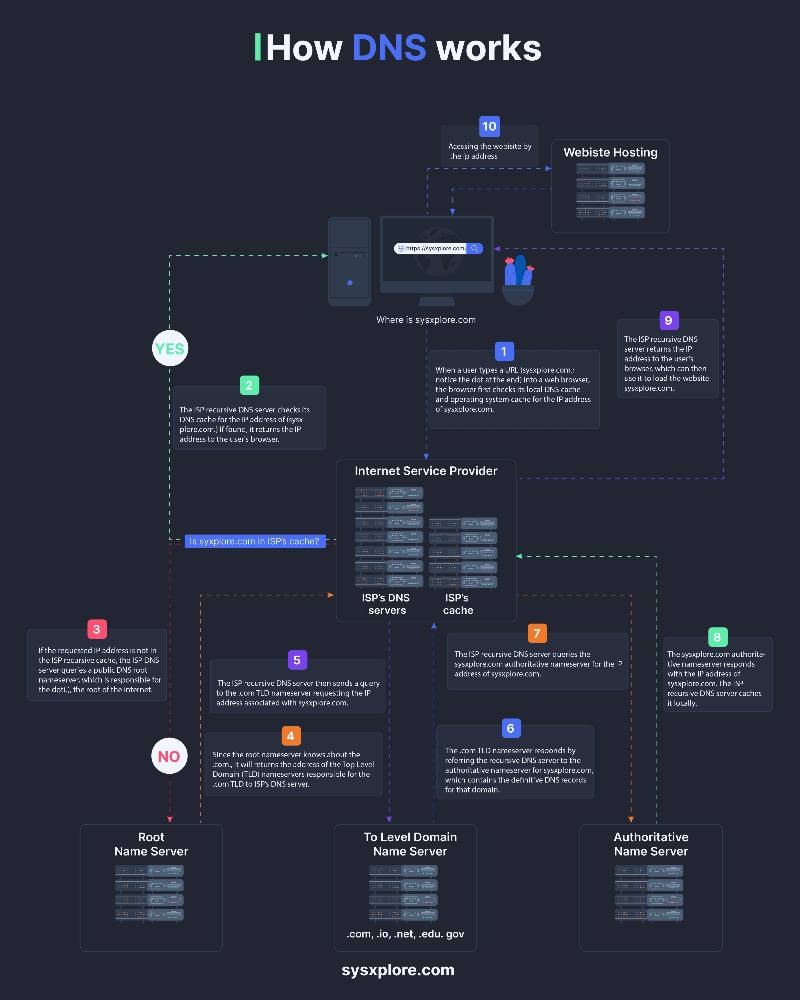

# Dns Crash Course

## Description
DNS Crash course...

## Content
DNS Crash course

## Category Information

- Main Category: system_design
- Sub Category: caching
- Item Name: dns_crash_course

## Source

- Original Tweet: [https://twitter.com/i/web/status/1872868881074929896](https://twitter.com/i/web/status/1872868881074929896)
- Date: 2025-02-20 15:36:34

## Media

### Media 1

**Description:** The infographic, titled "How DNS works," provides a comprehensive overview of the process through which a user's device resolves a website address into an IP address using a Domain Name System (DNS). The flowchart illustrates the step-by-step process, from entering a URL to accessing the requested webpage.

**Key Steps:**

* **Step 1:** The user enters a URL in their browser.
* **Step 2:** The request is sent to a DNS server, which checks its cache for the IP address associated with the entered domain name.
* **Step 3:** If the cache does not contain the required information, the DNS server sends a request to another DNS server, which may be closer to the user's location or have more recent data.
* **Step 4:** The second DNS server checks its cache and, if it does not contain the required information, sends a request to an authoritative name server associated with the domain name.
* **Step 5:** The authoritative name server responds with the IP address of the requested webpage.
* **Step 6:** The DNS server caches the result for future requests.
* **Step 7:** The user's device uses the retrieved IP address to access the requested webpage.

**Summary:**

The infographic effectively illustrates the process of how a user's device resolves a website address into an IP address using a Domain Name System (DNS). By breaking down the step-by-step process, it provides a clear understanding of how DNS works and why it is essential for accessing webpages.

*Last updated: 2025-02-20 15:36:34*