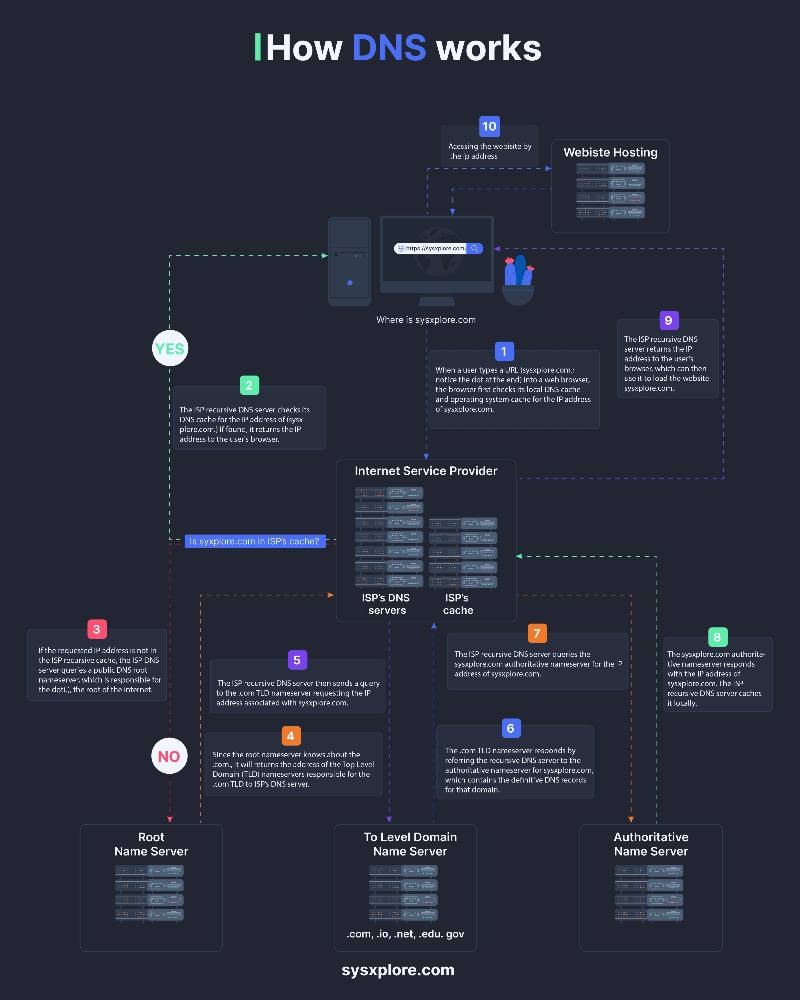

The Domain Name System (DNS) is a critical component of the internet infrastructure, responsible for translating human-readable domain names into IP addresses that devices can understand. This crash course provides an in-depth look at how DNS works, including the step-by-step process of resolving a website address into an IP address.

## Technical Overview
The DNS resolution process involves several key steps:

1. **User Request**: The user enters a URL in their browser, triggering a request to resolve the domain name into an IP address.
2. **DNS Server Query**: The request is sent to a DNS server, which checks its cache for the IP address associated with the entered domain name.
3. **Cache Miss**: If the cache does not contain the required information, the DNS server sends a request to another DNS server, which may be closer to the user's location or have more recent data.
4. **Authoritative Name Server Query**: The second DNS server checks its cache and, if it does not contain the required information, sends a request to an authoritative name server associated with the domain name.
5. **IP Address Response**: The authoritative name server responds with the IP address of the requested webpage.
6. **Caching**: The DNS server caches the result for future requests.
7. **Webpage Access**: The user's device uses the retrieved IP address to access the requested webpage.

The following infographic illustrates this process:

### Example Walkthrough
Suppose a user enters the URL `http://example.com` in their browser. The request is sent to a DNS server, which checks its cache for the IP address associated with `example.com`. If the cache does not contain the required information, the DNS server sends a request to another DNS server, which may be closer to the user's location or have more recent data. This process continues until the authoritative name server for `example.com` responds with the IP address of the requested webpage.

## Key Takeaways and Best Practices
* **Caching**: Implementing caching at each level of the DNS hierarchy can significantly improve resolution times and reduce latency.
* **DNS Server Selection**: Choosing a DNS server that is closer to the user's location or has more recent data can improve resolution times.
* **Security**: Ensuring the security and integrity of DNS responses is critical, as DNS spoofing or manipulation can have significant consequences.

## References
* [RFC 1035: Domain Names - Implementation and Specification](https://tools.ietf.org/html/rfc1035)
* [ICANN: Internet Corporation for Assigned Names and Numbers](https://www.icann.org/)

Note: The references provided are a selection of relevant resources and are not an exhaustive list.
## Source

- Original Tweet: [https://twitter.com/i/web/status/1872868881074929896](https://twitter.com/i/web/status/1872868881074929896)
- Date: 2025-02-20 16:56:02

## Media

### Media 1

**Description:** The infographic, titled "How DNS works," provides a comprehensive overview of the process through which a user's device resolves a website address into an IP address using a Domain Name System (DNS). The flowchart illustrates the step-by-step process, from entering a URL to accessing the requested webpage.

**Key Steps:**

* **Step 1:** The user enters a URL in their browser.
* **Step 2:** The request is sent to a DNS server, which checks its cache for the IP address associated with the entered domain name.
* **Step 3:** If the cache does not contain the required information, the DNS server sends a request to another DNS server, which may be closer to the user's location or have more recent data.
* **Step 4:** The second DNS server checks its cache and, if it does not contain the required information, sends a request to an authoritative name server associated with the domain name.
* **Step 5:** The authoritative name server responds with the IP address of the requested webpage.
* **Step 6:** The DNS server caches the result for future requests.
* **Step 7:** The user's device uses the retrieved IP address to access the requested webpage.

**Summary:**

The infographic effectively illustrates the process of how a user's device resolves a website address into an IP address using a Domain Name System (DNS). By breaking down the step-by-step process, it provides a clear understanding of how DNS works and why it is essential for accessing webpages.

*Last updated: 2025-02-20 16:56:02*