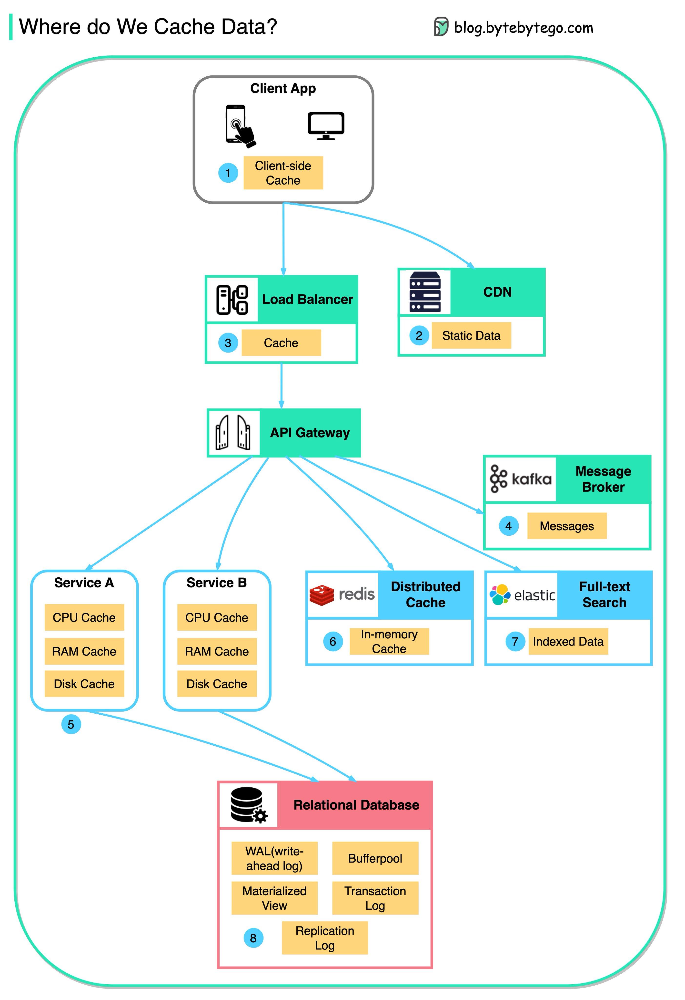

**Source:** [https://twitter.com/i/web/status/1879415142313754918](https://twitter.com/i/web/status/1879415142313754918)
**Original Post Date:** 2025-06-17 14:17:54

# Data Caching Layers Analysis in Distributed Systems Architecture

## Introduction
Modern distributed systems rely on multiple caching layers to optimize performance and reduce latency. This knowledge base item analyzes the hierarchical structure of these caches, from client-side storage to backend services, exploring their roles, interactions, and best practices for implementation in scalable architectures. The analysis covers each layer's specific purpose, caching mechanisms, and integration patterns.

## Client-Side Caching Layer

The client-side cache (Layer 1) serves as the first point of data access in a distributed system. This local storage significantly reduces latency by serving frequently accessed data directly from the user's device, improving application responsiveness and reducing server load.

Implementation strategies include browser-based caching for web applications and local storage mechanisms for mobile apps, with TTL (Time-to-Live) configurations to manage cache freshness.

```JavaScript
const clientCache = new Map();
clientCache.set('userPreferences', { theme: 'dark' });
```

## CDN and Load Balancer Caching

The CDN layer (Layer 2) optimizes static content delivery by caching assets closer to end-users. This reduces latency for resources like images, CSS, and JavaScript files.

Load balancers (Layer 3) implement request-level caching to reduce backend service load while improving response times through intelligent traffic distribution.

1. Configure CDN cache TTL based on content update frequency
1. Implement edge caching strategies for regional optimization

## Microservices and Distributed Cache Layer

Service A and B (Layer 5) utilize hierarchical caching with CPU, RAM, and disk caches to optimize data access. The distributed Redis cache (Layer 6) provides high-availability caching across multiple nodes.

Integration patterns include cache-aside, write-through, and read-through strategies to maintain consistency between cached and persistent storage.

```Python
redis_client = Redis(host='localhost', port=6379)
redis_client.setex('user_profile', 3600, user_data)
```

## Database and Search Layer Caching

The relational database (Layer 8) employs bufferpool caching to reduce disk I/O, while Elasticsearch (Layer 7) maintains indexed data for efficient search operations.

WAL and transaction logs ensure data consistency across distributed systems through atomic write operations.

> **Note/Tip:** Monitor cache hit rates to optimize cache sizes

> **Note/Tip:** Implement cache invalidation strategies based on data update patterns

## Key Takeaways

- Multi-layer caching reduces latency and improves system performance at each architectural level.
- Distributed caches like Redis provide scalable solutions for high-availability systems.
- Data consistency requires careful coordination between cache layers and persistent storage.

## Conclusion
Understanding the hierarchical nature of caching layers is crucial for designing efficient distributed systems. Each layer serves specific purposes in optimizing data access, reducing latency, and maintaining system scalability. The integration of various caching mechanisms across different architectural components forms a robust foundation for modern applications.

## External References

- [Redis Documentation](https://redis.io/docs/)
- [Elasticsearch Cache Management Guide](https://www.elastic.co/guide/en/elasticsearch/reference/current/cache.html)


## Media

**Image Description:** ### Image Description: Cache Data Architecture

The image is a detailed diagram illustrating the various layers and components where cache data is stored in a distributed system architecture. The diagram is structured in a hierarchical and flow-oriented manner, showing the progression of data from the client side to the backend services and databases. Below is a detailed breakdown of the image:

---

#### **1. Client App**
- **Location**: Top of the diagram.
- **Description**: Represents the client-side application, which could be a mobile app or a web application.
- **Key Components**:
  - **Client-side Cache (1)**: This is the first cache layer, where data is stored locally on the client device. This cache is used to reduce latency and improve the responsiveness of the application by serving frequently accessed data directly from the client device.

---

#### **2. Content Delivery Network (CDN)**
- **Location**: Right side of the diagram, connected to the Client App.
- **Description**: A CDN is used to deliver static content (e.g., images, CSS, JavaScript files) closer to the user geographically.
- **Key Components**:
  - **Static Data Cache (2)**: This cache stores static content, reducing the load on the origin server and improving the delivery speed of static assets.

---

#### **3. Load Balancer**
- **Location**: Center-left of the diagram, connected to the Client App.
- **Description**: A load balancer distributes incoming traffic across multiple servers to ensure high availability and optimal resource utilization.
- **Key Components**:
  - **Cache (3)**: The load balancer may also cache frequently accessed data to reduce the load on backend services and improve response times.

---

#### **4. API Gateway**
- **Location**: Center of the diagram, connected to the Load Balancer and CDN.
- **Description**: An API Gateway acts as a single entry point for all API requests, handling tasks such as authentication, rate limiting, and request routing.
- **Key Components**:
  - **No specific cache is mentioned here, but it often includes caching mechanisms internally to optimize performance.**

---

#### **5. Service A and Service B**
- **Location**: Bottom-left of the diagram, connected to the API Gateway.
- **Description**: These are microservices that handle specific business logic.
- **Key Components**:
  - **CPU Cache**: The fastest cache, typically managed by the CPU for immediate access to frequently used data.
  - **RAM Cache**: A higher-level cache that stores data in the system's memory for faster access than disk storage.
  - **Disk Cache**: A slower cache that stores data on the disk for longer-term storage.

---

#### **6. Distributed Cache (Redis)**
- **Location**: Bottom-center of the diagram, connected to the API Gateway.
- **Description**: A distributed in-memory cache system (e.g., Redis) that stores frequently accessed data across multiple nodes for high availability and scalability.
- **Key Components**:
  - **In-memory Cache (6)**: Data is stored in memory for fast access, making it ideal for caching frequently accessed data.

---

#### **7. Full-text Search (Elasticsearch)**
- **Location**: Bottom-right of the diagram, connected to the API Gateway.
- **Description**: A distributed search engine (e.g., Elasticsearch) used for indexing and searching large volumes of data.
- **Key Components**:
  - **Indexed Data (7)**: Data is indexed for efficient search operations, allowing for fast retrieval of information based on search queries.

---

#### **8. Relational Database**
- **Location**: Bottom-center of the diagram, connected to Service A, Service B, and the Distributed Cache.
- **Description**: A relational database (e.g., PostgreSQL, MySQL) that stores structured data.
- **Key Components**:
  - **WAL (Write-Ahead Log)**: A log that records all database transactions to ensure data consistency and recovery in case of failures.
  - **Bufferpool**: A cache that stores recently accessed data from the database to reduce disk I/O.
  - **Transaction Log**: Records all transactions to ensure atomicity and durability.
  - **Replication Log**: Used for database replication to maintain consistency across multiple database instances.

---

### **Flow of Data**
1. **Client App**: The client application sends requests to the API Gateway.
2. **CDN**: Static content is served from the CDN if available.
3. **Load Balancer**: The load balancer distributes the request to the appropriate backend services.
4. **API Gateway**: The gateway routes the request to the relevant microservices or cache systems.
5. **Services (A and B)**: Microservices process the request and may use local caches (CPU, RAM, Disk) to improve performance.
6. **Distributed Cache (Redis)**: Frequently accessed data is stored in Redis for fast retrieval.
7. **Full-text Search (Elasticsearch)**: Indexed data is used for search operations.
8. **Relational Database**: The database stores structured data and uses logs (WAL, Transaction Log, Replication Log) for consistency and recovery.

---

### **Key Technical Details**
- **Caching Layers**: The diagram highlights multiple caching layers, from client-side to distributed in-memory caches, optimizing performance at each level.
- **Scalability and High Availability**: The use of distributed systems (Redis, Elasticsearch) ensures scalability and high availability.
- **Data Consistency**: Logs (WAL, Transaction Log, Replication Log) ensure data consistency and recovery in case of failures.
- **Microservices Architecture**: The use of microservices (Service A and Service B) promotes modularity and scalability.

---

### **Summary**
The image provides a comprehensive view of where and how cache data is stored in a modern distributed system architecture. It emphasizes the importance of caching at various levels to improve performance, reduce latency, and handle large-scale data operations efficiently. The diagram also highlights the integration of different technologies (Redis, Elasticsearch, relational databases) to build a robust and scalable system.
