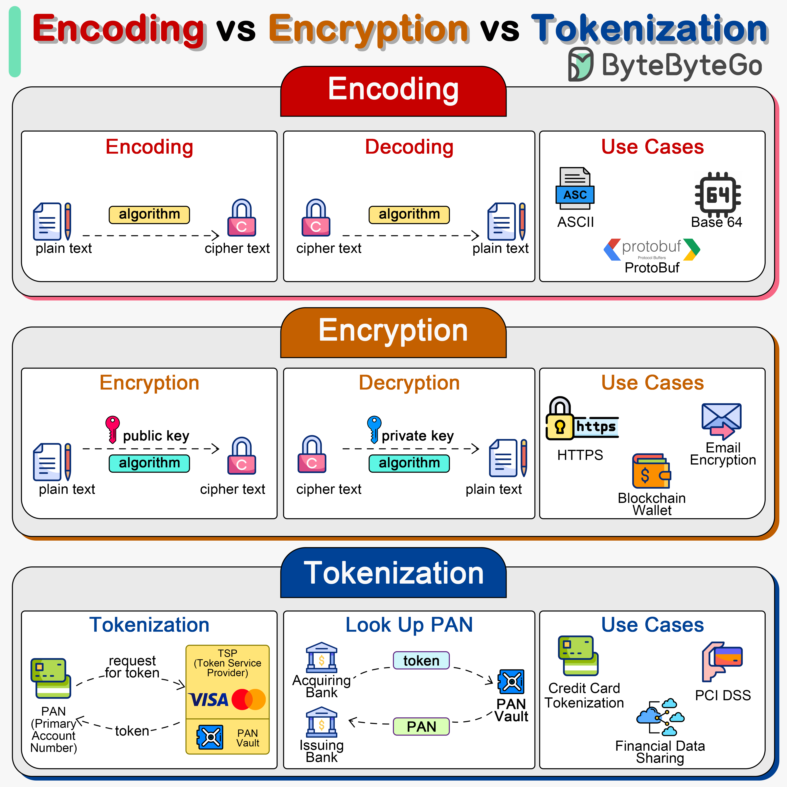

**Source:** [https://twitter.com/i/web/status/1869249708348391648](https://twitter.com/i/web/status/1869249708348391648)
**Original Post Date:** 2025-05-27 18:20:01

# Data Security Fundamentals: Encoding, Encryption, and Tokenization

## Introduction
In modern software systems, protecting and transforming sensitive data is critical. This article explores three fundamental concepts - encoding, encryption, and tokenization - explaining their differences, purposes, and appropriate use cases in data security architecture.

Understanding these transformations is essential for designing secure systems that protect user privacy while maintaining efficient data handling.

## Encoding: Data Transformation for Storage/Transmission

Encoding transforms data into a different format to ensure proper storage or transmission. The process uses an algorithm to convert input data into encoded output, which can be reversed using the same algorithm.

Common encoding techniques include ASCII (text representation), Base64 (binary-to-text conversion), and Protobuf (structured binary serialization). These methods are deterministic and reversible but offer no security against unauthorized access.

- ASCII encoding converts text to numerical values
- Base64 enables secure transmission of binary data over text-based protocols
- Protobuf optimizes network communication with compact binary format

> **Note/Tip:** Always use appropriate encoding based on your specific data type and storage requirements

> **Note/Tip:** Encoding alone should not be relied upon for security purposes

## Encryption: Data Protection Using Keys

Encryption provides secure communication channels by transforming plaintext into ciphertext using cryptographic algorithms. The process requires a public key for encryption and a private key for decryption.

Common encryption use cases include HTTPS (secure web communication), email encryption, and blockchain wallets where security is paramount.

1. HTTPS ensures secure data transmission over the internet
1. Email encryption protects sensitive communications
1. Blockchain wallets use public-key cryptography for transaction security

> **Note/Tip:** Choose strong encryption algorithms and key lengths appropriate to your threat model

> **Note/Tip:** Regularly rotate encryption keys in production environments

## Tokenization: Secure Data Replacement

Tokenization replaces sensitive data with non-sensitive tokens, stored securely in a vault. The process uses a Token Service Provider (TSP) to manage token generation and PAN retrieval.

This approach is particularly useful for credit card processing and PCI DSS compliance, where direct storage of sensitive information must be minimized.

- Reduces exposure of sensitive data in application code
- Simplifies compliance requirements for payment systems
- Enables secure financial data sharing between systems

> **Note/Tip:** Implement token vaults with strong access controls and monitoring

> **Note/Tip:** Maintain clear separation between tokenized environments and PAN vaults

## Key Takeaways

- Encoding transforms data format for storage/transmission but offers no security
- Encryption uses keys to secure data, essential for communication channels
- Tokenization replaces sensitive data with tokens, ideal for payment systems and compliance requirements
- Choose the appropriate technique based on your specific security and performance needs

## Conclusion
Understanding the distinctions between encoding, encryption, and tokenization is crucial for building secure software systems. Each serves a unique purpose in data handling - from basic format conversion to cryptographic protection and secure data replacement. By applying these techniques appropriately, developers can create robust solutions that balance security requirements with operational efficiency.

## External References

- [RFC 4648 - The Base16, Base32, and Base64 Data Encodings](https://tools.ietf.org/html/rfc4648)
- [NIST Special Publication 800-57 - Recommendation for Key Management](https://csrc.nist.gov/publications/detail/sp/800-57/part1/rev3/final)
- [PCI DSS Requirements and Security Standards](https://www.pcisecuritystandards.org/documents/PCI_DSS_v4.pdf)

## Media

**Image Description:** The image is a detailed comparison of three key concepts in data security and transformation: **Encoding**, **Encryption**, and **Tokenization**. Each concept is explained with diagrams, algorithms, and use cases. Below is a detailed breakdown of the image:

---

### **1. Encoding**
- **Header**: The section is titled "Encoding" in red.
- **Diagram Structure**:
  - **Encoding**:
    - **Input**: Plain text (represented by a document icon with a pencil).
    - **Process**: An algorithm (yellow box labeled "algorithm") is applied to transform the plain text.
    - **Output**: Cipher text (represented by a lock icon with a keyhole).
  - **Decoding**:
    - **Input**: Cipher text (lock icon).
    - **Process**: The same algorithm (yellow box labeled "algorithm") is applied in reverse to decode the cipher text.
    - **Output**: Plain text (document icon with a pencil).
- **Use Cases**:
  - **ASCII**: Represented by a document icon with the label "ASCII."
  - **Base64**: Represented by a CPU icon with the label "Base64."
  - **Protobuf**: Represented by a protocol buffer icon with the label "ProtoBuf."

### **2. Encryption**
- **Header**: The section is titled "Encryption" in orange.
- **Diagram Structure**:
  - **Encryption**:
    - **Input**: Plain text (document icon with a pencil).
    - **Process**: An algorithm (cyan box labeled "algorithm") is applied along with a **public key** (key icon) to transform the plain text.
    - **Output**: Cipher text (lock icon with a keyhole).
  - **Decryption**:
    - **Input**: Cipher text (lock icon).
    - **Process**: The same algorithm (cyan box labeled "algorithm") is applied along with a **private key** (key icon) to decrypt the cipher text.
    - **Output**: Plain text (document icon with a pencil).
- **Use Cases**:
  - **HTTPS**: Represented by a lock icon with the label "HTTPS."
  - **Email Encryption**: Represented by an email icon with the label "Email Encryption."
  - **Blockchain Wallet**: Represented by a wallet icon with the label "Blockchain Wallet."

### **3. Tokenization**
- **Header**: The section is titled "Tokenization" in blue.
- **Diagram Structure**:
  - **Tokenization**:
    - **Input**: Primary Account Number (PAN) (credit card icon).
    - **Process**: A request is sent to a **Token Service Provider (TSP)** (yellow box labeled "TSP").
    - **Output**: Token (lock icon with a keyhole).
  - **Look Up PAN**:
    - **Input**: Token (lock icon).
    - **Process**: The token is sent to the TSP, which retrieves the original PAN from a secure **PAN Vault** (vault icon).
    - **Output**: PAN (credit card icon).
- **Use Cases**:
  - **Credit Card Tokenization**: Represented by a credit card icon with the label "Credit Card Tokenization."
  - **PCI DSS Compliance**: Represented by a PCI DSS icon with the label "PCI DSS."
  - **Financial Data Sharing**: Represented by a cloud icon with the label "Financial Data Sharing."

---

### **Key Technical Details**
1. **Encoding**:
   - **Purpose**: Converts data into a different format for easier transmission or storage.
   - **Reversible**: Encoding is typically reversible using the same algorithm.
   - **Examples**: ASCII, Base64, Protobuf.

2. **Encryption**:
   - **Purpose**: Protects data by converting it into a secure format that can only be accessed with the correct key.
   - **Key-Based**: Uses public and private keys for encryption and decryption.
   - **Examples**: HTTPS, Email Encryption, Blockchain Wallets.

3. **Tokenization**:
   - **Purpose**: Replaces sensitive data (e.g., PAN) with a non-sensitive token, which can be used in place of the original data.
   - **Security**: The original data is stored in a secure vault, and tokens are used for transactions.
   - **Examples**: Credit Card Tokenization, PCI DSS Compliance, Financial Data Sharing.

---

### **Visual Elements**
- **Icons**: Used to represent concepts like plain text, cipher text, keys, wallets, and credit cards.
- **Colors**: Different colors are used to distinguish between encoding (red), encryption (orange), and tokenization (blue).
- **Arrows**: Show the flow of data transformation processes.

---

### **Overall Purpose**
The image provides a clear and concise comparison of encoding, encryption, and tokenization, highlighting their processes, use cases, and technical differences. It is designed to help readers understand the distinctions between these concepts and their applications in data security and transformation.
