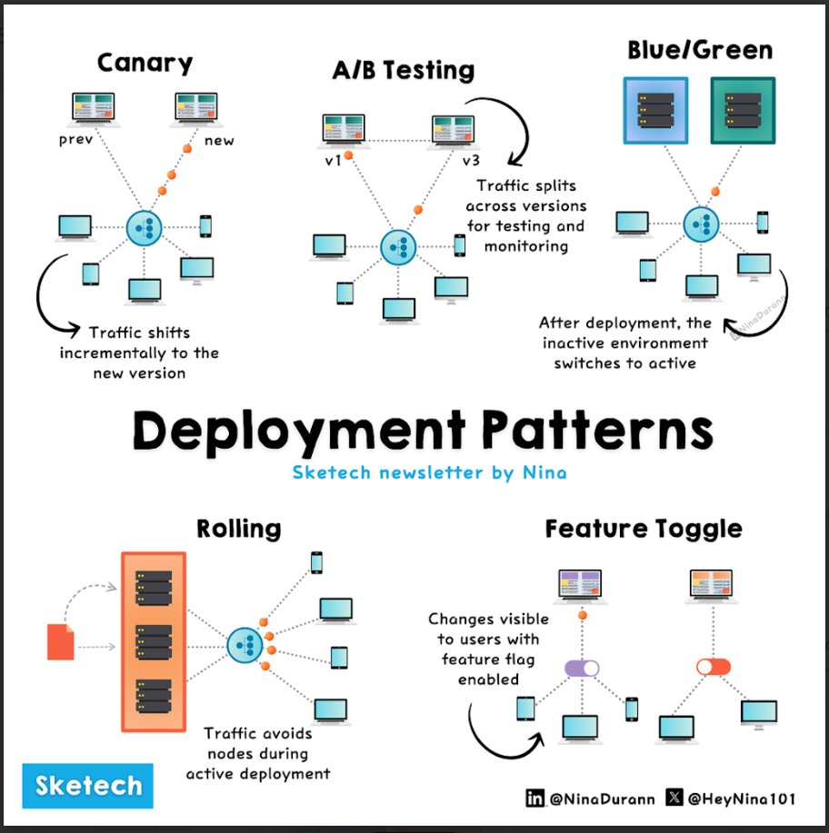

**Source:** [https://twitter.com/i/web/status/1866788802666074288](https://twitter.com/i/web/status/1866788802666074288)
**Original Post Date:** 2025-07-20 09:28:41

# Deployment Patterns: A Simplified Guide for Software Engineers

## Introduction
In modern software development, deploying new features or updates to production requires careful planning to minimize risk and ensure a smooth user experience. This guide simplifies the understanding of various deployment patterns by breaking down each strategy into its core concepts and visual representations. We'll explore Canary Deployment, A/B Testing, Blue/Green Deployment, Rolling Deployment, and Feature Toggle (Feature Flag), providing you with the essential knowledge to choose the right approach for your next release.

## Canary Deployment

Canary Deployment is a strategy that involves gradually rolling out a new version of an application to a small subset of users or traffic. This allows for monitoring and validation of the new version's performance and stability before it is fully deployed.

The visual representation shows a load balancer routing traffic incrementally from the previous version (labeled 'prev') to the new version (labeled 'new'). This incremental shift helps in identifying issues early and reducing the risk associated with deploying changes across the entire user base.

> **Note/Tip:** Ensure proper monitoring and logging to quickly detect and address any issues that arise during the canary phase.

> **Note/Tip:** Start with a small percentage of traffic (e.g., 1-5%) and gradually increase it based on observed performance and stability.

## A/B Testing

A/B Testing is a deployment pattern that involves dividing traffic between two or more versions of an application to compare their performance, user experience, or other metrics. This helps in making data-driven decisions about which version to fully deploy.

The diagram illustrates a load balancer splitting traffic across different versions (e.g., 'v1' and 'v3'). The circular flow indicates continuous testing and monitoring to determine the better-performing version.

> **Note/Tip:** Define clear metrics for comparison, such as user engagement, conversion rates, or performance benchmarks.

> **Note/Tip:** Ensure that the traffic split is random and representative of your user base to avoid biases.

## Blue/Green Deployment

Blue/Green Deployment involves having two identical production environments: one active (Blue) and one inactive (Green). The new version is deployed to the inactive environment, tested, and then traffic is switched over to the new environment once it is validated.

The visual representation shows two sets of servers labeled 'Blue' and 'Green'. Initially, Blue is active while Green is inactive. After deployment and testing, traffic is switched from Blue to Green, ensuring a clean cut-over with minimal downtime.

> **Note/Tip:** Ensure that the Green environment is fully provisioned and identical to the Blue environment before switching traffic.

> **Note/Tip:** Use feature flags or other mechanisms to ensure a smooth transition and rollback capability if needed.

## Rolling Deployment

Rolling Deployment involves updating servers one at a time while keeping the system operational. This approach minimizes downtime by ensuring that only a subset of servers are taken offline for updates at any given time.

The diagram shows multiple servers with some being updated to the new version while others remain on the old version. Traffic is routed away from nodes being updated, ensuring minimal disruption to users.

> **Note/Tip:** Monitor server health and performance during the rolling update process to quickly address any issues.

> **Note/Tip:** Consider using auto-scaling groups or load balancers to distribute traffic evenly across healthy servers.

## Feature Toggle (Feature Flag)

Feature Toggle, also known as Feature Flagging, involves using feature flags to enable or disable specific features in the application. This allows for gradual feature rollout or experimentation without deploying new code to all users.

The visual representation shows a load balancer with multiple servers and toggles (purple and red switches) indicating the activation or deactivation of features. Changes are visible to users based on these toggles, allowing for controlled and targeted feature releases.

> **Note/Tip:** Use feature flags judiciously to avoid complexity in code management and maintenance.

> **Note/Tip:** Ensure that feature flags have clear ownership and documentation to facilitate future updates or removals.

## Key Takeaways

- Canary Deployment is ideal for gradually introducing changes with minimal risk by monitoring a small subset of users first.
- A/B Testing helps in making data-driven decisions by comparing different versions based on user metrics and performance.
- Blue/Green Deployment ensures a clean cut-over with minimal downtime by using two identical environments.
- Rolling Deployment minimizes disruption by updating servers incrementally while keeping the system operational.
- Feature Toggle allows for controlled feature releases and experimentation without full deployment.

## Conclusion
Understanding these deployment patterns is crucial for software engineers and DevOps professionals to ensure smooth, risk-free deployments. Each pattern has its own strengths and use cases, so choosing the right one depends on your specific requirements, such as minimizing downtime, reducing risk, or enabling experimentation. By leveraging visual representations and concise explanations, this guide simplifies the adoption of these strategies in your deployment workflows.

## External References

- [Sketechtech newsletter by Nina](https://www.linkedin.com/in/ninadurann)
- [Nina's Twitter handle](https://twitter.com/HeyNina101)

## Media

**Image Description:** This image is a detailed infographic that illustrates various software deployment patterns used in software development and DevOps practices. The main subject of the image is the comparison and explanation of different deployment strategies, each depicted with a visual representation and a brief description. Below is a detailed breakdown of the image:

### **Title**
- The title at the top of the image reads: **"Deployment Patterns"**.
- The subtitle below it says: **"Sketechtech newsletter by Nina"**, indicating the source or creator of the infographic.

### **Sections**
The image is divided into five main sections, each representing a different deployment pattern. Each section includes a visual diagram and a brief explanation.

---

### **1. Canary Deployment**
- **Visual Representation**:
  - A central node (blue circle) represents the load balancer or routing mechanism.
  - Multiple servers are shown, with some labeled as "prev" (previous version) and others as "new" (new version).
  - Arrows indicate that traffic is gradually shifted from the previous version to the new version.
  - The transition is depicted as incremental, with a small portion of traffic being directed to the new version first.

- **Explanation**:
  - **Traffic shifts incrementally to the new version**.
  - This pattern involves gradually rolling out a new version to a small subset of users or traffic to monitor its performance and stability before fully deploying it.

---

### **2. A/B Testing**
- **Visual Representation**:
  - A central node (blue circle) represents the load balancer or routing mechanism.
  - Multiple servers are shown, with some labeled as "v1" (version 1) and others as "v3" (version 3).
  - Arrows indicate that traffic is split across different versions.
  - The diagram shows a circular flow, suggesting continuous testing and monitoring.

- **Explanation**:
  - **Traffic splits across versions for testing and monitoring**.
  - This pattern involves dividing traffic between two or more versions of the application to compare their performance, user experience, or other metrics.

---

### **3. Blue/Green Deployment**
- **Visual Representation**:
  - Two sets of servers are shown, one labeled "Blue" and the other "Green".
  - The Blue set is active, while the Green set is inactive (initially).
  - Arrows indicate a switch from the Blue set to the Green set after deployment.
  - The diagram shows a clean cut-over, with no overlap between the two environments.

- **Explanation**:
  - **After deployment, the inactive environment switches to active**.
  - This pattern involves having two identical production environments (Blue and Green). One is active while the other is inactive. The new version is deployed to the inactive environment, tested, and then the traffic is switched over to the new environment.

---

### **4. Rolling Deployment**
- **Visual Representation**:
  - A central node (blue circle) represents the load balancer or routing mechanism.
  - Multiple servers are shown, with some being updated to the new version while others remain on the old version.
  - Arrows indicate that traffic is directed to the active nodes, avoiding the nodes being updated.
  - The diagram shows a rolling update process, where nodes are updated one by one.

- **Explanation**:
  - **Traffic avoids nodes during active deployment**.
  - This pattern involves updating servers one at a time while keeping the system operational. Traffic is routed away from the nodes being updated to ensure minimal downtime.

---

### **5. Feature Toggle (Feature Flag)**
- **Visual Representation**:
  - A central node (blue circle) represents the load balancer or routing mechanism.
  - Multiple servers are shown, with some toggles (purple and red switches) indicating the activation or deactivation of features.
  - Arrows indicate that changes are visible to users based on the toggles.

- **Explanation**:
  - **Changes visible to users with feature flag**.
  - This pattern involves using feature flags to enable or disable specific features in the application. This allows for gradual feature rollout or experimentation without deploying new code to all users.

---

### **Additional Details**
- **Visual Style**:
  - The diagrams use a consistent color scheme:
    - **Blue** for the central load balancer or routing node.
    - **Orange dots** to highlight key points or transitions.
    - **Arrows** to indicate the flow of traffic or changes.
  - The servers are represented as rectangular boxes, with labels indicating versions or states.

- **Footer**:
  - The bottom of the image includes social media handles:
    - **LinkedIn**: @NinaDurann
    - **Twitter**: @HeyNina101

---

### **Overall Theme**
The infographic effectively communicates the key concepts of each deployment pattern using clear visuals and concise descriptions. It is designed to be educational, targeting software developers, DevOps engineers, or anyone interested in understanding deployment strategies. The use of diagrams and arrows helps to visualize the flow of traffic and the transition between versions, making the concepts easy to grasp.
