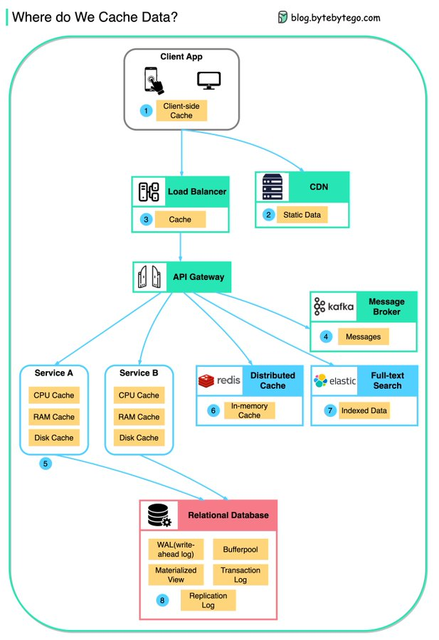

# data_cached_everywhere_from

**Tweet URL:** [https://x.com/bytebytego/status/1879415142313754918](https://x.com/bytebytego/status/1879415142313754918)

**Tweet Text:** Data is cached everywhere, from the front end to the back end!

This diagram illustrates where we cache data in a typical architecture.

There are 𝐦𝐮𝐥𝐭𝐢𝐩𝐥𝐞 𝐥𝐚𝐲𝐞𝐫𝐬 along the flow.

1. Client apps: HTTP responses can be cached by the browser. We request data over HTTP for the first time, and it is returned with an expiry policy in the HTTP header; we request data again, and the client app tries to retrieve the data from the browser cache first.

2. CDN: CDN caches static web resources. The clients can retrieve data from a CDN node nearby.

3. Load Balancer: The load Balancer can cache resources as well.

4. Messaging infra: Message brokers store messages on disk first, and then consumers retrieve them at their own pace. Depending on the retention policy, the data is cached in Kafka clusters for a period of time.

5. Services: There are multiple layers of cache in a service. If the data is not cached in the CPU cache, the service will try to retrieve the data from memory. Sometimes the service has a second-level cache to store data on disk.

6. Distributed Cache: Distributed cache like Redis hold key-value pairs for multiple services in memory. It provides much better read/write performance than the database.

7. Full-text Search: we sometimes need to use full-text searches like Elastic Search for document search or log search. A copy of data is indexed in the search engine as well.

8. Database: Even in the database, we have different levels of caches:
- WAL(Write-ahead Log): data is written to WAL first before building the B tree index
- Bufferpool: A memory area allocated to cache query results
- Materialized View: Pre-compute query results and store them in the database tables for better query performance
- Transaction log: record all the transactions and database updates
- Replication Log: used to record the replication state in a database cluster

Over to you: With the data cached at so many levels, how can we guarantee the 𝐬𝐞𝐧𝐬𝐢𝐭𝐢𝐯𝐞 𝐮𝐬𝐞𝐫 𝐝𝐚𝐭𝐚 is completely erased from the systems?

--
Subscribe to our weekly newsletter to get a Free System Design PDF (158 pages): [https://bit.ly/bbg-social](https://bit.ly/bbg-social)

**Image 1 Description:** The infographic, titled "Where do We Cache Data?", illustrates the caching process in data storage. It features a flowchart with numbered sections that depict various components involved in caching data.

**Flowchart Components:**

*   **Client App**: This section represents the client application, which initiates the caching process.
*   **Load Balancer**: The load balancer is responsible for distributing incoming traffic across multiple servers to ensure efficient resource utilization and prevent overload on any single server.
*   **API Gateway**: The API gateway acts as an entry point for all incoming requests, routing them to the appropriate server based on their content or other criteria.
*   **Distributed Cache**: A distributed cache is a type of caching system that stores data across multiple servers in a cluster, allowing for high availability and scalability.
*   **Relational Database**: The relational database stores data in a structured format using tables, rows, and columns.

**Key Takeaways:**

The infographic provides a clear overview of the various components involved in caching data. It highlights the importance of each component in ensuring efficient and reliable data storage. By understanding these components and their roles, developers can design effective caching systems for their applications.

