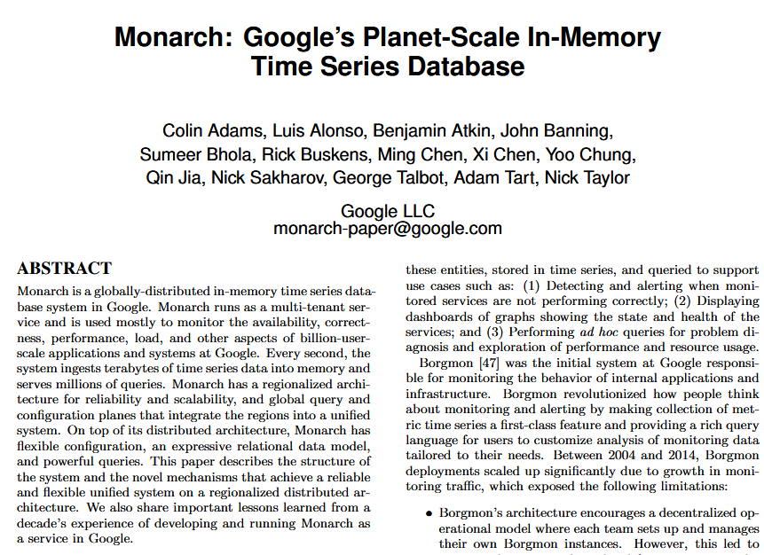

**Source:** [https://twitter.com/i/web/status/1916898104705777941](https://twitter.com/i/web/status/1916898104705777941)
**Original Post Date:** 2025-05-27 22:53:44

# Google Monarch: Planet-Scale In-Memory Time Series Database

## Introduction
Monarch represents a significant evolution in monitoring systems at Google, replacing the earlier Borgmon platform. As a globally distributed in-memory time series database, Monarch addresses modern challenges of massive scale by providing real-time insights through terabyte-scale data ingestion and complex query capabilities.

## Architectural Overview

Monarch employs a regionalized architecture with a globalized query layer to ensure both reliability and scalability. This design enables the system to handle planet-scale workloads while maintaining low latency and high throughput.

The regionalization strategy distributes data processing across multiple regions, ensuring fault tolerance and improved response times for geographically dispersed users.

- Regionalized architecture for fault isolation
- Globalized query layer for unified access
- In-memory storage for low latency

## Technical Capabilities and Features

Monarch's expressive relational data model enables complex time series analysis through ad hoc querying, making it ideal for monitoring service performance and troubleshooting.

The system supports multi-tenant operation, allowing simultaneous use by various teams while maintaining isolation and security.

1. Handles billions of users simultaneously
1. Supports millions of queries per second
1. Processes terabytes of data every second

## Use Cases and Applications

Monarch serves as a core monitoring platform for Google's infrastructure, providing real-time insights through dashboards, alerts, and customizable analysis.

The system supports various monitoring needs including performance tracking, resource utilization monitoring, and anomaly detection.

## Key Takeaways

- Monarch represents a shift from traditional disk-based time series databases to in-memory systems for enhanced performance
- Regionalized architecture with global query integration enables both local reliability and global scalability
- The system's expressive data model and multi-tenant capabilities make it suitable for diverse monitoring use cases

## Conclusion
Monarch exemplifies the evolution of distributed database design to meet modern scale requirements. Its architectural choices address key challenges in handling time series data at planet-scale, setting a new standard for global distributed systems.

## External References

- [Original Research Paper: Monarch](https://research.google/pubs/pub48270/)
- [Google LLC Contact](mailto:monarch-paper-paper@google.com)

## Media

**Image Description:** ### Description of the Image

The image is a screenshot of a research paper titled **"Monarch: Google's Planet-Scale In-Memory Time Series Database"**. The paper discusses the design, architecture, and functionality of **Monarch**, a globally distributed in-memory time series database system developed by Google. Below is a detailed breakdown of the content and technical details presented in the image:

---

#### **Title and Authors**
- **Title**: "Monarch: Google's Planet-Scale In-Memory Time Series Database"
- **Authors**: The paper is authored by a large team of researchers and engineers from Google, including:
  - Colin Adams, Luis Alonso, Benjamin Atkin, John Banning, Sumeer Bhola, Rick Buskens, Ming Chen, Xi Chen, Yoo Chung, Qin Jia, Nick Sakhararov, George Talbot, Adam Tart, and Nick Taylor.
- **Affiliation**: All authors are associated with **Google LLC**.
- **Contact Information**: An email address is provided for correspondence: `monarch-paper-paper@google.com`.

---

#### **Abstract**
The abstract provides an overview of the Monarch system and its key features. Here are the main points:

1. **Overview of Monarch**:
   - Monarch is a **globally distributed in-memory time series database system**.
   - It is designed to handle **planet-scale** workloads, making it suitable for monitoring and analyzing massive amounts of data.
   - The system is used primarily for monitoring services and applications within Google.

2. **Key Features**:
   - **Multi-Tenant Service**: Monarch runs as a multi-tenant service, meaning it can serve multiple users or applications simultaneously.
   - **High Throughput and Low Latency**: The system is optimized for high throughput and low latency, ingesting terabytes of time series data into memory every second.
   - **Scalability**: Monarch is designed to scale horizontally to handle billions of users and millions of queries per second.
   - **Use Cases**:
     - **Monitoring and Alerting**: Detecting and alerting when monitored services are not performing correctly.
     - **Dashboarding**: Displaying dashboards with graphs showing the state and health of services.
     - **Ad Hoc Querying**: Performing ad hoc queries for problem diagnosis and exploration of performance and resource usage.

3. **Architecture**:
   - **Regionalized and Globalized Query Architecture**: Monarch uses a regionalized architecture for reliability and scalability, with a globalized query layer that integrates regions into a unified system.
   - **Flexible Configuration**: The system supports flexible configuration and powerful configuration planes that integrate regions into a unified system.

4. **Data Model**:
   - Monarch uses an **expressive relational data model** for time series data, allowing users to perform rich queries and customize their analysis.

5. **Evolution from Borgmon**:
   - The paper discusses the evolution of Monarch from **Borgmon**, an earlier monitoring system at Google.
   - Borgmon was the initial system responsible for monitoring the behavior of internal applications and infrastructure.
   - Monarch addresses the limitations of Borgmon, such as the need for a more unified and scalable system.

6. **Lessons Learned**:
   - The paper shares important lessons learned from developing and running Monarch, highlighting the challenges and solutions encountered during its development.

---

#### **Technical Details**
- **In-Memory Time Series Database**: Monarch is designed to store and query time series data in memory, enabling fast access and processing.
- **Distributed Architecture**: The system is globally distributed, with a regionalized architecture that ensures reliability and scalability.
- **Query Capabilities**: Monarch supports expressive queries, allowing users to perform complex analyses on time series data.
- **Monitoring Use Cases**: The system is primarily used for monitoring services, applications, and infrastructure within Google, providing real-time insights into performance and health.

---

#### **Key Points from the Abstract**
1. **Planet-Scale Workloads**: Monarch is designed to handle massive amounts of data and queries, making it suitable for Google's scale.
2. **In-Memory Processing**: The system leverages in-memory storage for high performance and low latency.
3. **Multi-Tenant Service**: Monarch supports multiple users and applications, making it a versatile monitoring tool.
4. **Regionalized and Globalized Architecture**: The system uses a regionalized architecture for reliability and scalability, with a globalized query layer for unified access.
5. **Evolution from Borgmon**: Monarch is an evolution of Borgmon, addressing its limitations and providing a more unified and scalable monitoring solution.

---

#### **Visual Layout**
- The document is formatted in a standard academic paper style.
- The title is prominently displayed at the top in bold.
- The authors' names are listed below the title.
- The abstract is clearly marked and provides a concise summary of the paper's content.
- The text is well-organized, with clear sections and bullet points for emphasis.

---

### Summary
The image describes **Monarch**, a globally distributed in-memory time series database system developed by Google. The system is designed to handle planet-scale workloads, providing high throughput and low latency for monitoring and analyzing time series data. Monarch evolved from Borgmon, addressing its limitations and offering a more unified and scalable monitoring solution. The paper highlights the system's architecture, key features, and lessons learned during its development. The abstract provides a comprehensive overview of Monarch's capabilities and its role in Google's monitoring infrastructure.
