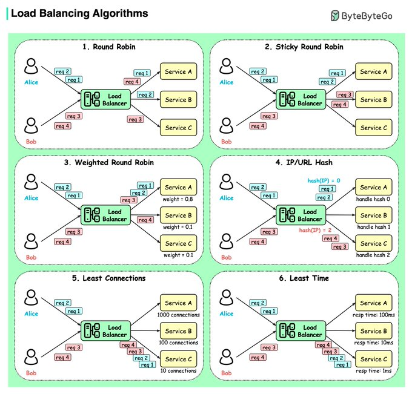

# load_balancing_algorithms

**Tweet URL:** [https://x.com/alexxubyte/status/1878489954265035149](https://x.com/alexxubyte/status/1878489954265035149)

**Tweet Text:** Top 6 Load Balancing Algorithms.

**Image 1 Description:** The image presents a comprehensive overview of load balancing algorithms, showcasing six distinct methods for optimizing network traffic distribution. The title "Load Balancing Algorithms" is prominently displayed at the top left corner.

**Algorithm 1: Round Robin**

*   **Description:** This algorithm assigns incoming requests to servers in a cyclical manner.
*   **Key Features:**
    *   Each server receives an equal number of requests.
    *   Requests are distributed one by one among all available servers.

**Algorithm 2: Sticky Round Robin**

*   **Description:** Similar to the round-robin algorithm, but with an added feature that allows users to be directed to the same server for subsequent requests.
*   **Key Features:**
    *   Users are assigned a specific server upon their first request.
    *   Subsequent requests from the same user are routed to the same server.

**Algorithm 3: Weighted Round Robin**

*   **Description:** A variation of the round-robin algorithm that takes into account the relative weights or capacities of each server.
*   **Key Features:**
    *   Servers with higher weights receive more requests than those with lower weights.
    *   The distribution of requests is based on the weighted capacity of each server.

**Algorithm 4: IP/URL Hash**

*   **Description:** This algorithm uses a hash function to map incoming requests to servers based on their IP addresses or URLs.
*   **Key Features:**
    *   Each request is hashed and mapped to a specific server.
    *   The hashing process ensures that each server receives an equal number of requests.

**Algorithm 5: Least Connections**

*   **Description:** This algorithm directs incoming requests to the server with the fewest active connections.
*   **Key Features:**
    *   Servers are ranked based on their current connection load.
    *   Requests are assigned to the server with the lowest connection count.

**Algorithm 6: Least Time**

*   **Description:** Similar to the least connections algorithm, but instead of focusing on connection counts, it considers response times.
*   **Key Features:**
    *   Servers are ranked based on their average response time.
    *   Requests are directed to the server with the fastest response time.

In summary, the image provides a detailed comparison of six load balancing algorithms, each with its unique approach to optimizing network traffic distribution. By understanding these algorithms, users can select the most appropriate method for their specific needs and improve overall system performance.

