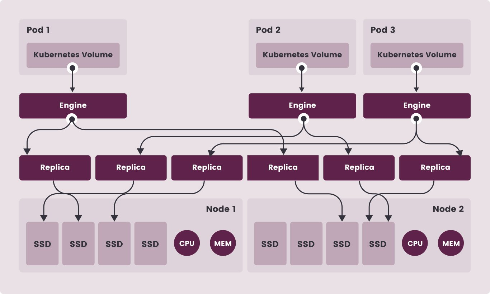

**Source:** [https://twitter.com/i/web/status/1914034087569879275](https://twitter.com/i/web/status/1914034087569879275)
**Original Post Date:** 2025-05-28 08:10:08

# Longhorn Storage Controller: Distributed Architecture for High Availability

## Introduction
This article examines the architectural design of a Longhorn storage controller within a distributed system. The system is built on Kubernetes, utilizing a sophisticated arrangement of pods, engines, and replicas to ensure high availability and scalability. This analysis explores how components interact across two nodes with dedicated resources, providing insights into modern distributed storage solutions.

## System Architecture Overview

The system comprises three Kubernetes pods (Pod 1-3), each containing an engine and connected to Kubernetes volumes for persistent storage. Each pod manages specific replicas, with a total of ten distributed across the nodes.

Replication distribution follows an optimal pattern: Pod 1 and Pod 2 have 3 replicas each on Node 1, while Pod 3 has 4 replicas on Node 2. This balanced approach ensures fault tolerance and efficient resource utilization.

## Node Resource Allocation

Resource distribution across nodes is carefully planned: Node 1 houses 4 SSDs, 1 CPU, and 1 MEM unit to support Pods 1 and 2's replicas. Node 2 contains 5 SSDs with equivalent compute resources for Pod 3.

The asymmetric resource allocation demonstrates strategic placement of workload based on replica distribution patterns.

- Node 1: 4x SSD, 1 CPU, 1 MEM (Supports Pods 1 & 2)
- Node 2: 5x SSD, 1 CPU, 1 MEM (Supports Pod 3)

## Replication and Fault Tolerance

The system employs a redundant replication strategy with ten replicas spread across pods. This ensures data availability even in case of node failures.

Each engine manages its replicas, maintaining consistency while providing efficient access to storage resources.

```yaml
# Example Longhorn volume specification
apiVersion: longhorn.io/v1beta2
kind: Volume
metadata:
  name: distributed-volume
spec:
  size: "5Gi"
  numberOfReplicas: 3
```

> **Note/Tip:** Ensure balanced replica distribution across nodes to prevent resource contention.

> **Note/Tip:** Monitor node load metrics for optimal performance.

## Kubernetes Integration

Kubernetes volumes provide persistent storage management, ensuring data durability through pod restarts or failures.

The integration allows seamless scaling and resource orchestration while maintaining high availability guarantees.

## Key Takeaways

- Distributed architecture with three pods ensures scalability and fault tolerance
- Strategic replica distribution balances workload across nodes
- Kubernetes volumes provide robust storage management capabilities

## Conclusion
The Longhorn storage controller architecture demonstrates an effective approach to distributed systems design, balancing performance, availability, and scalability. Through careful resource allocation and replication strategies, it provides a reliable foundation for modern containerized applications.

## External References

- [Longhorn Documentation](https://longhorn.io/docs)
- [Kubernetes Storage Volumes Guide](https://kubernetes.io/docs/concepts/storage/persistent-volumes/)


## Media

**Image Description:** The image depicts an architecture diagram of a distributed system, likely designed for high availability, scalability, and fault tolerance. The diagram illustrates the relationships between various components, including pods, engines, replicas, nodes, and storage resources. Below is a detailed breakdown of the image:

### **Main Components and Structure**
1. **Pods**:
   - There are three pods labeled **Pod 1**, **Pod 2**, and **Pod 3**.
   - Each pod contains a **Kubernetes Volume** (a persistent storage resource managed by Kubernetes).
   - These pods are the primary containers that encapsulate the application logic and resources.

2. **Engines**:
   - Each pod hosts an **Engine** component.
   - The engines are the core processing units that interact with the replicas and manage the data or application logic.
   - The engines are connected to their respective Kubernetes volumes, indicating that they use persistent storage for data management.

3. **Replicas**:
   - There are **10 replicas** in total, distributed across the three pods.
   - The replicas are evenly distributed, with **3 replicas** connected to **Pod 1**, **3 replicas** connected to **Pod 2**, and **4 replicas** connected to **Pod 3**.
   - The replicas are likely used for data replication, load balancing, or fault tolerance purposes.

4. **Nodes**:
   - The system is deployed across **two nodes**, labeled **Node 1** and **Node 2**.
   - Each node contains a set of resources:
     - **SSDs (Solid-State Drives)**: These are storage devices used for fast data access.
     - **CPU (Central Processing Unit)**: The computational power for processing tasks.
     - **MEM (Memory)**: The RAM required for running applications and storing data in memory.

5. **Storage and Resource Allocation**:
   - **Node 1**:
     - Contains **4 SSDs**, **1 CPU**, and **1 MEM**.
     - The replicas from **Pod 1** and **Pod 2** are connected to the resources on Node 1.
   - **Node 2**:
     - Contains **5 SSDs**, **1 CPU**, and **1 MEM**.
     - The replicas from **Pod 3** are connected to the resources on Node 2.

6. **Connections**:
   - The **Engines** in each pod are connected to their respective replicas.
   - The replicas are further connected to the storage resources (SSDs) on the nodes.
   - The **Kubernetes Volumes** in the pods are linked to the engines, indicating that the engines use these volumes for persistent data storage.

### **Key Observations**
- **Distributed Architecture**: The system is designed to be distributed across multiple nodes, ensuring that the workload is spread out and can handle failures gracefully.
- **Redundancy and Fault Tolerance**: The use of multiple replicas suggests a focus on redundancy and fault tolerance. If one replica fails, others can take over.
- **Resource Management**: The allocation of SSDs, CPU, and memory across nodes indicates careful resource planning to ensure optimal performance.
- **Kubernetes Integration**: The use of Kubernetes volumes suggests that the system leverages Kubernetes for orchestration, scaling, and managing persistent storage.

### **Technical Details**
- **Kubernetes Volumes**: These are persistent storage resources that ensure data durability and availability across pod restarts or failures.
- **Replication**: The replicas are likely used for data replication, ensuring that data is stored in multiple locations for redundancy.
- **Node-Level Resources**: The allocation of SSDs, CPU, and memory on each node ensures that the system can handle the computational and storage demands of the replicas.

### **Summary**
The image illustrates a distributed system architecture with three pods, each containing an engine and connected to replicas. The replicas are spread across two nodes, each equipped with SSDs, CPU, and memory. The system leverages Kubernetes volumes for persistent storage and employs replication for fault tolerance and scalability. The design emphasizes high availability, efficient resource utilization, and fault tolerance.
