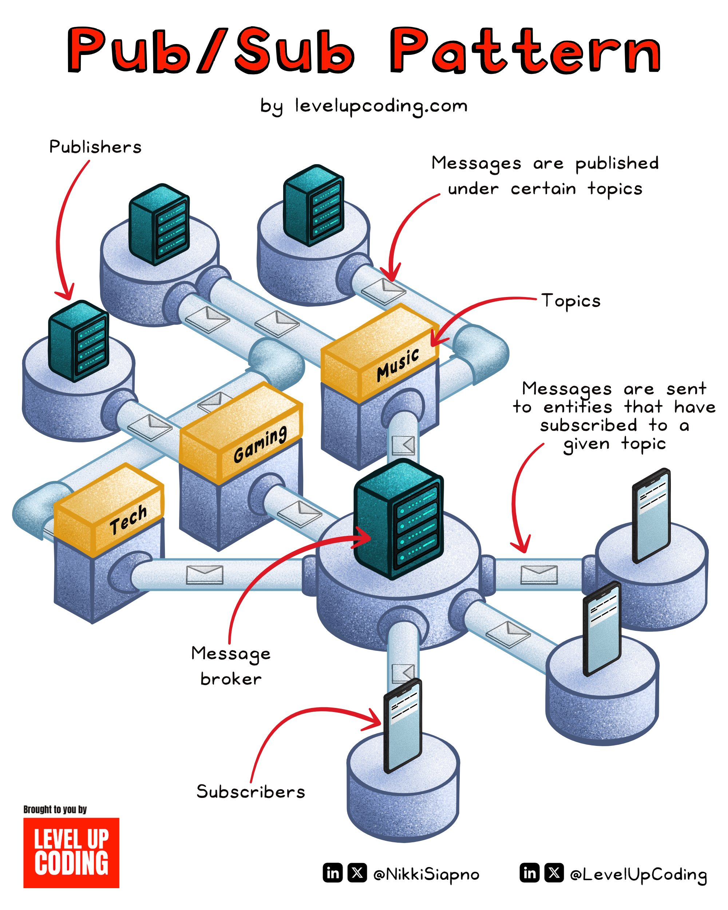

# Pub Sub Pattern

## Description
Pub/Sub Pattern Explained.

Distributed systems need to handle scalable, decoupled communication. The publish-subscribe messaging pattern enables this by providing asynchronous, event-driven message d...

## Content
Pub/Sub Pattern Explained.

Distributed systems need to handle scalable, decoupled communication. The publish-subscribe messaging pattern enables this by providing asynchronous, event-driven message distribution.

There are three entities involved — publishers, topics, and subscribers.

Subscribers tell the system which messages they would like to be informed about by subscribing to a topic.

Publishers send messages to topics, without knowledge of who the message should be sent to.

A message broker or event bus then forwards these messages to the appropriate subscribers.

Social media platforms and messaging apps have several features that would be perfect candidates for this model. 

For example, Twitter's account notifications feature. I could turn on notifications for any user, which could be the equivalent of subscribing to a topic.

After doing so, a push notification would be sent to me every time that user creates a post.

Message senders and receivers are heavily decoupled in a Pub/Sub model. This leads to improved scalability, flexibility, and fault tolerance.

As a result, it is a popular option for distributed systems that require large amounts of communication between nodes. It is often used alongside other communication patterns to meet the system’s needs.

 Over to you. Do you use Pub/Sub? 

~~
Thanks to our partner Typesense who keeps our content free to the community.

PHP devs, did you know you can easily implement instant, typo-tolerant search (for free)? 

Check out Lavarel Scout—Typesense: https://lucode.co/typesense-laravel-z7ltt…

## Category Information

- Main Category: system_design
- Sub Category: distributed_systems
- Item Name: pub_sub_pattern

## Source

- Original Tweet: [https://twitter.com/i/web/status/1889910591718039886](https://twitter.com/i/web/status/1889910591718039886)
- Date: 2025-02-20 15:36:34

## Media

### Media 1

**Description:** The image presents a visual representation of the Pub/Sub pattern, also known as the Publish-Subscribe or Observer design pattern. This pattern is commonly used in software development to facilitate communication between objects without imposing a rigid structure on them.

**Main Points:**

* **Publishers**
	+ Represented by small boxes with blue tops and black outlines
	+ Located at the top of the image, each connected to a central hub
	+ No statistics provided
* **Messages**
	+ Depicted as envelopes flowing through pipes connecting publishers to subscribers
	+ No specific data or statistics mentioned
* **Subscribers**
	+ Represented by boxes with yellow tops and black outlines
	+ Located at the bottom of the image, each connected to a central hub
	+ No statistics provided

**Summary:**

The Pub/Sub pattern is a design pattern that enables objects to communicate without being tightly coupled. In this diagram, publishers are represented by small blue boxes at the top, while subscribers are depicted as yellow boxes at the bottom. Messages flow through pipes connecting these components, facilitating communication between them. No specific data or statistics are mentioned in the image.

*Last updated: 2025-02-20 15:36:34*