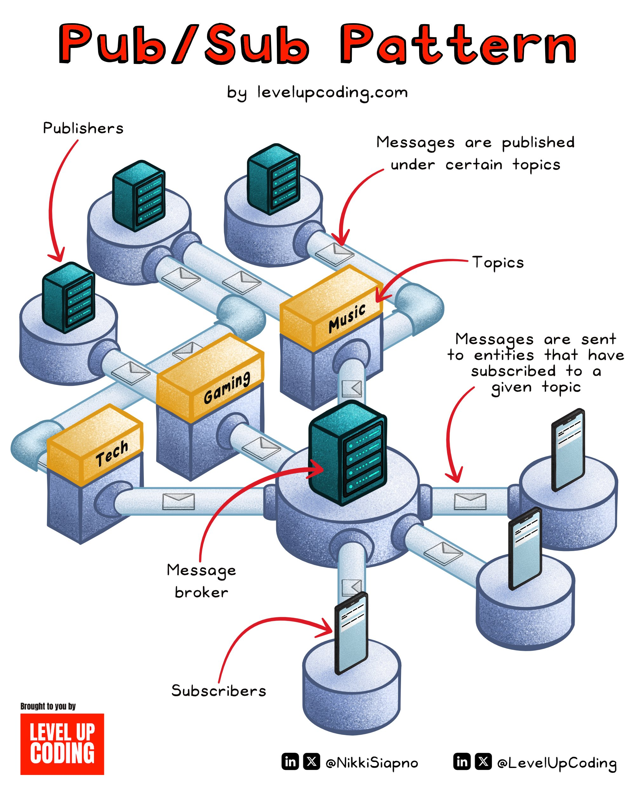

The Publish-Subscribe pattern, commonly referred to as Pub/Sub, is a design pattern that enables objects to communicate without being tightly coupled. It provides an asynchronous, event-driven message distribution mechanism, allowing for scalable and decoupled communication in distributed systems.

## Technical Content
In the Pub/Sub pattern, there are three primary entities involved:
* **Publishers**: These are the components that send messages to topics.
* **Topics**: These are the subjects or categories that messages are published to.
* **Subscribers**: These are the components that receive messages from topics they have subscribed to.

The process works as follows:

1. Subscribers register their interest in specific topics by subscribing to them.
2. Publishers send messages to these topics without knowing who the message should be sent to.
3. A message broker or event bus then forwards these messages to the appropriate subscribers.

### Example
To illustrate this, consider Twitter's account notifications feature. When you turn on notifications for a particular user, it is equivalent to subscribing to a topic. Every time that user creates a post, a push notification is sent to you, demonstrating how the Pub/Sub pattern facilitates communication between distributed components (in this case, users and their followers) without them needing direct knowledge of each other.

### Benefits
The Pub/Sub model offers several benefits:
* **Scalability**: Message senders and receivers are heavily decoupled, allowing for improved scalability.
* **Flexibility**: The pattern supports a wide range of communication scenarios.
* **Fault Tolerance**: Because components are loosely coupled, failures in one part of the system do not directly affect others.

## Key Takeaways and Best Practices
- **Use Pub/Sub for distributed systems that require large amounts of communication between nodes**. This pattern is particularly useful when you need to handle a high volume of messages or when the sender and receiver do not need direct knowledge of each other.
- **Consider implementing Pub/Sub alongside other communication patterns**. Depending on your system's needs, combining Pub/Sub with request-response models can provide a robust and flexible communication infrastructure.
- **Optimize message brokers for performance and reliability**. Since the message broker plays a central role in forwarding messages to subscribers, ensuring its efficiency and fault tolerance is crucial.

## References
For PHP developers looking to implement instant, typo-tolerant search functionality, consider leveraging [Laravel Scout](https://laravel.com/docs/11.x/scout) integrated with [Typesense](https://lucode.co/typesense-laravel-z7ltt), which offers a powerful search solution. For distributed systems design and the implementation of Pub/Sub patterns, exploring frameworks and libraries specific to your programming language or ecosystem can provide valuable insights and tools.

## Additional Resources
- [Pub/Sub Pattern Documentation](https://en.wikipedia.org/wiki/Publish%E2%80%93subscribe_pattern)
- [Typesense Documentation](https://typesense.io/docs/)
- [Laravel Scout Documentation](https://laravel.com/docs/11.x/scout)
## Source

- Original Tweet: [https://twitter.com/i/web/status/1889910591718039886](https://twitter.com/i/web/status/1889910591718039886)
- Date: 2025-02-20 17:19:43

## Media

### Media 1

**Description:** The image presents a visual representation of the Pub/Sub pattern, also known as the Publish-Subscribe or Observer design pattern. This pattern is commonly used in software development to facilitate communication between objects without imposing a rigid structure on them.

**Main Points:**

* **Publishers**
	+ Represented by small boxes with blue tops and black outlines
	+ Located at the top of the image, each connected to a central hub
	+ No statistics provided
* **Messages**
	+ Depicted as envelopes flowing through pipes connecting publishers to subscribers
	+ No specific data or statistics mentioned
* **Subscribers**
	+ Represented by boxes with yellow tops and black outlines
	+ Located at the bottom of the image, each connected to a central hub
	+ No statistics provided

**Summary:**

The Pub/Sub pattern is a design pattern that enables objects to communicate without being tightly coupled. In this diagram, publishers are represented by small blue boxes at the top, while subscribers are depicted as yellow boxes at the bottom. Messages flow through pipes connecting these components, facilitating communication between them. No specific data or statistics are mentioned in the image.

*Last updated: 2025-02-20 17:19:43*