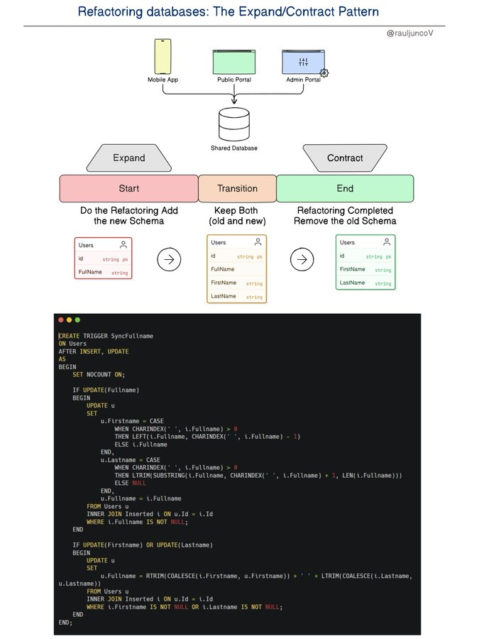

# refactoring_databases_different_animal

**Tweet URL:** [https://x.com/RaulJuncoV/status/1876631417368596674](https://x.com/RaulJuncoV/status/1876631417368596674)

**Tweet Text:** Refactoring databases is a different animal.

Here is a simple approach, the “Expand/Contract Pattern”.

Refactoring a database can be tricky, especially when multiple applications share the same database.

Teams often avoid changing the database schema, fearing it will break other applications.

This is when the Expand/Contract pattern gets handy. 

It introduces a Transition Phase that ensures backward compatibility, giving other teams time to adapt without breaking anything.

How It Works

The process has two main phases:

• Expand: Introduce the new structure while keeping the old one.

• Contract: Remove the old structure once all systems use the new one.

This approach avoids timing problems, as both the old and new versions coexist during the transition. 

The transition can last anywhere from a few days to months, depending on how quickly teams can adapt.

A simple example: Splitting a FullName Column

Imagine you want to split a FullName column into FirstName and LastName.

During the Transition:

• You add New Columns, FirstName and LastName, and keep the existing FullName.

• Migrate the existing data, splitting the FullName values into FirstName and LastName for all rows.

Now, you use a trigger to ensure changes to one structure reflect in the other:

• If an old system inserts/updates FullName, the trigger updates FirstName and LastName.

• If a new system inserts/updates FirstName and LastName, the trigger updates FullName.

This ensures both old and new systems work without disruption.

After the Transition:

Once all systems use the new FirstName and LastName structure, you can:

• Drop the trigger.
• Remove the old FullName column.

Databases are key to software architectures—developers who ignore this will suffer.

P.S. There is only one problem with this pattern, which is not technical. What is the issue?

**Image 1 Description:** The image presents a comprehensive guide to refactoring databases, focusing on the "Expand/Contract Pattern." It is divided into several sections, each addressing a specific aspect of this pattern.

*   **Title**: The title at the top reads "Refactoring databases: The Expand/Contract Pattern."
    *   This indicates that the content will cover the process and tools for refactoring databases using the Expand/Contract pattern.
*   **Database Refactoring Process**:
    *   **Expand**: This involves adding new schema elements to an existing database schema.
        *   It includes steps such as identifying areas where expansion is necessary, creating new tables or views, and updating data types accordingly.
    *   **Transition**: This phase focuses on migrating existing data into the newly expanded schema.
        *   It involves writing scripts or SQL queries to transfer data from old to new structures while ensuring data integrity.
    *   **Contract**: In this step, redundant or unnecessary parts of the database are removed.
        *   This includes identifying and deleting unused tables, views, or columns that no longer serve a purpose.
*   **Refactoring Tools**:
    *   The image does not explicitly mention specific tools but suggests an approach using SQL queries and scripts to manage the refactoring process.
        *   It implies leveraging database management system (DBMS) capabilities for executing these changes efficiently.

In summary, the image outlines the three main steps in the Expand/Contract pattern for database refactoring: expanding the schema, transitioning data into the new structure, and contracting by removing unnecessary elements. While it does not specify particular tools, it emphasizes the importance of SQL queries and scripts in managing this process effectively.

