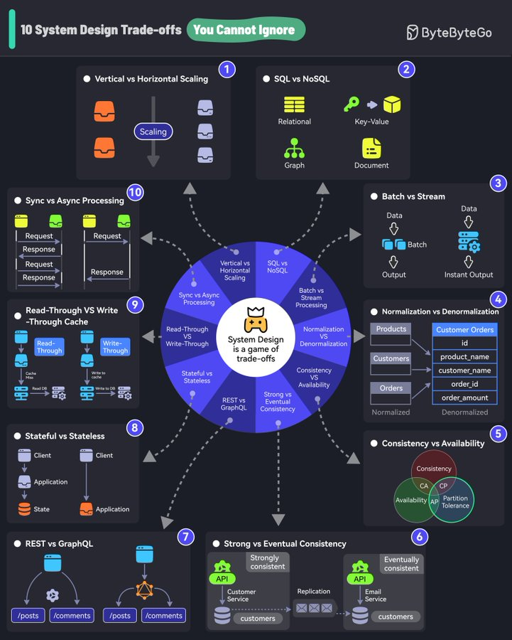

# system_design_about_tradeoffs

**Tweet URL:** [https://x.com/sahnlam/status/1878669562495017468](https://x.com/sahnlam/status/1878669562495017468)

**Tweet Text:** System Design is About Tradeoffs

**Image 1 Description:** The infographic, titled "10 System Design Trade-offs," presents a comprehensive overview of the trade-offs involved in system design. The title is displayed in white text within a green bubble at the top left corner.

**Central Visual Representation**

At the center of the infographic is a circular diagram illustrating the relationships between different components and processes. This visual representation is accompanied by arrows pointing outward from the circle, connecting to numbered sections that provide detailed explanations of each trade-off.

**Trade-offs Illustrated**

The infographic highlights ten key trade-offs in system design:

1. **Vertical vs Horizontal Scaling**: This trade-off involves deciding whether to scale up or out to meet increasing demand.
2. **SQL vs NoSQL**: This trade-off compares the use of relational databases (SQL) versus non-relational databases (NoSQL).
3. **Batch vs Stream Processing**: This trade-off considers the processing of data in batches versus real-time streams.
4. **Normalization vs Denormalization**: This trade-off involves deciding whether to normalize or denormalize data for efficient querying and retrieval.
5. **Consistency vs Availability**: This trade-off weighs the importance of ensuring consistency versus achieving high availability in a system.
6. **Strong vs Eventual Consistency**: This trade-off compares the use of strong consistency models versus eventual consistency models.
7. **Customer Orders Id**: This trade-off involves deciding how to manage customer orders, including product names and order amounts.
8. **Stateful vs Stateless**: This trade-off considers whether a system should maintain state or not.
9. **Read-Through vs Write-Through Cache**: This trade-off compares the use of read-through and write-through caching mechanisms.
10. **Sync vs Async Processing**: This trade-off involves deciding between synchronous and asynchronous processing methods.

**Conclusion**

The infographic provides a clear and concise overview of the trade-offs involved in system design, highlighting the importance of considering multiple factors when making decisions about system architecture. By understanding these trade-offs, designers can create systems that meet their specific needs and requirements.

