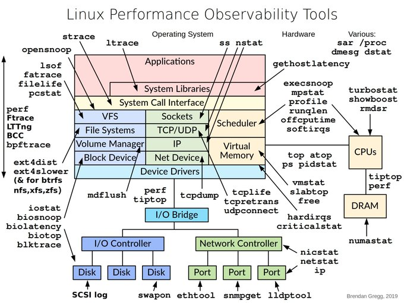

# tech_insight_20250114_18686167

**Tweet URL:** [https://x.com/chessMan786/status/1868616720794955835](https://x.com/chessMan786/status/1868616720794955835)

**Tweet Text:** Linux Performance Observability Tools

ALT

**Image 1 Description:** The image presents a comprehensive overview of Linux Performance Observability Tools, showcasing various components and their relationships within the system. The diagram is divided into several sections, each representing different aspects of the tools.

*   **System Libraries**
    *   This section highlights key libraries that play a crucial role in performance observability.
        *   System Call Interface
            *   Provides an interface for interacting with system calls.
        *   VFS (Virtual File System)
            *   Manages file systems and provides access to files and directories.
        *   TCP/IP Stack
            *   Handles network communication protocols.
*   **File Systems**
    *   This section focuses on the various file systems used in Linux.
        *   ext4
            *   A popular journaling file system optimized for performance.
        *   XFS (Extents File System)
            *   A high-performance file system designed for large-scale systems.
*   **Networking**
    *   This section covers networking-related components and tools.
        *   TCP/IP Stack
            *   Handles network communication protocols.
        *   Network Controller
            *   Manages network interfaces and configuration.
*   **System Monitoring**
    *   This section highlights tools used for monitoring system performance and resource utilization.
        *   System Call Interface
            *   Provides an interface for interacting with system calls.
        *   VFS (Virtual File System)
            *   Manages file systems and provides access to files and directories.
*   **Performance Analysis**
    *   This section covers tools used for analyzing system performance data.
        *   perf (Performance Counter)
            *   Collects and analyzes performance counter data.
        *   ftrace (Function Tracer)
            *   Traces function calls and their execution times.

In summary, the image provides a detailed overview of Linux Performance Observability Tools, including system libraries, file systems, networking components, system monitoring tools, and performance analysis tools. These components work together to provide insights into system performance and resource utilization, enabling administrators to optimize system configuration and troubleshoot issues effectively.

