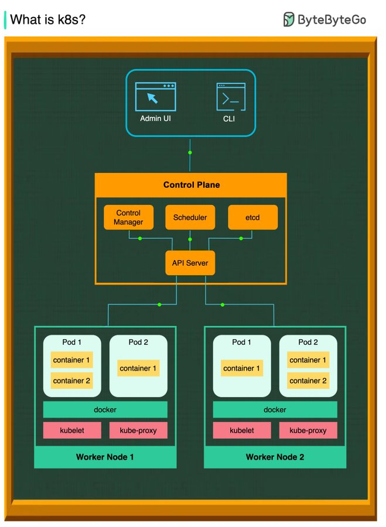

# what_kubernetes_container_orchestration

**Tweet URL:** [https://x.com/bytebytego/status/1867084687505756438](https://x.com/bytebytego/status/1867084687505756438)

**Tweet Text:** What is k8s (Kubernetes)? 

k8s is a container orchestration system. It is used for container deployment and management. Its design is greatly impacted by Google’s internal system Borg. 
 
A k8s cluster consists of a set of worker machines, called nodes, that run containerized applications. Every cluster has at least one worker node. 
 
The worker node(s) host the Pods that are the components of the application workload. The control plane manages the worker nodes and the Pods in the cluster. In production environments, the control plane usually runs across multiple computers and a cluster usually runs multiple nodes, providing fault-tolerance and high availability. 
 
 Control Plane Components 
 
1. API Server 
The API server talks to all the components in the k8s cluster. All the operations on pods are executed by talking to the API server. 
 
2. Scheduler 
The scheduler watches the workloads on pods and assigns loads on newly created pods. 
 
3. Controller Manager 
The controller manager runs the controllers, including Node Controller, Job Controller, EndpointSlice Controller, and ServiceAccount Controller. 
 
4. etcd 
etcd is a key-value store used as Kubernetes' backing store for all cluster data. 
 
 Nodes 
1. Pods 
A pod is a group of containers and is the smallest unit that k8s administers. Pods have a single IP address applied to every container within the pod. 
 
2. Kubelet 
An agent that runs on each node in the cluster. It ensures containers are running in a Pod. 
 
3. Kube Proxy 
kube-proxy is a network proxy that runs on each node in your cluster. It routes traffic coming into a node from the service. It forwards requests for work to the correct containers. 

--
Subscribe to our weekly newsletter to get a Free System Design PDF (158 pages): [https://bit.ly/bbg-social](https://bit.ly/bbg-social)

**Image 1 Description:** The image presents a comprehensive overview of the architecture and components involved in managing and controlling Kubernetes clusters, with a focus on the Control Plane and its various components.

*   **Control Plane**
    *   The Control Plane is responsible for managing and controlling the entire cluster.
    *   It consists of several key components:
        *   **API Server**: Handles incoming requests from users and services.
        *   **Controller Manager**: Manages and coordinates the behavior of controllers within the cluster.
        *   **Scheduler**: Determines which node to place a pod on based on resource availability and other factors.
        *   **Etcd**: A distributed key-value store that provides a consistent way for all components in the system to agree on the state of the cluster.
    *   The Control Plane is typically deployed as a single entity, but can be scaled horizontally by running multiple instances behind a load balancer.
*   **Worker Nodes**
    *   Worker nodes are responsible for executing workloads and containers within the cluster.
    *   Each node runs:
        *   **Kubelet**: Responsible for managing pods on that node.
        *   **Container Runtime**: Executes containers within the pod.
        *   **Proxy Service**: Handles incoming traffic from outside the cluster.
*   **Pods**
    *   Pods are the basic execution unit in Kubernetes, comprising one or more containers.
    *   Each pod has its own IP address and can communicate with other pods using standard networking protocols.

In summary, the image provides a detailed illustration of the Control Plane's architecture and components, highlighting their roles and interactions within a Kubernetes cluster. The inclusion of worker nodes and pods demonstrates how these components work together to manage and execute workloads in a distributed environment.

