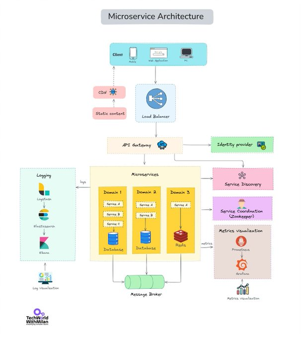

# 𝗪𝗵𝗮𝘁_𝗶𝘀_𝗠𝗶𝗰𝗿𝗼𝘀𝗲𝗿𝘃𝗶𝗰𝗲_𝗔𝗿𝗰𝗵𝗶𝘁𝗲𝗰𝘁

**Tweet URL:** [https://x.com/milan_milanovic/status/1871101048552575374](https://x.com/milan_milanovic/status/1871101048552575374)

**Tweet Text:** 𝗪𝗵𝗮𝘁 𝗶𝘀 𝗠𝗶𝗰𝗿𝗼𝘀𝗲𝗿𝘃𝗶𝗰𝗲 𝗔𝗿𝗰𝗵𝗶𝘁𝗲𝗰𝘁𝘂𝗿𝗲?

Have you ever wondered why companies like Netflix and Amazon seem to roll out features at the speed of light? The secret might be hidden in their tech stack based on Microservice architecture.

At its core, Microservice architecture is about breaking down an application into a collection of small, loosely coupled services. Each service runs a unique process and communicates through a well-defined API. Each service is a separate codebase, which can be managed by a small development team and deployed independently. 

Key elements of microservice architecture:

𝟭. 𝗟𝗼𝗮𝗱 𝗕𝗮𝗹𝗮𝗻𝗰𝗲𝗿: Ensures even distribution of incoming network traffic across various servers.

𝟮. 𝗖𝗗𝗡 (𝗖𝗼𝗻𝘁𝗲𝗻𝘁 𝗗𝗲𝗹𝗶𝘃𝗲𝗿𝘆 𝗡𝗲𝘁𝘄𝗼𝗿𝗸): A distributed server system that delivers web content based on the user's location. It's about bringing content closer to the end-user, making page loads faster.

𝟯. 𝗔𝗣𝗜 𝗚𝗮𝘁𝗲𝘄𝗮𝘆: Manages requests by directing them to the appropriate microservice using REST API or other protocols. 

𝟰. 𝗠𝗮𝗻𝗮𝗴𝗲𝗺𝗲𝗻𝘁: Monitoring and coordinating the microservices, ensuring they run efficiently and communicate effectively.

𝟱. 𝗠𝗶𝗰𝗿𝗼𝘀𝗲𝗿𝘃𝗶𝗰𝗲𝘀: Each microservice handles a distinct functionality, allowing for focused development and easier troubleshooting. They can talk with each other using RPC (Remote Procedure Call). Services are responsible for persisting their own data or external state.

𝗕𝗲𝗻𝗲𝗳𝗶𝘁𝘀:

 𝗦𝗰𝗮𝗹𝗮𝗯𝗶𝗹𝗶𝘁𝘆: Scale up specific parts of an app without affecting others.
 𝗙𝗹𝗲𝘅𝗶𝗯𝗶𝗹𝗶𝘁𝘆: Each microservice can be developed, deployed, and scaled independently.
 𝗥𝗲𝘀𝗶𝗹𝗶𝗲𝗻𝗰𝗲: If one microservice fails, it doesn't affect the entire system.
 𝗙𝗮𝘀𝘁𝗲𝗿 𝗗𝗲𝗽𝗹𝗼𝘆𝗺𝗲𝗻𝘁𝘀: Smaller codebases mean quicker feature rollouts.

𝗗𝗿𝗮𝘄𝗯𝗮𝗰𝗸𝘀:

 𝗖𝗼𝗺𝗽𝗹𝗲𝘅𝗶𝘁𝘆: More services can lead to a more complex system.
 𝗗𝗮𝘁𝗮 𝗖𝗼𝗻𝘀𝗶𝘀𝘁𝗲𝗻𝗰𝘆: Maintaining consistency across services can be challenging.
 𝗡𝗲𝘁𝘄𝗼𝗿𝗸 𝗟𝗮𝘁𝗲𝗻𝗰𝘆: Inter-service communication can introduce delays.
 𝗘𝗿𝗿𝗼𝗿 𝗵𝗮𝗻𝗱𝗹𝗶𝗻𝗴: When an error happens, it's hard to debug why and where it happened.

While Microservice architecture isn't a silver bullet, it's a tool for modern software development. Should you use it for your project? It depends, and we will discuss more in the following days.

**Image 1 Description:** The image presents a comprehensive overview of Microservice Architecture, showcasing its various components and their interconnections. The diagram is divided into several sections, each representing a different aspect of microservices.

*   **Client**
    *   The client section is depicted in blue and features an icon of a computer monitor.
    *   It represents the user interface or application that interacts with the microservices.
    *   The client sends requests to the API gateway, which acts as an entry point for incoming traffic.
*   **API Gateway**
    *   The API gateway section is colored in light blue and includes an icon of a gear.
    *   It serves as a single entry point for all incoming traffic from clients.
    *   The API gateway routes requests to the appropriate microservices based on their URLs or paths.
*   **Identity Provider**
    *   The identity provider section is represented by a green rectangle with an icon of a person.
    *   It handles authentication and authorization for users accessing the system.
    *   The identity provider verifies user credentials and generates tokens or sessions to grant access to protected resources.
*   **Service Discovery**
    *   The service discovery section is depicted in pink and features an icon of a puzzle piece.
    *   It enables microservices to register themselves with the registry and discover other services at runtime.
    *   Service discovery allows for dynamic scaling, load balancing, and failover capabilities.
*   **Load Balancer**
    *   The load balancer section is colored in light pink and includes an icon of a traffic cone.
    *   It distributes incoming traffic across multiple instances of a service to improve responsiveness, reliability, and scalability.
    *   Load balancing ensures that no single instance becomes overwhelmed with requests.
*   **Database**
    *   The database section is represented by a yellow rectangle with an icon of a database table.
    *   It stores persistent data for the microservices, providing a centralized repository for storing and retrieving information.
    *   Databases can be relational or NoSQL, depending on the specific requirements of the application.
*   **Message Broker**
    *   The message broker section is depicted in light green and features an icon of a speech bubble.
    *   It facilitates communication between microservices by enabling them to send messages to each other asynchronously.
    *   Message brokers provide a mechanism for decoupling services, allowing them to operate independently while still exchanging data.

In summary, the image illustrates the key components of Microservice Architecture, including the client, API gateway, identity provider, service discovery, load balancer, database, and message broker. These elements work together to enable scalable, flexible, and maintainable software systems.

