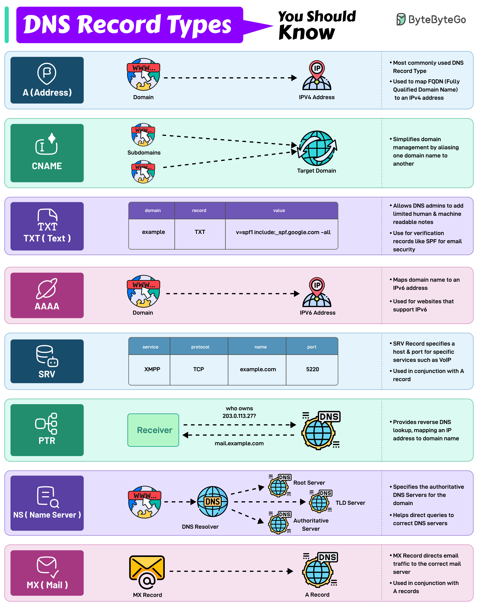

**Source:** [https://twitter.com/i/web/status/1868695105395404917](https://twitter.com/i/web/status/1868695105395404917)
**Original Post Date:** 2025-07-23 06:19:35

# Comprehensive Analysis of DNS Record Types: A Technical Deep Dive

## Introduction
The Domain Name System (DNS) is a critical component of the internet, translating human-readable domain names into machine-readable IP addresses. Understanding various DNS record types is essential for effective domain management, network configuration, and troubleshooting. This analysis provides a detailed breakdown of eight key DNS record types, their functions, and practical examples.

## 1. A (Address) Record

The A (Address) record is the most commonly used DNS record type. It maps a Fully Qualified Domain Name (FQDN) to an IPv4 address, enabling users to access websites and services using human-readable domain names instead of numerical IP addresses.

For example, the domain `www.example.com` can be mapped to the IPv4 address `192.0.2.1`. This mapping allows users to type `www.example.com` in their browsers and connect to the server with the IP address `192.0.2.1`.

_This example demonstrates how an A record maps a domain name to an IPv4 address._

```plaintext
www.example.com → 192.0.2.1
```

## 2. CNAME (Canonical Name) Record

The CNAME (Canonical Name) record simplifies domain management by aliasing one domain name to another. This is particularly useful for redirecting subdomains to a primary domain, reducing the need to update multiple records when changes occur.

For instance, if you have a subdomain `subdomain.example.com` that needs to point to `example.com`, you can create a CNAME record to achieve this redirection. This way, any updates to the IP address of `example.com` will automatically apply to `subdomain.example.com`.

_This CNAME record redirects the subdomain `subdomain.example.com` to the primary domain `example.com`._

```plaintext
subdomain.example.com → example.com
```

## 3. TXT (Text) Record

The TXT (Text) record allows DNS administrators to add human-readable notes or machine-readable data to a domain. This is commonly used for verification records, such as SPF (Sender Policy Framework) for email security.

For example, you can use a TXT record to specify the SPF policy for your domain, which helps prevent email spoofing and phishing attacks. The TXT record might look like this: `v=spf1 include:_spf.google.com -all`.

_This TXT record specifies the SPF policy for the domain `example.com`, helping to secure email communication._

```plaintext
example.com → TXT record: v=spf1 include:_spf.google.com -all
```

## 4. AAAA Record

The AAAA (Quad-A) record maps a domain name to an IPv6 address, supporting websites and services that use the newer IPv6 protocol.

For example, the domain `www.example.com` can be mapped to the IPv6 address `2001:db8::1`. This allows users with IPv6-enabled devices to access the website using the IPv6 address.

_This AAAA record maps the domain `www.example.com` to an IPv6 address, enabling IPv6 connectivity._

```plaintext
www.example.com → 2001:db8::1
```

## 5. SRV (Service) Record

The SRV (Service) record specifies a host and port for specific services, such as VoIP or XMPP. It is used in conjunction with A or AAAA records to provide additional service-specific information.

For example, you can use an SRV record to define the host and port for an XMPP service on your domain. This allows clients to discover and connect to the service automatically.

_This SRV record specifies that the XMPP service on `example.com` is available on port `5220`._

```plaintext
_xmpp._tcp.example.com → 5220
```

## 6. PTR (Pointer) Record

The PTR (Pointer) record provides reverse DNS lookup, mapping an IP address to a domain name. This is useful for verifying the ownership of an IP address and ensuring that email servers can identify the domain associated with an IP address.

For example, if you have an IP address `203.0.113.27`, you can create a PTR record to map it to the domain name `mail.example.com`. This helps in verifying the ownership of the IP address and ensuring proper email delivery.

_This PTR record maps the IP address `203.0.113.27` to the domain name `mail.example.com`, enabling reverse DNS lookup._

```plaintext
203.0.113.27 → mail.example.com
```

## 7. NS (Name Server) Record

The NS (Name Server) record specifies the authoritative DNS servers for a domain. This helps direct queries to the correct DNS servers, ensuring that domain resolution is accurate and efficient.

For example, if you have a domain `example.com`, you can specify its authoritative name servers using NS records. This ensures that DNS queries for `example.com` are directed to the correct servers.

_These NS records specify the authoritative name servers for the domain `example.com`._

```plaintext
example.com → ns1.example.com, ns2.example.com
```

## 8. MX (Mail Exchange) Record

The MX (Mail Exchange) record directs email traffic to the correct mail server. It is used in conjunction with A or AAAA records to ensure that emails are delivered to the appropriate server.

For example, you can use an MX record to specify that emails for `example.com` should be directed to the mail server `mail.example.com`. This ensures that emails sent to `@example.com` addresses are properly routed.

_This MX record directs email traffic for the domain `example.com` to the mail server `mail.example.com`._

```plaintext
example.com → mail.example.com
```

## Key Takeaways

- The A (Address) record maps a domain name to an IPv4 address, enabling users to access websites using human-readable domain names.
- The CNAME (Canonical Name) record simplifies domain management by aliasing one domain name to another.
- The TXT (Text) record allows DNS administrators to add human-readable notes or machine-readable data for verification and security purposes.
- The AAAA (Quad-A) record maps a domain name to an IPv6 address, supporting websites that use the newer IPv6 protocol.
- The SRV (Service) record specifies a host and port for specific services like VoIP or XMPP, used in conjunction with A or AAAA records.
- The PTR (Pointer) record provides reverse DNS lookup, mapping an IP address to a domain name for verification purposes.
- The NS (Name Server) record specifies the authoritative DNS servers for a domain, ensuring accurate and efficient domain resolution.
- The MX (Mail Exchange) record directs email traffic to the correct mail server, ensuring proper email delivery.

## Conclusion
Understanding these DNS record types is crucial for effective domain management, network configuration, and troubleshooting. Each record type serves a specific purpose in translating human-readable domain names into machine-readable IP addresses, enabling seamless communication over the internet.

## External References

- [DNS Records Explained](https://www.example.com/dns-records)
- [Understanding DNS Records](https://www.example.com/understanding-dns-records)


## Media

**Image Description:** ### Image Description: DNS Record Types

The image is an infographic titled **"DNS Record Types You Should Know"**, created by **ByteByteGo**. It provides a comprehensive overview of various DNS (Domain Name System) record types, each explained with icons, diagrams, and brief descriptions. The infographic is visually organized into sections, each dedicated to a specific DNS record type. Below is a detailed breakdown of the content:

---

### **1. A (Address) Record**
- **Icon**: A shield with a gear.
- **Diagram**: 
  - A domain (e.g., `www.example.com`) is mapped to an IPv4 address (e.g., `192.0.2.1`).
  - The connection is represented by a dashed arrow.
- **Description**:
  - **Most commonly used DNS record type**.
  - Maps a Fully Qualified Domain Name (FQDN) to an IPv4 address.
  - Example: `www.example.com → 192.0.2.1`.

---

### **2. CNAME (Canonical Name) Record**
- **Icon**: A globe with an arrow.
- **Diagram**:
  - A subdomain (e.g., `subdomain.example.com`) is aliased to a target domain (e.g., `example.com`).
  - The connection is represented by multiple dashed arrows.
- **Description**:
  - Simplifies domain management by aliasing one domain name to another.
  - Useful for redirecting subdomains to a primary domain.
  - Example: `subdomain.example.com → example.com`.

---

### **3. TXT (Text) Record**
- **Icon**: A text document.
- **Diagram**:
  - A domain (e.g., `example.com`) has a TXT record with a value (e.g., `v=spf1 include:_spf.google.com -all`).
  - The connection is represented by a dashed arrow.
- **Description**:
  - Allows DNS administrators to add human-readable notes or machine-readable data.
  - Commonly used for verification records like SPF (Sender Policy Framework) for email security.
  - Example: `example.com → TXT record: v=spf1 include:_spf.google.com -all`.

---

### **4. AAAA Record**
- **Icon**: A globe with a gear.
- **Diagram**:
  - A domain (e.g., `www.example.com`) is mapped to an IPv6 address (e.g., `2001:db8::1`).
  - The connection is represented by a dashed arrow.
- **Description**:
  - Maps a domain name to an IPv6 address.
  - Used for websites that support IPv6.
  - Example: `www.example.com → 2001:db8::1`.

---

### **5. SRV (Service) Record**
- **Icon**: A database with a robot.
- **Diagram**:
  - A service (e.g., XMPP) is defined with a protocol (e.g., TCP), domain name (e.g., `example.com`), and port (e.g., `5220`).
  - The connection is represented by a dashed arrow.
- **Description**:
  - Specifies a host and port for specific services such as VoIP or XMPP.
  - Used in conjunction with A or AAAA records.
  - Example: `_xmpp._tcp.example.com → 5220`.

---

### **6. PTR (Pointer) Record**
- **Icon**: A globe with a crosshair.
- **Diagram**:
  - An IP address (e.g., `203.0.113.27`) is mapped to a domain name (e.g., `mail.example.com`).
  - The connection is represented by a dashed arrow.
- **Description**:
  - Provides reverse DNS lookup, mapping an IP address to a domain name.
  - Used for verifying the ownership of an IP address.
  - Example: `203.0.113.27 → mail.example.com`.

---

### **7. NS (Name Server) Record**
- **Icon**: A DNS symbol with a question mark.
- **Diagram**:
  - A domain (e.g., `example.com`) is associated with its authoritative name servers.
  - The connection is represented by a dashed arrow.
- **Description**:
  - Specifies the authoritative DNS servers for a domain.
  - Helps direct queries to the correct DNS servers.
  - Example: `example.com → ns1.example.com, ns2.example.com`.

---

### **8. MX (Mail Exchange) Record**
- **Icon**: An envelope with a checkmark.
- **Diagram**:
  - A domain (e.g., `example.com`) is associated with a mail server (e.g., `mail.example.com`).
  - The connection is represented by a dashed arrow.
- **Description**:
  - Directs email traffic to the correct mail server.
  - Used in conjunction with A or AAAA records.
  - Example: `example.com → mail.example.com`.

---

### **Visual and Organizational Details**
- **Color Coding**: Each DNS record type is represented by a distinct color and icon, making the infographic visually appealing and easy to navigate.
- **Icons**: Each record type has a unique icon that symbolizes its function (e.g., a shield for A records, a globe for CNAME, a text document for TXT).
- **Arrows and Connections**: Dashed arrows are used to illustrate the mapping or relationship between domain names, IP addresses, and other records.
- **Examples**: Each section includes a practical example to demonstrate how the record type is used in real-world scenarios.

---

### **Purpose**
The infographic serves as an educational tool to help readers understand the different types of DNS records, their functions, and how they are used in domain management and internet infrastructure. It is particularly useful for developers, system administrators, and anyone working with DNS configurations.

---

### **Conclusion**
The image is a well-structured and visually engaging resource that breaks down complex DNS concepts into digestible sections. It effectively communicates the purpose and usage of each DNS record type, making it a valuable reference for both beginners and experienced professionals.
