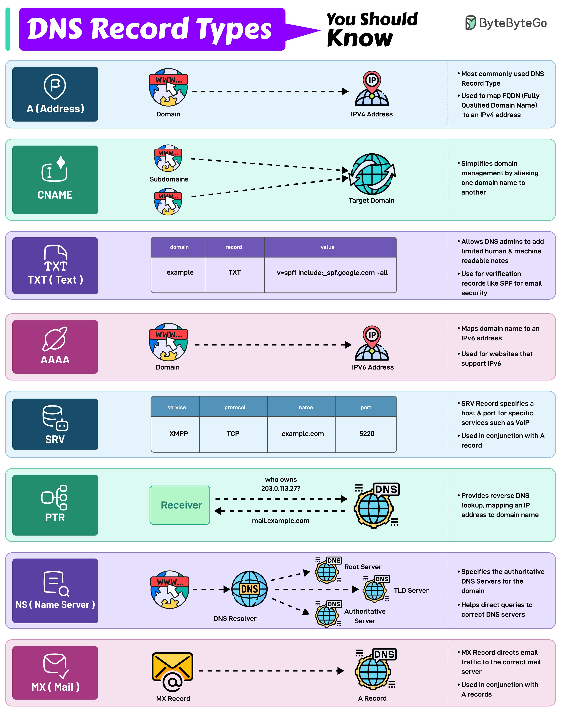

**Source:** [https://twitter.com/i/web/status/1891716788620230815](https://twitter.com/i/web/status/1891716788620230815)
**Original Post Date:** 2025-05-27 16:41:26

# DNS Record Types: Comprehensive Guide for Network Architects

## Introduction
Domain Name System (DNS) is the backbone of internet connectivity, translating human-readable domain names to machine-readable IP addresses. Understanding DNS record types is crucial for network architects, system administrators, and developers managing web infrastructure.

This guide explores eight essential DNS record types, their technical specifications, and practical applications in modern networking architectures.

## A (Address) Record

The A record is the most fundamental DNS resource record type, mapping a Fully Qualified Domain Name (FQDN) to an IPv4 address. This straightforward but critical relationship forms the basis of most domain resolution processes.

When a user types www.example.com into their browser, the A record directs this request to the corresponding IP address (e.g., 192.0.2.1). This direct mapping ensures reliable and efficient DNS resolution for IPv4-based services.

_Example of an A record in standard BIND format, specifying the domain name, type (A), and IPv4 address._

```text
www.example.com IN A 192.0.2.1
```

## CNAME (Canonical Name) Record

The CNAME record creates aliases between domain names. Unlike A records that map to IP addresses, CNAME records create a symbolic link from one DNS name to another.

This is particularly useful for maintaining consistency when multiple services need to point to the same target without manually updating each record.

_Example of a CNAME record redirecting blog.example.com to resolve to whatever IP address example.com resolves to._

```text
blog.example.com IN CNAME example.com
```

## TXT (Text) Record

TXT records store arbitrary text information associated with a domain. They are primarily used for verification purposes and security protocols.

Common applications include SPF (Sender Policy Framework), DKIM (DomainKeys Identified Mail), and DMARC (Domain-based Message Authentication, Reporting & Conformance) configurations.

_Example of a TXT record implementing an SPF policy that includes Google's mail servers and rejects all others._

```text
example.com IN TXT "v=spf1 include:_spf.google.com -all"
```

## AAAA Record

The AAAA record is the IPv6 counterpart to the A record, mapping domain names to 128-bit IPv6 addresses. As IPv6 adoption increases globally, AAAA records become increasingly important for future-proof network architectures.

_Example of an AAAA record mapping www.example.com to the IPv6 address 2001:db8::1._

```text
www.example.com IN AAAA 2001:db8::1
```

## SRV (Service) Record

The SRV record specifies the location, protocol, and port number for services within a domain. It's particularly useful in distributed systems where multiple service endpoints exist.

This record type helps clients locate specific services without hardcoding IP addresses or ports.

_Example of an SRV record specifying that the XMPP service on TCP port 5269 is available at mailserver.example.com._

```text
_xmpp._tcp.example.com IN SRV 0 5 5269 mailserver.example.com
```

## PTR (Pointer) Record

The PTR record enables reverse DNS lookups, mapping IP addresses back to domain names. This process verifies that an IP address corresponds to a specific hostname.

Reverse DNS is critical for email authentication and network diagnostics.

_Example of a PTR record mapping the IP address 203.0.113.27 to mail.example.com._

```text
27.113.0.203.in-addr.arpa IN PTR mail.example.com
```

## NS (Name Server) Record

The NS record identifies authoritative name servers for a domain, delegating DNS authority and enabling hierarchical management of DNS infrastructure.

Each subdomain typically has its own set of NS records pointing to the servers responsible for that specific zone.

_Example of NS records specifying two authoritative name servers for example.com._

```text
example.com IN NS ns1.example.com
example.com IN NS ns2.example.com
```

## MX (Mail Exchange) Record

The MX record specifies the mail server responsible for accepting email messages on behalf of a domain. It includes a priority value to determine the order in which multiple mail servers should be tried.

Lower numerical values indicate higher priority.

_Example of MX records specifying primary (priority 10) and secondary (priority 20) mail servers for example.com._

```text
example.com IN MX 10 mail.example.com
example.com IN MX 20 backup.mail.example.com
```

## Key Takeaways

- DNS record types serve distinct purposes in the domain resolution process, from basic IP mapping to complex service discovery.
- Properly configured DNS records are essential for email delivery, web services, and network security.
- Modern architectures often require a combination of multiple record types to ensure redundancy, reliability, and efficient operation.

## Conclusion
Understanding the intricacies of DNS record types is fundamental for designing robust networking infrastructure. Each record type plays a specific role in enabling internet connectivity, email delivery, service discovery, and security verification. As network architectures evolve, maintaining expertise in DNS configuration becomes increasingly critical for system reliability and performance.

## External References

- [DNS Resource Records - RFC 1035](https://tools.ietf.org/html/rfc1035)
- [Understanding DNS: Concepts and Tools by Paul Crichton](http://www.admin-solutions.com/understanding-dns.pdf)
- [OpenDNS Engineering Blog](https://blog.opendns.com/)


## Media

**Image Description:** The image is an infographic titled **"DNS Record Types You Should Know"**, created by **ByteByteGo**. It provides a comprehensive overview of various DNS (Domain Name System) record types, their purposes, and how they function. The infographic is visually organized into sections, each detailing a specific DNS record type with icons, descriptions, and examples. Below is a detailed breakdown:

---

### **1. A (Address) Record**
- **Icon**: A shield with a checkmark.
- **Description**: The most commonly used DNS record type.
- **Purpose**: Maps a Fully Qualified Domain Name (FQDN) to an IPv4 address.
- **Diagram**: Shows a domain (e.g., `www.example.com`) pointing to an IPv4 address (e.g., `192.0.2.1`).
- **Example**:  
  ```
  www.example.com → 192.0.2.1
  ```

---

### **2. CNAME (Canonical Name) Record**
- **Icon**: A globe with an arrow.
- **Description**: Simplifies domain management by aliasing one domain name to another.
- **Purpose**: Creates an alias for a domain, allowing it to point to another domain name.
- **Diagram**: Shows a subdomain (e.g., `subdomain.example.com`) pointing to a target domain (e.g., `example.com`).
- **Example**:  
  ```
  subdomain.example.com → example.com
  ```

---

### **3. TXT (Text) Record**
- **Icon**: A document with a plus sign.
- **Description**: Allows DNS administrators to add human-readable and machine-readable notes.
- **Purpose**: Used for verification records (e.g., SPF, DKIM, DMARC) and other text-based information.
- **Diagram**: Shows a domain with a TXT record containing a value (e.g., `v=spf1 include:_spf.google.com -all`).
- **Example**:  
  ```
  example.com TXT → v=spf1 include:_spf.google.com -all
  ```

---

### **4. AAAA Record**
- **Icon**: A globe with a gear.
- **Description**: Maps a domain name to an IPv6 address.
- **Purpose**: Similar to the A record but for IPv6 addresses.
- **Diagram**: Shows a domain (e.g., `www.example.com`) pointing to an IPv6 address (e.g., `2001:db8::1`).
- **Example**:  
  ```
  www.example.com → 2001:db8::1
  ```

---

### **5. SRV (Service) Record**
- **Icon**: A database with a robot.
- **Description**: Specifies a host and port for specific services.
- **Purpose**: Used for services like VoIP, XMPP, etc., by defining the service, protocol, name, and port.
- **Diagram**: Shows an SRV record for a service (e.g., XMPP) with details like protocol (TCP), name (e.g., `example.com`), and port (e.g., `5220`).
- **Example**:  
  ```
  _xmpp._tcp.example.com SRV → 5220 example.com
  ```

---

### **6. PTR (Pointer) Record**
- **Icon**: A globe with a crosshair.
- **Description**: Provides reverse DNS lookup.
- **Purpose**: Maps an IP address to a domain name.
- **Diagram**: Shows an IP address (e.g., `203.0.113.27`) pointing to a domain name (e.g., `mail.example.com`).
- **Example**:  
  ```
  203.0.113.27 PTR → mail.example.com
  ```

---

### **7. NS (Name Server) Record**
- **Icon**: A globe with a question mark.
- **Description**: Specifies the authoritative name servers for a domain.
- **Purpose**: Indicates which DNS servers are authoritative for a domain.
- **Diagram**: Shows a domain (e.g., `example.com`) pointing to its authoritative name servers.
- **Example**:  
  ```
  example.com NS → ns1.example.com, ns2.example.com
  ```

---

### **8. MX (Mail Exchange) Record**
- **Icon**: An envelope with a checkmark.
- **Description**: Directs email traffic to the correct mail server.
- **Purpose**: Specifies the mail server responsible for handling email for a domain.
- **Diagram**: Shows a domain (e.g., `example.com`) pointing to its mail server (e.g., `mail.example.com`).
- **Example**:  
  ```
  example.com MX → mail.example.com
  ```

---

### **Overall Layout and Design**
- The infographic uses a clean, color-coded layout to differentiate between record types.
- Each section includes:
  - An icon representing the record type.
  - A descriptive title and brief explanation.
  - A diagram illustrating the flow or relationship between the domain and its corresponding value.
  - An example to demonstrate how the record is used in practice.
- The background colors alternate between shades of blue, green, purple, and pink to visually separate the sections.

---

### **Key Technical Details**
1. **A Record**: Maps domain names to IPv4 addresses.
2. **CNAME Record**: Creates aliases for domain names.
3. **TXT Record**: Used for text-based information, often for email verification (SPF, DKIM, etc.).
4. **AAAA Record**: Maps domain names to IPv6 addresses.
5. **SRV Record**: Specifies services, protocols, and ports for specific applications.
6. **PTR Record**: Provides reverse DNS lookup from IP addresses to domain names.
7. **NS Record**: Identifies authoritative DNS servers for a domain.
8. **MX Record**: Directs email traffic to the correct mail server.

---

### **Conclusion**
The infographic effectively communicates the essential DNS record types and their functions, making it a valuable resource for understanding how DNS works and how different records contribute to domain resolution and service configuration. The use of icons, diagrams, and examples enhances clarity and aids in comprehension.
