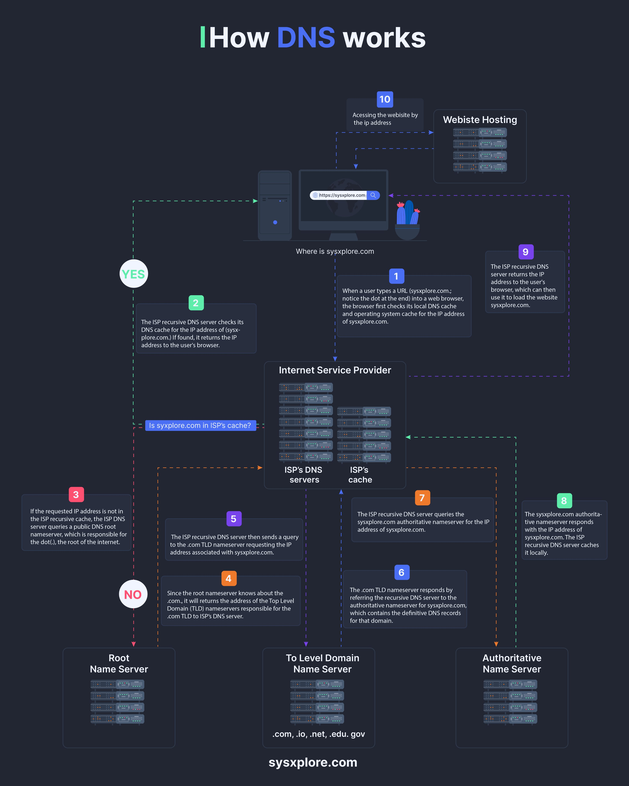

**Source:** [https://twitter.com/i/web/status/1872868881074929896](https://twitter.com/i/web/status/1872868881074929896)
**Original Post Date:** 2025-05-27 19:56:16

# DNS Resolution Process: From URL Input to Website Loading

## Introduction
The Domain Name System (DNS) is a fundamental component of the internet infrastructure that translates human-readable domain names into IP addresses. Understanding how this hierarchical system works is crucial for developers, system architects, and network engineers. This article provides a comprehensive walkthrough of DNS resolution steps, from initial user input to final website loading.

## Local Resolution Steps

When a user enters a URL (e.g., https://sysxplore.com), the browser first checks its local cache. This cache typically stores previously resolved DNS entries, reducing lookup time for frequently accessed sites.

If the local cache contains the requested domain's IP address and it hasn't expired, the browser can immediately proceed to establish a connection with the server.

- Local DNS caching improves performance for frequently visited sites
- TTL (Time To Live) values determine cache expiration

## Recursive DNS Process

If the local cache misses, the browser forwards the query to its ISP's recursive DNS server. This server handles all necessary steps to resolve the domain name.

The recursive process involves querying root servers, TLD servers, and authoritative name servers until a definitive answer is found.

```plaintext
dig +trace sysxplore.com
;; Querying root servers first...
;; Then .com TLD server
;; Finally authoritative nameserver
```

## DNS Hierarchy and Caching

Each step in the DNS resolution process includes caching mechanisms to optimize future lookups. The ISP's recursive server caches resolved addresses, while the browser maintains its local cache.

This hierarchical caching structure significantly reduces query time for subsequent requests.

1. Root Server Caching: Hours to days
1. TLD Server Caching: Hours to days
1. Authoritative Nameserver Caching: Minutes to hours

> **Note/Tip:** Monitor cache hit rates to optimize DNS performance

> **Note/Tip:** Implement zone transfers for authoritative name server redundancy

## Server Communication Flow

The final stage involves the browser establishing a connection with the web server using the resolved IP address. This initiates HTTP/HTTPS communication for content delivery.

Understanding this flow is essential for troubleshooting connectivity issues and optimizing website performance.

## Key Takeaways

- DNS resolution follows a hierarchical process from local cache to root servers
- Caching at multiple levels significantly improves query response times
- ISP recursive DNS servers act as intermediaries between users and authoritative name servers

## Conclusion
Understanding the DNS resolution process is crucial for developing robust web applications. The combination of caching mechanisms, hierarchical server structure, and efficient query handling ensures reliable domain name translation across the internet.

## External References

- [RFC 1034 - Domain Names - Concepts and Facilities](https://tools.ietf.org/html/rfc1034)
- [IETF DNS Operations Working Group](https://datatracker.ietf.org/wg/dnsop/about/)


## Media

**Image Description:** The image is a detailed flowchart illustrating the process of how the Domain Name System (DNS) works when a user types a URL into a web browser. The main subject of the image is the DNS resolution process, which translates a domain name (e.g., `sysxplore.com`) into its corresponding IP address. Below is a step-by-step breakdown of the image, focusing on the main subject and technical details:

---

### **Title**
- The title at the top of the image reads: **"How DNS works"** in bold, white, and blue text.

---

### **Main Flow**
The flowchart is divided into several steps, numbered from 1 to 10, illustrating the DNS resolution process. Each step is connected by arrows, showing the sequence of events.

---

### **Step-by-Step Breakdown**

#### **Step 1: User Input**
- **Description**: A user types a URL (e.g., `[https://sysxplore.com`)](https://sysxplore.com`)) into a web browser.
- **Visual**: A computer monitor is shown with the URL typed into the address bar.
- **Technical Detail**: The browser initiates the DNS resolution process to find the IP address associated with the domain name.

#### **Step 2: Local DNS Cache Check**
- **Description**: The browser first checks its local DNS cache (part of the operating system) for the IP address of `sysxplore.com`.
- **Visual**: A dashed line points to a local cache representation.
- **Technical Detail**: If the IP address is found in the local cache, the browser uses it directly to load the website. This step is marked as **"YES"** in the flowchart.

#### **Step 3: ISP Recursive DNS Server Check**
- **Description**: If the IP address is not found in the local cache, the browser sends a DNS query to the ISP's recursive DNS server.
- **Visual**: The query is shown traveling to the ISP's DNS server.
- **Technical Detail**: The ISP's recursive DNS server checks its own cache for the IP address of `sysxplore.com`.

#### **Step 4: Root Name Server Query**
- **Description**: If the IP address is not found in the ISP's cache, the recursive DNS server queries the root name server.
- **Visual**: The query travels to the root name server.
- **Technical Detail**: The root name server does not store specific IP addresses but directs the recursive DNS server to the appropriate Top-Level Domain (TLD) name server (e.g., `.com`).

#### **Step 5: TLD Name Server Query**
- **Description**: The recursive DNS server queries the `.com` TLD name server.
- **Visual**: The query travels to the `.com` TLD name server.
- **Technical Detail**: The `.com` TLD name server responds with the IP address of the authoritative name server for `sysxplore.com`.

#### **Step 6: Authoritative Name Server Query**
- **Description**: The recursive DNS server queries the authoritative name server for `sysxplore.com`.
- **Visual**: The query travels to the authoritative name server.
- **Technical Detail**: The authoritative name server contains the definitive DNS records for `sysxplore.com` and returns the IP address associated with the domain.

#### **Step 7: ISP Cache Update**
- **Description**: The ISP's recursive DNS server caches the IP address of `sysxplore.com` for future use.
- **Visual**: The IP address is stored in the ISP's cache.
- **Technical Detail**: This step improves performance for subsequent requests for the same domain.

#### **Step 8: Recursive DNS Server Response**
- **Description**: The ISP's recursive DNS server sends the IP address of `sysxplore.com` back to the user's browser.
- **Visual**: The IP address is returned to the browser.
- **Technical Detail**: The browser now has the IP address needed to load the website.

#### **Step 9: Browser Access**
- **Description**: The browser uses the IP address to access the website hosting server.
- **Visual**: The IP address is sent to the website hosting server.
- **Technical Detail**: The browser communicates directly with the server hosting `sysxplore.com`.

#### **Step 10: Website Loading**
- **Description**: The website hosting server responds by sending the website content to the browser.
- **Visual**: The website content is displayed on the browser.
- **Technical Detail**: The browser renders the website, and the user sees the webpage.

---

### **Key Components in the Flowchart**
1. **User's Computer**: Initiates the DNS query by typing a URL.
2. **Local DNS Cache**: First point of check for the IP address.
3. **ISP's Recursive DNS Server**: Acts as an intermediary to resolve the domain name.
4. **Root Name Server**: Directs to the appropriate TLD name server.
5. **TLD Name Server**: Provides the IP address of the authoritative name server.
6. **Authoritative Name Server**: Contains the definitive DNS records for the domain.
7. **ISP's Cache**: Stores resolved IP addresses for faster future lookups.
8. **Website Hosting Server**: Serves the website content to the browser.

---

### **Visual Elements**
- **Color Coding**: Different steps are highlighted with colors (e.g., green, purple, orange) to distinguish between stages.
- **Arrows**: Directed arrows show the flow of queries and responses between components.
- **Icons**: Representations of servers, caches, and browsers are used to visually depict the components involved.

---

### **Conclusion**
The image effectively illustrates the DNS resolution process, from the user typing a URL to the browser loading the website. It highlights the hierarchical structure of DNS servers and the caching mechanisms that optimize the resolution process. The flowchart is detailed and educational, making it easy to understand the technical steps involved in DNS resolution.
