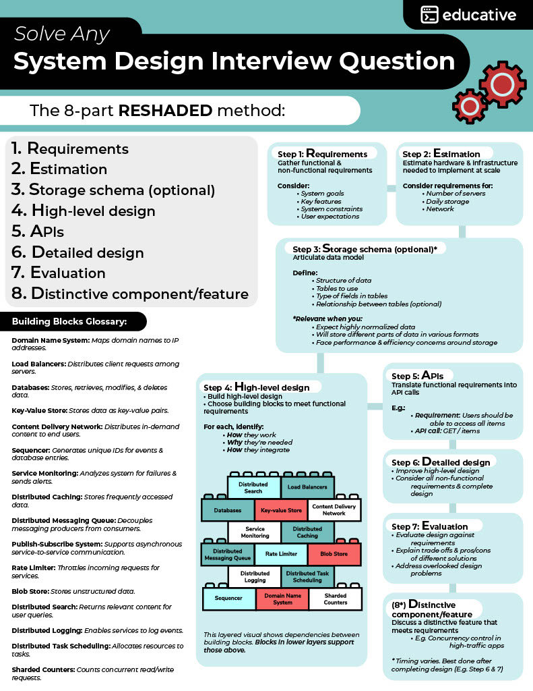

**Source:** [https://twitter.com/i/web/status/1875810743595020718](https://twitter.com/i/web/status/1875810743595020718)
**Original Post Date:** 2025-06-17 10:34:26

# RESHADED Method: A Systematic Approach to Solving System Design Interview Questions

## Introduction
System design interviews are a critical component of technical assessments at top tech companies. These interviews test your ability to architect large-scale distributed systems by combining multiple concepts and making appropriate trade-offs. The RESHADED method provides a structured approach that ensures you don't miss any crucial aspects when designing a system from scratch.

This framework has proven effective in numerous real-world scenarios, helping engineers navigate complex design discussions with confidence.

## Understanding the RESHADED Framework

RESHADED is an acronym that breaks down the system design process into eight distinct phases: Requirements, Estimation, Storage Schema (Optional), High-Level Design, APIs, Detailed Design, Evaluation, and Distinctive Component/Feature.

Each phase builds upon the previous one, creating a comprehensive approach to solving any system design question. The method is particularly valuable because it ensures you systematically address both functional requirements and critical non-functional aspects like scalability and performance.

- Requirements: Define what the system must do and constraints it must satisfy
- Estimation: Calculate resource needs based on scale assumptions
- Storage Schema: Design data models when complexity requires explicit consideration
- High-Level Design: Select appropriate building blocks for core functionality
- APIs: Define interfaces that translate requirements into implementable calls
- Detailed Design: Refine high-level design to address non-functional requirements
- Evaluation: Validate the design against all requirements and assumptions
- Distinctive Component/Feature: Highlight innovative solutions to specific challenges

## Key Building Blocks in System Design

The RESHADED method relies on a set of common building blocks that form the foundation of scalable distributed systems. These components address different aspects of system architecture and are essential for creating robust solutions.

- Databases: Core storage engines for structured data
- Load Balancers: Distribute traffic across multiple servers
- CDN (Content Delivery Network): Optimize content delivery to users globally
- Key-Value Stores: Handle high-volume, low-latency read/write operations
- Distributed Caching: Reduce database load through caching strategies
- Messaging Queues: Decouple producers and consumers in asynchronous systems
- Service Monitoring: Track system health and performance metrics

> **Note/Tip:** Choose building blocks based on specific requirements rather than using all available options.

> **Note/Tip:** Each component should have a clear purpose and justification in your design.

## Addressing Non-Functional Requirements

System design interviews often focus heavily on non-functional requirements such as scalability, availability, fault tolerance, and security. The RESHADED method ensures these aspects are systematically addressed during the detailed design phase.

- Scalability: Implement horizontal scaling strategies with load balancers
- Availability: Design for redundancy and failover mechanisms
- Performance: Optimize query patterns and leverage caching layers
- Security: Implement authentication, authorization, and data encryption

> **Note/Tip:** Always quantify non-functional requirements (e.g., 'System must handle 10k requests per second')

> **Note/Tip:** Discuss trade-offs when making design decisions based on these requirements

## Practical Application of RESHADED

Applying the RESHADED method effectively requires practice. Start by identifying sample system designs and walking through each phase systematically.

1. Begin with simple systems (e.g., URL shortener) before tackling complex ones
1. Practice whiteboarding the high-level design using appropriate notation
1. Focus on explaining your reasoning behind component choices
1. Be prepared to modify designs based on interviewer feedback

> **Note/Tip:** Use real-world examples to illustrate concepts during interviews

> **Note/Tip:** Don't be afraid to question assumptions if they impact your design decisions

## Key Takeaways

- RESHADED provides a structured approach to ensure comprehensive system designs.
- Focus on both functional requirements and non-functional aspects of the system.
- Justify component choices with clear reasoning related to specific requirements.
- Practice applying the framework to different types of systems before interviews.

## Conclusion
Mastering the RESHADED method significantly improves your ability to tackle system design interview questions. By following this structured approach, you can demonstrate a thorough understanding of distributed systems and show how you systematically address complex architectural challenges.

Remember that while the framework provides structure, the key is explaining your reasoning clearly and being able to adapt the design based on interviewer feedback and changing requirements.

## External References

- [Educative's RESHADED Method Guide](https://www.educative.io/blog/system-design-interview-guide)
- [Designing Data-Intensive Applications by Martin Kleppmann](https://dataintensive.net/)

## Media

**Image Description:** ### Image Description

The image is a structured guide titled **"Solve Any System Design Interview Question"** by **Educative**. It outlines an 8-part method called **RESHADEDED** for approaching system design interview questions. The method is designed to provide a systematic approach to designing scalable, efficient, and robust systems. Below is a detailed breakdown of the image:

---

### **Main Title and Theme**
- **Title**: "Solve Any System Design Interview Question"
- **Subtitle**: "The 8-part RESHADED method"
- **Logo**: The Educative logo is present in the top-right corner, indicating the source of the content.

---

### **The RESHADED Method**
The method is divided into 8 steps, each represented as a part of the acronym **RESHADEDED**. Each step is explained in detail, with supporting visuals and technical details.

#### **1. Requirements**
- **Objective**: Gather functional and non-functional requirements.
- **Details**:
  - **Functional Requirements**: System goals, key features, and user expectations.
  - **Non-Functional Requirements**: System constraints, performance, scalability, reliability, security, etc.
- **Visual**: A simple bullet list highlighting the types of requirements.

#### **2. Estimation**
- **Objective**: Estimate hardware and infrastructure needs.
- **Details**:
  - Consider the number of servers, daily server load, network requirements, and storage needs.
  - Estimate based on the scale of the system.
- **Visual**: A bullet list of considerations for estimation.

#### **3. Storage Schema (Optional)**
- **Objective**: Articulate the data model.
- **Details**:
  - Define the structure of data, including tables, fields, and relationships.
  - Relevant when dealing with highly normalized data or complex storage requirements.
- **Visual**: A bullet list of considerations for storage schema.

#### **4. High-Level Design**
- **Objective**: Build a high-level design using building blocks.
- **Details**:
  - Choose appropriate building blocks (e.g., databases, key-value stores, load balancers) to meet functional requirements.
  - Identify how each component works, why it's needed, and how it integrates.
- **Visual**:
  - A layered diagram showing dependencies between building blocks.
  - Building blocks include:
    - **Databases**
    - **Key-value Store**
    - **Load Balancers**
    - **Content Delivery Network**
    - **Service Monitoring**
    - **Distributed Caching**
    - **Distributed Messaging Queue**
    - **Publish-Subscribe System**
    - **Rate Limiter**
    - **Blob Store**
    - **Distributed Search**
    - **Sequencer**
    - **Domain Name System**
    - **Scheduling**
    - **Sharded Counters**

#### **5. APIs**
- **Objective**: Translate functional requirements into API calls.
- **Details**:
  - Define APIs based on user requirements.
  - Example: An API call like `GET /items` to access all items.
- **Visual**: A simple example of an API call.

#### **6. Detailed Design**
- **Objective**: Improve the high-level design by considering non-functional requirements.
- **Details**:
  - Refine the design to address performance, scalability, and other non-functional requirements.
- **Visual**: A continuation of the layered diagram, showing detailed integration of components.

#### **7. Evaluation**
- **Objective**: Evaluate the design against requirements.
- **Details**:
  - Assess the design for meeting functional and non-functional requirements.
  - Discuss trade-offs and potential solutions.
- **Visual**: A checklist-like structure for evaluation.

#### **8. Distinctive Component/Feature**
- **Objective**: Discuss a distinctive feature that meets specific requirements.
- **Details**:
  - Highlight a unique feature or component that addresses a specific need, such as concurrency control in high-traffic applications.
- **Visual**: A note emphasizing the importance of distinctive features.

---

### **Building Blocks Glossary**
The image includes a glossary of common building blocks used in system design, each with a brief description:

- **Domain Name System (DNS)**: Maps domain names to IP addresses.
- **Load Balancers**: Distributes client requests among servers.
- **Databases**: Stores, retrieves, modifies, and deletes data.
- **Key-Value Store**: Stores data as key-value pairs.
- **Content Delivery Network (CDN)**: Distributes content to end users.
- **Sequencer**: Generates unique IDs for events and database entries.
- **Service Monitoring**: Analyzes systems for failures and sends alerts.
- **Distributed Caching**: Stores frequently accessed data.
- **Distributed Messaging Queue**: Decouples producers from consumers.
- **Publish-Subscribe System**: Supports asynchronous communication.
- **Rate Limiter**: Throttles incoming requests.
- **Blob Store**: Stores unstructured data.
- **Distributed Search**: Returns relevant content for user queries.
- **Distributed Logging**: Enables services to log events.
- **Distributed Task Scheduling**: Allocates resources for tasks.
- **Sharded Counters**: Counts concurrent read/write operations.

---

### **Visual Layout**
- The image uses a clean, structured layout with:
  - **Text Boxes**: For step descriptions and glossary definitions.
  - **Icons**: To represent building blocks (e.g., database, load balancer).
  - **Layered Diagram**: To illustrate dependencies between building blocks.
  - **Color Coding**: To differentiate sections and components.

---

### **Key Technical Details**
1. **System Design Layers**: The layered diagram visually represents the dependencies between building blocks, emphasizing modularity and scalability.
2. **Building Blocks**: The glossary provides a comprehensive list of common components used in system design.
3. **Scalability and Performance**: The method emphasizes considerations for scalability, performance, and non-functional requirements.
4. **API Design**: Focuses on translating requirements into practical API calls.
5. **Distinctive Features**: Encourages identifying unique solutions to meet specific needs.

---

### **Conclusion**
The image is a comprehensive guide for solving system design interview questions, providing a structured approach through the RESHADED method. It combines textual explanations, visual aids, and a glossary to help readers understand and apply system design principles effectively. The method is particularly useful for designing scalable, efficient, and robust systems.
