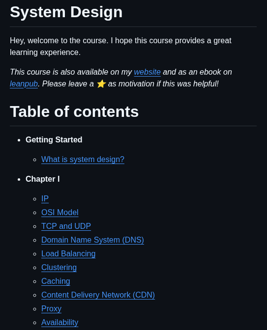

**Source:** [https://twitter.com/i/web/status/1941101970439160130](https://twitter.com/i/web/status/1941101970439160130)
**Original Post Date:** 2025-07-14 20:20:04

# System Design Interview Preparation: Core Concepts and Techniques

## Introduction
System design is a critical skill for software engineers, especially in technical interviews. This guide covers core concepts such as IP, OSI Model, TCP/UDP, DNS, load balancing, clustering, caching, CDN, proxy, and availability. These topics are fundamental to designing scalable and reliable systems.

## Introduction to System Design

System design involves creating the architecture and infrastructure for a software system. It focuses on scalability, reliability, performance, and maintainability.

The OSI Model is a conceptual framework used to understand how data moves between two devices across a network. It consists of seven layers: Physical, Data Link, Network, Transport, Session, Presentation, and Application.

- Understanding system design principles is crucial for building scalable applications.
- The OSI Model helps in troubleshooting network issues by isolating problems to specific layers.

> **Note/Tip:** Always start with the high-level design before diving into details.

> **Note/Tip:** Use diagrams to visualize your system architecture during interviews.

## Networking Basics

IP (Internet Protocol) is responsible for addressing and routing packets across networks. TCP (Transmission Control Protocol) ensures reliable, ordered delivery of data, while UDP (User Datagram Protocol) prioritizes speed over reliability.

DNS (Domain Name System) translates human-readable domain names into IP addresses, enabling users to access websites using easy-to-remember names.

- TCP is connection-oriented and ensures data integrity through error-checking and retransmission.
- UDP is connectionless and is used for applications where speed is more important than reliability, such as video streaming.

> **Note/Tip:** Understanding the difference between TCP and UDP is essential for designing networked applications.

> **Note/Tip:** DNS caching can significantly improve performance by reducing lookup times.

## Scalability and Performance

Load balancing distributes incoming traffic across multiple servers to ensure no single server bears too much load, improving performance and reliability.

Clustering involves grouping multiple servers together to act as a single system, providing redundancy and improved performance.

Caching stores frequently accessed data in memory or on disk to reduce response times. CDN (Content Delivery Network) distributes content closer to users to minimize latency.

- Load balancers can use algorithms like round-robin, least connections, or IP hash for distributing traffic.
- Clustering can be used for both horizontal and vertical scaling.

> **Note/Tip:** Implement caching at multiple levels (browser, server, CDN) to optimize performance.

> **Note/Tip:** Consider using a reverse proxy like Nginx or Apache for load balancing.

## Proxy and Availability

A proxy acts as an intermediary between clients and servers, providing benefits such as caching, security, and access control.

Availability refers to the ability of a system to remain operational over time. Techniques like redundancy, failover, and monitoring help ensure high availability.

- Proxies can be used for load balancing, caching, and filtering content.
- High availability systems often use redundant components to minimize downtime.

> **Note/Tip:** Use health checks and auto-scaling to maintain high availability.

> **Note/Tip:** Consider using tools like HAProxy or Nginx for proxying and load balancing.

## Key Takeaways

- System design involves creating scalable, reliable, and performant software architectures.
- Understanding networking basics like IP, TCP/UDP, DNS is crucial for system design.
- Load balancing, clustering, caching, CDN, proxy, and availability are key techniques for optimizing performance and reliability.

## Conclusion
Mastering these core concepts will prepare you for technical interviews and real-world system design challenges. Always focus on high-level architecture before diving into details, and use diagrams to visualize your designs.

## External References

- [OSI Model Explained](https://www.geeksforgeeks.org/osi-model/)
- [TCP vs UDP: Differences and Use Cases](https://www.cloudflarestream.com/blog/tcp-vs-udp-differences-and-use-cases/)

## Media

**Image Description:** The image shows a screenshot of a webpage or document titled **"System Design"**, which appears to be an introduction to a course or learning resource. Below is a detailed description of the content and structure:

### **Main Subject**
The main subject of the image is a **System Design course outline**, which introduces the course and provides a detailed table of contents. The content is structured in a clean, organized format with headings, subheadings, and hyperlinks.

---

### **Header**
- **Title**: "System Design" is prominently displayed at the top in bold, large font.
- **Introduction**: Below the title, there is a brief welcoming message:
  - "Hey, welcome to the course. I hope this course provides a great learning experience."
  - This sets a friendly and encouraging tone for learners.

---

### **Additional Information**
- **Course Availability**: The text mentions that the course is available in multiple formats:
  - On the author's **website** (hyperlinked as "website").
  - As an **ebook** on **Leanpub** (hyperlinked as "leanpub").
- **Motivation Prompt**: The text encourages users to leave a star (⭐) as motivation if they found the course helpful.

---

### **Table of Contents**
The main section of the image is the **Table of Contents**, which is structured hierarchically with bullet points and sub-bullet points. Here is a detailed breakdown:

#### **1. Getting Started**
- **Subtopics**:
  - **What is system design?**
    - This is a hyperlink, suggesting it leads to a detailed explanation of the concept.

#### **2. Chapter I**
- **Subtopics**:
  - **IP**
  - **OSI Model**
  - **TCP and UDP**
  - **Domain Name System (DNS)**
  - **Load Balancing**
  - **Clustering**
  - **Caching**
  - **Content Delivery Network (CDN)**
  - **Proxy**
  - **Availability**

---

### **Design and Formatting**
- **Color Scheme**:
  - The background is **dark** (black or dark gray), and the text is **light-colored** (white or light gray), providing high contrast for readability.
  - Hyperlinks are in **blue**, making them stand out.
- **Typography**:
  - Headings and subheadings are bold and clearly differentiated in size.
  - Bullet points are used to organize the content logically.
- **Layout**:
  - The content is well-structured, with clear separation between sections using horizontal lines.
  - The use of sub-bullet points helps to group related topics under broader categories.

---

### **Technical Details**
- **Hyperlinks**: Several terms are hyperlinked, indicating that they lead to more detailed explanations or resources.
- **Topics Covered**: The course appears to cover fundamental concepts in system design, networking, and distributed systems, including:
  - Networking basics (IP, OSI Model, TCP/UDP).
  - Domain Name System (DNS).
  - Scalability and performance topics (Load Balancing, Clustering, Caching, CDN).
  - Proxy servers and availability strategies.

---

### **Overall Impression**
The image presents a well-organized and user-friendly course outline. The use of hyperlinks suggests interactivity, and the structured format makes it easy for learners to navigate and understand the scope of the course. The inclusion of practical topics like DNS, Load Balancing, and CDN indicates a focus on real-world system design principles. The welcoming tone and motivation prompt add a personal touch, encouraging engagement from learners. 

This is likely part of an online course or educational resource designed for individuals interested in learning about system design and networking.
