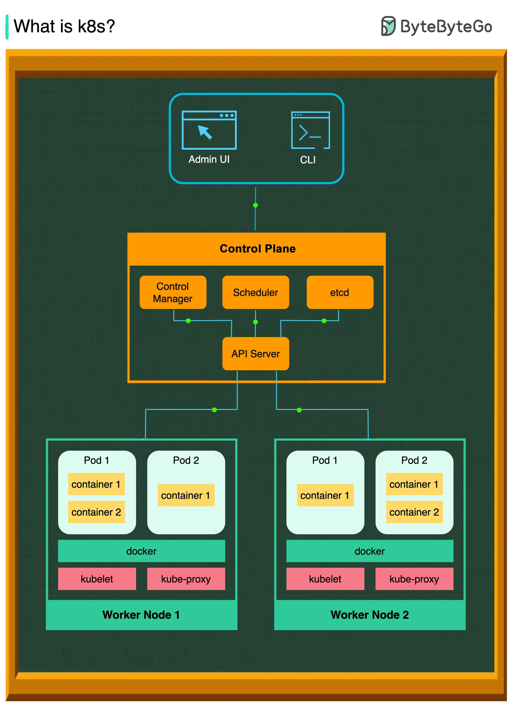

**Source:** [https://twitter.com/i/web/status/1867084687505756438](https://twitter.com/i/web/status/1867084687505756438)
**Original Post Date:** 2025-07-23 06:21:33

# Kubernetes Cluster Architecture: A Deep Dive into Components and Interactions

## Introduction
Kubernetes is a powerful open-source platform for automating containerized application deployment, scaling, and management. Understanding its architecture is crucial for effectively managing and troubleshooting Kubernetes clusters. This article delves into the core components of a Kubernetes cluster, their roles, and how they interact with each other.

## Top-Level Components

The top-level components of Kubernetes are the Admin UI and CLI (Command Line Interface). These serve as entry points for users to interact with the Kubernetes cluster. The Admin UI provides a graphical interface, while the CLI offers terminal-based management capabilities.

Both the Admin UI and CLI communicate with the API Server in the Control Plane, which is responsible for maintaining the desired state of the cluster.

- Admin UI: Graphical user interface for managing Kubernetes clusters.
- CLI (Command Line Interface): Terminal-based interface for managing Kubernetes resources.

## Control Plane

The Control Plane is the central management component of Kubernetes, responsible for maintaining the desired state of the cluster and ensuring that the actual state matches the desired state.

Key components within the Control Plane include the API Server, Scheduler, etcd (a distributed key-value store), and Control Manager. These components work together to manage the overall control loop for the cluster.

- API Server: Entry point for all communication with the Kubernetes cluster.
- Scheduler: Responsible for scheduling Pods onto nodes based on available resources and requirements.
- etcd: Distributed key-value store that serves as the backing store for all cluster data.
- Control Manager: Manages node management, replication control, and other cluster-wide operations.

## Worker Nodes

Worker Nodes are the compute nodes where containers are actually run. Each Worker Node contains Pods (groups of containers), Docker (the container runtime), Kubelet, and Kube-proxy.

Kubelet is the primary node agent that ensures containers in a Pod are running in a healthy state and reports the status to the Control Plane. Kube-proxy manages network traffic for services by maintaining network rules and performing NAT.

- Pods: Smallest deployable units containing one or more containers.
- Docker: Container runtime responsible for managing containers within Pods.
- Kubelet: Node agent ensuring healthy state of containers and reporting status to the Control Plane.
- Kube-proxy: Network proxy implementing Kubernetes Service abstraction by maintaining network rules.

## Relationships Between Components

The diagram shows the flow of communication and dependencies between components. The Admin UI and CLI interact with the API Server in the Control Plane, which communicates with etcd to maintain the cluster state.

The Scheduler interacts with the API Server to schedule Pods onto Worker Nodes. Kubelet on each Worker Node reports the status of Pods and containers to the Control Plane via the API Server.

- Admin UI and CLI interact with the API Server.
- API Server communicates with etcd for cluster state management.
- Scheduler interacts with the API Server for Pod scheduling.
- Kubelet reports status to the Control Plane via the API Server.

## Color Coding and Layout

The diagram uses color coding to differentiate between components: orange for Control Plane components, green for Worker Nodes and their components, blue for Admin UI and CLI, and yellow for containers within Pods.

The layout is organized in a top-down manner, starting with user interfaces at the top, followed by the Control Plane in the middle, and Worker Nodes at the bottom. Arrows indicate the flow of communication between components.

- Orange: Control Plane components (API Server, Scheduler, etcd, Control Manager).
- Green: Worker Nodes and their components (Pods, Docker, Kubelet, Kube-proxy).
- Blue: Admin UI and CLI.
- Yellow: Containers within Pods.

## Key Takeaways

- Kubernetes architecture consists of a Control Plane for management and Worker Nodes for executing workloads.
- Key components include the API Server, Scheduler, etcd, Kubelet, and Kube-proxy.
- The Admin UI and CLI serve as entry points for interacting with the Kubernetes cluster.
- Worker Nodes run Pods (groups of containers) using Docker as the container runtime.
- Color coding in diagrams helps differentiate between various components and their roles.

## Conclusion
Understanding the architecture of a Kubernetes cluster is essential for effective management and troubleshooting. The Control Plane manages the overall state, while Worker Nodes execute workloads. Key components like Pods, API Server, Scheduler, etcd, Kubelet, and Kube-proxy work together to ensure smooth operation.

## External References

- [Kubernetes Official Documentation](https://kubernetes.io/docs/concepts/overview/what-is-kubernetes/)
- [Kubernetes Architecture Diagram](https://kubernetes.io/docs/concepts/architecture/)

## Media

**Image Description:** ### Description of the Image

The image is a diagram illustrating the architecture of Kubernetes (commonly referred to as "k8s"), an open-source platform for automating the deployment, scaling, and management of containerized applications. The diagram is structured in a hierarchical manner, showing the components of Kubernetes and their relationships. Below is a detailed breakdown:

---

#### **1. Title**
- The title at the top of the image reads: **"What is k8s?"**
- This indicates that the diagram is meant to explain the core components and structure of Kubernetes.

---

#### **2. Top-Level Components**
- At the top of the diagram, there are two main entry points for interacting with Kubernetes:
  - **Admin UI**: A graphical user interface (GUI) for managing Kubernetes clusters.
  - **CLI (Command Line Interface)**: A terminal-based interface for managing Kubernetes resources.

---

#### **3. Control Plane**
- The **Control Plane** is the central management component of Kubernetes. It is responsible for maintaining the desired state of the cluster and ensuring that the actual state matches the desired state.
- The Control Plane is highlighted in an orange box and contains the following key components:
  - **API Server**: The entry point for all communication with the Kubernetes cluster. It exposes an API that allows users and other components to interact with the cluster.
  - **Scheduler**: Responsible for scheduling pods (groups of containers) onto nodes. It ensures that pods are placed on nodes that have the necessary resources and meet the scheduling requirements.
  - **etcd**: A distributed key-value store that serves as the backing store for all cluster data. It ensures high availability and consistency of the cluster state.
  - **Control Manager**: Manages the overall control loop for the cluster, including node management, replication control, and other cluster-wide operations.

---

#### **4. Worker Nodes**
- Below the Control Plane, there are two **Worker Nodes** (labeled as **Worker Node 1** and **Worker Node 2**), which are the compute nodes where containers are actually run.
- Each Worker Node contains the following components:
  - **Pods**: A Pod is the smallest deployable unit in Kubernetes. Each Pod can contain one or more containers. The diagram shows two Pods per Worker Node:
    - **Pod 1** and **Pod 2**.
    - Each Pod contains one or more containers (e.g., **container 1**, **container 2**).
  - **Docker**: The container runtime used to run the containers. Docker is responsible for managing the containers within the Pods.
  - **Kubelet**: The primary node agent that runs on each Worker Node. It ensures that the containers in a Pod are running in a healthy state and reports the status of the node to the Control Plane.
  - **Kube-proxy**: A network proxy that runs on each Worker Node. It is responsible for implementing the Kubernetes Service abstraction by maintaining network rules and performing network address translation (NAT) for services.

---

#### **5. Relationships Between Components**
- The diagram shows the flow of communication and dependencies between the components:
  - The **Admin UI** and **CLI** interact with the **API Server** in the Control Plane.
  - The **API Server** communicates with the **etcd** store to maintain the cluster state.
  - The **Scheduler** interacts with the **API Server** to schedule Pods onto Worker Nodes.
  - The **Kubelet** on each Worker Node communicates with the **API Server** to report the status of Pods and containers.
  - The **Kube-proxy** manages network traffic for services, ensuring that requests are routed to the appropriate Pods.

---

#### **6. Color Coding**
- The diagram uses color coding to differentiate between components:
  - **Orange**: Control Plane components (API Server, Scheduler, etcd, Control Manager).
  - **Green**: Worker Nodes and their components (Pods, Docker, Kubelet, Kube-proxy).
  - **Blue**: Admin UI and CLI.
  - **Yellow**: Containers within Pods.

---

#### **7. Layout and Structure**
- The diagram is organized in a top-down manner, starting with the user interfaces (Admin UI and CLI) at the top, followed by the Control Plane in the middle, and the Worker Nodes at the bottom.
- Arrows indicate the flow of communication between components, emphasizing the hierarchical and distributed nature of Kubernetes.

---

### **Summary**
The image provides a clear and concise overview of the Kubernetes architecture, highlighting the key components and their interactions. It shows how the Control Plane manages the cluster, while Worker Nodes execute the actual workloads (Pods and containers). The diagram effectively illustrates the distributed and scalable nature of Kubernetes, making it easier to understand the platform's core concepts.
