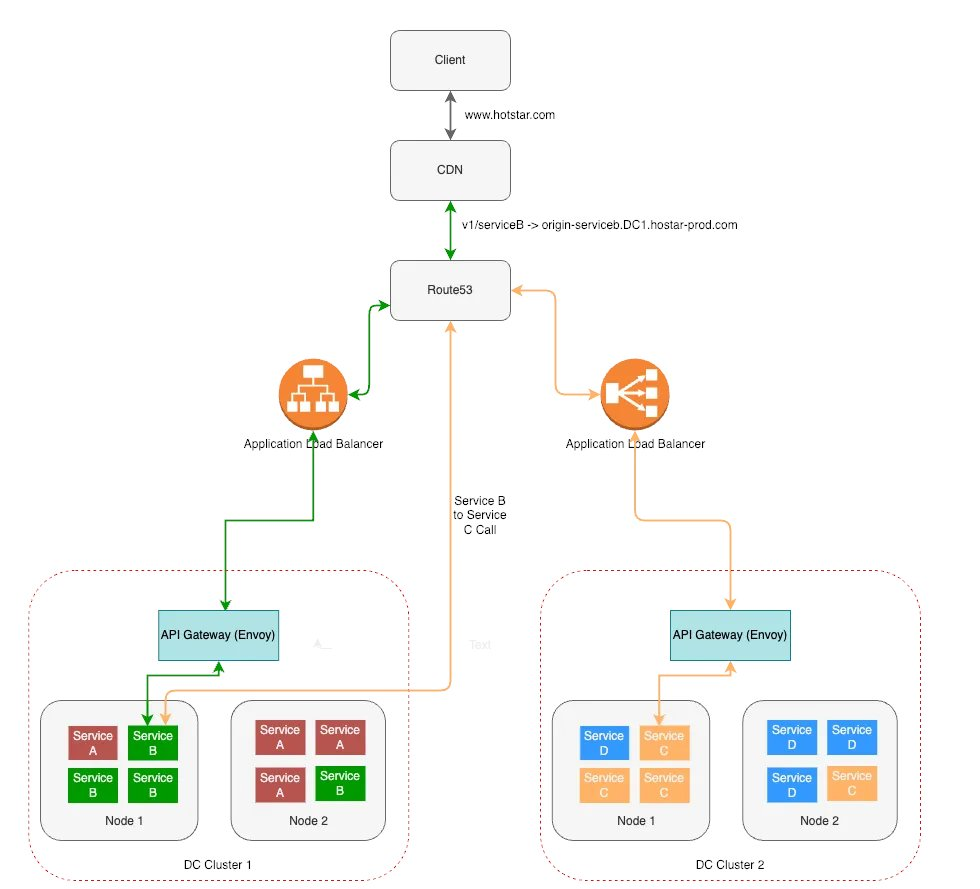

**Source:** [https://twitter.com/i/web/status/1935100656488169837](https://twitter.com/i/web/status/1935100656488169837)
**Original Post Date:** 2025-07-12 22:00:42

# Kubernetes Scaling Concepts: Horizontal Pod Autoscaler, Cluster Autoscaler, and Vertical Pod Autoscaler

## Introduction
Kubernetes is a powerful container orchestration platform that enables automated deployment, scaling, and management of containerized applications. Scaling is one of the core functionalities provided by Kubernetes, allowing applications to handle varying loads efficiently. This article delves into three key scaling concepts in Kubernetes: Horizontal Pod Autoscaler (HPA), Cluster Autoscaler, and Vertical Pod Autoscaler (VPA). We will explore their configurations, use cases, and best practices.

## Horizontal Pod Autoscaler (HPA)

The Horizontal Pod Autoscaler (HPA) is a Kubernetes resource that automatically scales the number of pods in a deployment or replica set based on observed CPU or memory utilization, or custom metrics.

HPA works by periodically adjusting the number of replicas in a deployment to meet the target average CPU or memory utilization specified in its configuration. It uses the Kubernetes metrics server to gather resource usage data from pods and adjusts the replica count accordingly.

To configure HPA, you need to specify the target CPU or memory utilization, and optionally, custom metrics. The HPA controller then runs periodically (default interval is 15 seconds) to check if the current number of replicas meets the target utilization.

- HPA is useful for applications with variable workloads, such as web servers or APIs that experience traffic spikes.
- It helps in optimizing resource usage by scaling out (increasing the number of replicas) during high load and scaling in (decreasing the number of replicas) during low load.
- HPA can be configured to use custom metrics for more granular control over scaling decisions.

> **Note/Tip:** Ensure that your application's resource requests and limits are properly set, as HPA relies on these values for accurate scaling decisions.

> **Note/Tip:** Monitor the performance of your application after enabling HPA to fine-tune the target utilization values if necessary.

## Cluster Autoscaler

The Cluster Autoscaler is a Kubernetes resource that automatically adjusts the number and size of nodes in a cluster based on the current demand for resources by pods.

Unlike HPA, which scales individual pods within a deployment, the Cluster Autoscaler focuses on scaling the infrastructure itself. It monitors the resource requirements of all pods in the cluster and adds or removes nodes as needed to accommodate these requirements.

The Cluster Autoscaler is particularly useful for managing costs in cloud environments, where you pay for the resources you use. By automatically adjusting the number of nodes, it ensures that you have enough capacity to handle your workloads without over-provisioning.

- Cluster Autoscaler is ideal for applications with unpredictable or bursty workloads.
- It helps in reducing infrastructure costs by dynamically adjusting the number of nodes based on demand.
- The Cluster Autoscaler can be configured to use different node types (e.g., spot instances, preemptible VMs) for cost optimization.

> **Note/Tip:** Ensure that your cloud provider supports the necessary APIs for the Cluster Autoscaler to function properly.

> **Note/Tip:** Monitor the performance of your cluster after enabling the Cluster Autoscaler to fine-tune its configuration if necessary.

## Vertical Pod Autoscaler (VPA)

The Vertical Pod Autoscaler (VPA) is a Kubernetes resource that automatically adjusts the resource requests and limits of pods based on their observed usage.

Unlike HPA, which scales the number of replicas, VPA focuses on optimizing the resource allocation for individual pods. It uses historical data to determine the optimal CPU and memory values for each pod, ensuring that they have enough resources to perform well without over-provisioning.

VPA is particularly useful for applications with stable workloads, where you can predict the resource requirements based on past usage patterns.

- VPA helps in optimizing resource allocation and reducing costs by ensuring that pods have the right amount of CPU and memory.
- It is useful for applications with stable workloads, where you can predict resource requirements based on past usage patterns.
- VPA can be configured to use different modes (e.g., off mode, recompute mode) for fine-tuning its behavior.

> **Note/Tip:** Ensure that your application's resource requests and limits are properly set before enabling VPA.

> **Note/Tip:** Monitor the performance of your pods after enabling VPA to fine-tune its configuration if necessary.

## Best Practices for Kubernetes Scaling

When implementing scaling in Kubernetes, it is essential to follow best practices to ensure optimal performance and cost efficiency.

Firstly, set appropriate resource requests and limits for your pods. This helps the HPA and VPA make accurate scaling decisions based on observed usage.

Secondly, monitor your application's performance regularly. Use tools like Prometheus and Grafana to gather metrics and visualize trends. This will help you fine-tune your scaling configurations and identify potential issues early on.

- Use HPA for applications with variable workloads.
- Use Cluster Autoscaler to manage costs in cloud environments.
- Use VPA for applications with stable workloads.
- Set appropriate resource requests and limits for your pods.
- Monitor your application's performance regularly.

> **Note/Tip:** Consider using custom metrics for more granular control over scaling decisions.

> **Note/Tip:** Test your scaling configurations in a staging environment before applying them to production.

## Key Takeaways

- HPA automatically scales the number of pods based on observed resource utilization or custom metrics.
- Cluster Autoscaler adjusts the number and size of nodes in a cluster based on current demand for resources by pods.
- VPA optimizes resource allocation for individual pods based on their observed usage.
- Set appropriate resource requests and limits for your pods to ensure accurate scaling decisions.
- Monitor your application's performance regularly to fine-tune your scaling configurations.

## Conclusion
In conclusion, Kubernetes provides powerful tools for scaling applications efficiently. By leveraging HPA, Cluster Autoscaler, and VPA, you can optimize resource usage, reduce costs, and ensure that your applications have the necessary capacity to handle varying workloads.

## External References

- [Kubernetes Documentation on Horizontal Pod Autoscaler](https://kubernetes.io/docs/tasks/run-application/horizontal-pod-autoscale/)
- [Kubernetes Documentation on Cluster Autoscaler](https://kubernetes.io/docs/tasks/cluster-management/cluster-autoscaler/)
- [Kubernetes Documentation on Vertical Pod Autoscaler](https://kubernetes.io/docs/tasks/vertical-pod-autoscaler/)

## Media

**Image Description:** The image depicts an architectural diagram of a distributed microservices-based system, showcasing the flow of requests from a client to various services hosted across different data centers (DCs). The diagram highlights the use of load balancing, API gateways, content delivery networks (CDNs), and DNS resolution to manage traffic efficiently. Below is a detailed breakdown of the components and their interactions:

---

### **Main Components and Flow**

1. **Client**:
   - The flow begins with a **Client** sending a request to the domain `www.hotstar.com`.
   - This is the entry point of the system, where the client interacts with the application.

2. **Content Delivery Network (CDN)**:
   - The request is first routed to a **CDN** (Content Delivery Network).
   - CDNs are used to cache static content (e.g., images, videos, CSS, JavaScript) and reduce latency by serving content from geographically closer servers.
   - The CDN helps in improving performance and scalability by handling static content requests.

3. **DNS Resolution (Route53)**:
   - After passing through the CDN, the request is resolved via **Route53**, which is Amazon's DNS service.
   - Route53 handles domain name resolution, mapping the domain `www.hotstar.com` to the appropriate IP address or service endpoint.
   - The diagram shows that Route53 routes the request to the **Application Load Balancer**.

4. **Application Load Balancer**:
   - The **Application Load Balancer** (ALB) is responsible for distributing incoming traffic across multiple targets, such as EC2 instances, containers, or other services.
   - The ALB ensures high availability and fault tolerance by routing traffic to healthy instances.
   - The ALB is shown to route traffic to **API Gateways (Envoy)** in different data centers.

5. **API Gateway (Envoy)**:
   - The **API Gateway** (implemented using **Envoy**) acts as a reverse proxy and load balancer for microservices.
   - Envoy is a popular open-source proxy designed for handling service-to-service communication in a microservices architecture.
   - The API Gateway is responsible for:
     - Routing requests to the appropriate microservices.
     - Handling authentication, rate limiting, and other API management tasks.
     - Providing observability and monitoring capabilities.

6. **Microservices**:
   - The system is built using a **microservices architecture**, where each service is independent and can be scaled and deployed separately.
   - The diagram shows two **Data Center Clusters (DC Clusters)**, each containing multiple **Nodes**:
     - **DC Cluster 1**:
       - Contains **Node 1** and **Node 2**.
       - Services deployed on these nodes include **Service A** and **Service B**.
     - **DC Cluster 2**:
       - Contains **Node 1** and **Node 2**.
       - Services deployed on these nodes include **Service C** and **Service D**.
   - Each node hosts multiple instances of the services, ensuring redundancy and scalability.

7. **Service Communication**:
   - The services (**A, B, C, D**) communicate with each other as needed to fulfill the client's request.
   - The API Gateway (Envoy) manages the communication between these services, ensuring proper routing and load balancing.

8. **Request Flow**:
   - The client request is routed through the CDN, DNS (Route53), and Load Balancer to the appropriate API Gateway.
   - The API Gateway then routes the request to the relevant microservices in the data center clusters.
   - The services collaborate to process the request and return the response back to the client.

---

### **Key Technical Details**

- **Load Balancing**:
  - **Application Load Balancer**: Distributes traffic across multiple nodes and services.
  - **API Gateway (Envoy)**: Provides additional load balancing and service-to-service communication management.

- **Microservices Architecture**:
  - Services (**A, B, C, D**) are decoupled and independently scalable.
  - Each service is hosted on multiple nodes within data center clusters for redundancy.

- **DNS and CDN**:
  - **Route53** ensures efficient DNS resolution and load balancing at the domain level.
  - **CDN** caches static content to reduce latency and improve performance.

- **Data Center Clusters**:
  - The system is distributed across **DC Cluster 1** and **DC Cluster 2** to ensure high availability and fault tolerance.
  - Each cluster contains multiple nodes, each hosting multiple service instances.

- **API Gateway (Envoy)**:
  - Envoy is used as the API Gateway, providing features like:
    - Service discovery.
    - Traffic management.
    - Security (e.g., authentication, rate limiting).
    - Observability (e.g., metrics, logging).

---

### **Summary**

The diagram illustrates a highly scalable and resilient microservices-based architecture. The system uses a combination of **CDNs**, **DNS resolution (Route53)**, **Load Balancers**, and **API Gateways (Envoy)** to manage and distribute traffic efficiently. The use of **Data Center Clusters** ensures high availability and fault tolerance, while the **microservices architecture** allows for independent scaling and deployment of individual services. The overall design emphasizes performance, reliability, and observability. 

---

### **Final Answer**:
The image depicts a distributed microservices architecture for a system hosted on **www.hotstar.com**, utilizing **CDNs**, **DNS resolution (Route53)**, **Load Balancers**, and **API Gateways (Envoy)** to manage traffic. The system is distributed across **two Data Center Clusters (DC Cluster 1 and DC Cluster 2)**, each containing multiple **Nodes** hosting independent microservices (**A, B, C, D**). The architecture ensures high availability, scalability, and fault tolerance. 

\boxed{\text{Distributed Microservices Architecture with CDNs, DNS, Load Balancers, and API Gateways}}
