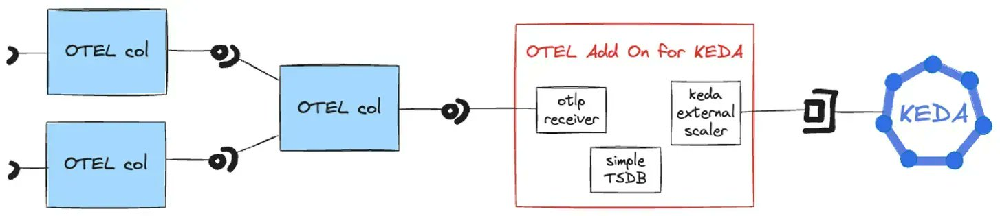

**Source:** [https://twitter.com/i/web/status/1913671703260963102](https://twitter.com/i/web/status/1913671703260963102)
**Original Post Date:** 2025-05-28 08:06:30

# KEDA OTEL Scaler Integration: Observability-Driven Autoscaling

## Introduction
Modern applications require sophisticated autoscaling mechanisms that respond to real-time performance metrics. This article explores the integration of Kubernetes Event-Driven Autoscaling (KEDA) with OpenTelemetry, enabling dynamic scaling based on observability data. By leveraging OTEL's comprehensive telemetry collection and KEDA's flexible scaling capabilities, we can create responsive systems that automatically adjust resource allocation in response to actual usage patterns.

## Architecture Overview

The integration comprises a distributed architecture where multiple OpenTelemetry collectors aggregate data from various sources. This telemetry data flows through a central collector before being processed by the KEDA External Scaler component, which generates scaling signals based on predefined metrics thresholds.

Key components include OTEL collectors for data collection, an OTLP receiver for standardized telemetry ingestion, and a time-series database (TSDB) for metric storage. The architecture ensures low-latency processing of observability data to enable timely scaling decisions.

_Configuration example showing how KEDA references the OTEL scaler and defines scaling thresholds based on telemetry data._

```yaml
apiVersion: keda.sh/v1alpha1
kind: ScaledObject
ame: otel-scaler
spec:
  scaleTargetRef:
    name: target-deployment
  minReplicaCount: 1
  maxReplicaCount: 10
  triggers:
  - type: open-telemetry
    metadata:
      metricName: request_count
      threshold: '5'
      timeWindowSeconds: '60'
```

1. OTEL collectors gather metrics from application components
1. Central collector aggregates and processes telemetry data
1. KEDA External Scaler evaluates metrics against thresholds
1. KEDA operator adjusts resource allocation based on signals

## Data Flow and Processing

The flow begins with distributed OTEL collectors that gather metrics from application components. These collectors use OTLP for efficient, protocol-agnostic transmission of telemetry data to the central collector.

After aggregation, the telemetry data enters the KEDA External Scaler where it's evaluated against configured thresholds using a simple time-series database for historical context.

- OTLP receiver normalizes incoming metrics into a consistent format
- Simple TSDB stores metric data with timestamp information
- External scaler generates scaling signals based on defined rules

## Implementation Best Practices

To maximize the effectiveness of this integration, consider implementing robust error handling and monitoring within the OTEL collector pipeline. Use appropriate sampling strategies to manage telemetry volume without compromising signal quality.

Configure KEDA with reasonable scaling thresholds that reflect your application's performance characteristics while avoiding unnecessary resource allocation.

> **Note/Tip:** Implement gradual scaling thresholds to prevent thrashing

> **Note/Tip:** Monitor collector latency for optimal autoscaling response times

> **Note/Tip:** Use sampling strategies to balance data fidelity and processing load

## Key Takeaways

- The integration leverages OTEL's standardized telemetry collection with KEDA's dynamic scaling capabilities
- Centralized processing of metrics enables efficient scaling decisions based on aggregated observability data
- Time-series database storage provides historical context for more informed autoscaling

## Conclusion
Integrating OpenTelemetry with KEDA creates a powerful system that combines comprehensive observability with responsive autoscaling. By basing scaling decisions on real-time telemetry data, this architecture enables applications to efficiently adapt to changing workloads while maintaining optimal resource utilization.

## External References

- [KEDA Documentation](https://keda.sh/docs/)
- [OpenTelemetry Project](https://opentelemetry.io)


## Media

**Image Description:** The image depicts a flowchart or diagram illustrating the integration of OpenTelemetry (OTEL) with KEDA (Kubernetes Event-Driven Autoscaling). The diagram outlines the components and their interactions in a technical setup. Below is a detailed description:

### **Main Components and Structure**

1. **OpenTelemetry (OTEL) Components:**
   - The diagram shows multiple instances of "OTEL col" (likely short for "OpenTelemetry Collector") on the left side of the image. These represent OpenTelemetry collectors, which are responsible for collecting telemetry data (metrics, traces, and logs) from various sources.
   - There are four "OTEL col" boxes, each connected to a central "OTEL col" box in the middle. This central box likely represents a unified or aggregated collector that processes data from the other collectors.

2. **Central OTEL Collector:**
   - The central "OTEL col" box acts as a hub, collecting data from the four peripheral collectors. This suggests a centralized processing or aggregation of telemetry data.

3. **OTEL Add-On for KEDA:**
   - To the right of the central OTEL collector, there is a red-bordered box labeled "OTEL Add On for KEDA." This indicates an integration or extension of OpenTelemetry with KEDA.
   - Inside this red-bordered box, there are three smaller components:
     - **OTLP Receiver:** This component is responsible for receiving telemetry data in the OpenTelemetry Protocol (OTLP) format. OTLP is a protocol used for transmitting telemetry data between OpenTelemetry components.
     - **KEDA External Scaler:** This component represents the integration point with KEDA. It acts as an external scaler, which means it provides scaling signals to KEDA based on the telemetry data received.
     - **Simple TSDB:** This component is labeled as a "simple TSDB" (Time Series Database). It suggests that the telemetry data is stored or processed in a time-series database format, which is common for metrics and traces.

4. **KEDA Component:**
   - On the far right, there is a hexagonal shape labeled "KEDA." This represents the Kubernetes Event-Driven Autoscaling (KEDA) system. KEDA is a Kubernetes operator that enables event-driven scaling of applications based on external triggers or metrics.
   - The hexagonal shape is connected to the "KEDA External Scaler" component, indicating that the scaler provides scaling signals to KEDA.

### **Flow of Data and Interactions:**

1. **Data Collection:**
   - Multiple OTEL collectors (peripheral "OTEL col" boxes) collect telemetry data from various sources.
   - This data is forwarded to the central "OTEL col" box for aggregation or processing.

2. **Data Processing and Integration:**
   - The central OTEL collector sends the aggregated telemetry data to the "OTEL Add On for KEDA."
   - Inside the "OTEL Add On for KEDA":
     - The **OTLP Receiver** processes the incoming telemetry data in OTLP format.
     - The **Simple TSDB** component stores or processes the telemetry data in a time-series database format.
     - The **KEDA External Scaler** generates scaling signals based on the telemetry data.

3. **Scaling with KEDA:**
   - The scaling signals from the "KEDA External Scaler" are sent to the KEDA component.
   - KEDA uses these signals to scale Kubernetes resources (e.g., deployments, pods) based on the telemetry data.

### **Technical Details and Observations:**

- **OpenTelemetry (OTEL):**
  - OpenTelemetry is a cloud-native observability framework that standardizes the collection and export of telemetry data (metrics, traces, and logs).
  - The diagram emphasizes the use of OTLP for data transmission, which is a modern and efficient protocol for telemetry data exchange.

- **KEDA (Kubernetes Event-Driven Autoscaling):**
  - KEDA is an open-source project that enables event-driven scaling of Kubernetes workloads. It can scale based on various triggers, including metrics from external systems.
  - The integration with OpenTelemetry allows KEDA to scale based on telemetry data, such as application metrics or traces.

- **Integration Focus:**
  - The diagram highlights the integration of OpenTelemetry with KEDA through an "OTEL Add On for KEDA." This add-on acts as a bridge, enabling KEDA to leverage telemetry data for scaling decisions.

- **Scalability and Observability:**
  - The setup combines observability (via OpenTelemetry) with scalability (via KEDA), allowing applications to scale dynamically based on real-time telemetry data.

### **Summary:**

The image illustrates a technical architecture where OpenTelemetry collectors gather telemetry data, which is then processed and integrated with KEDA through an "OTEL Add On for KEDA." This integration enables KEDA to scale Kubernetes resources based on the telemetry data, providing a powerful combination of observability and scalability. The diagram emphasizes the flow of data from collectors to KEDA, highlighting the key components and their interactions.
