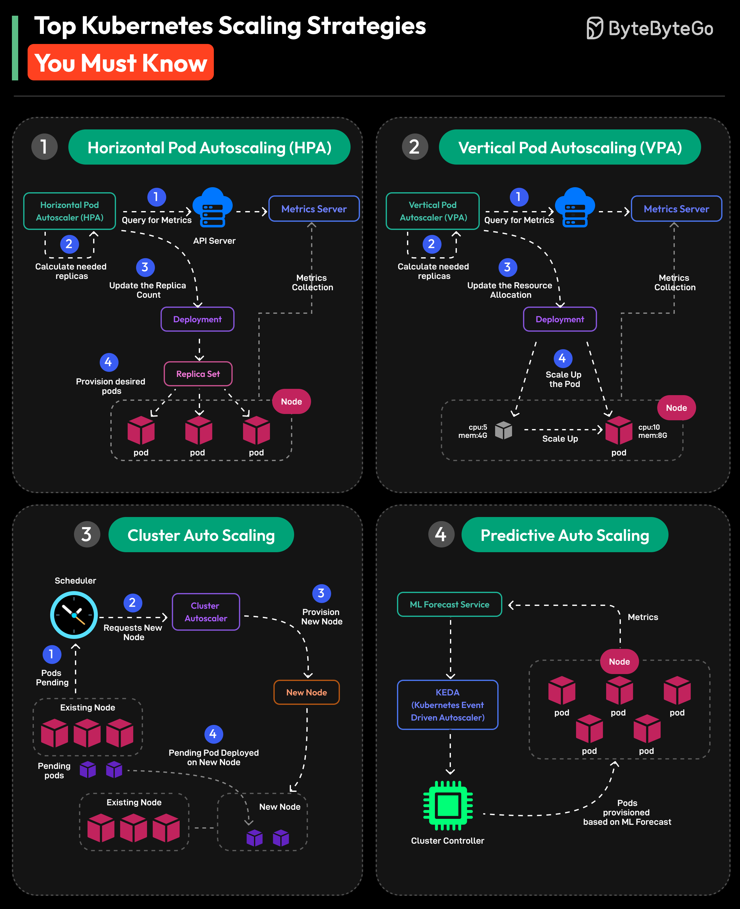

**Source:** [https://twitter.com/i/web/status/1925574891837022469](https://twitter.com/i/web/status/1925574891837022469)
**Original Post Date:** 2025-05-28 08:02:50

# Kubernetes Scaling Strategies: A Comprehensive Guide to HPA, VPA, CAS, and Predictive Autoscaling

## Introduction
Kubernetes provides multiple sophisticated approaches to handle workload demands efficiently. This guide explores four core scaling strategies - Horizontal Pod Autoscaling, Vertical Pod Autoscaling, Cluster Auto Scaling, and Predictive Autoscaling - each serving distinct use cases in modern cloud-native architectures. Understanding these mechanisms is crucial for building resilient, cost-effective Kubernetes deployments.

## Horizontal Pod Autoscaling (HPA)

HPA dynamically adjusts pod count based on observed metrics like CPU and memory usage.

The process involves the HPA querying the Metrics Server, calculating required replicas, updating ReplicaSets, and provisioning new pods.

```yaml
apiVersion: autoscaling/v2
kind: HorizontalPodAutoscaler
target:
  apiVersion: apps/v1
  kind: Deployment
  name: my-app
spec:
  minReplicas: 3
  maxReplicas: 10
  metrics:
    - type: Resource
      resource:
        name: cpu
        targetAverageUtilization: 50
```

- Best suited for stateless applications with predictable scaling patterns
- Requires careful metric selection to avoid thrashing
- Works well in combination with VPA

## Vertical Pod Autoscaling (VPA)

VPA automatically adjusts individual pod resources by modifying CPU and memory limits.

The VPA controller monitors resource usage and updates container requests and limits accordingly.

1. Reduces node fragmentation through efficient resource utilization
1. Minimizes manual intervention for resource management
1. Ideal for pods with varying workload patterns

## Cluster Auto Scaling (CAS)

CAS dynamically adjusts the cluster's node count based on pod scheduling demands.

Works through integration between Scheduler, Cluster Autoscaler, and underlying cloud provider.

> **Note/Tip:** Enable node auto-discovery to avoid scaling inefficiencies

> **Note/Tip:** Configure proper pod disruption budgets for smooth scaling

## Predictive Auto Scaling

Leverages ML forecasting to proactively scale resources before demand arises.

Uses historical metrics and KEDA integration for event-driven scaling decisions.

- Requires reliable historical data access
- Best suited for predictable seasonal patterns
- Lowers latency through proactive resource allocation

## Key Takeaways

- HPA and VPA complement each other by handling different aspects of workload scaling
- CAS ensures cluster-wide resource availability while minimizing costs
- Predictive autoscaling reduces scaling lag but requires robust ML infrastructure
- Choose strategies based on application patterns, cost constraints, and operational requirements

## Conclusion
Effective Kubernetes deployment requires strategic selection and combination of these scaling mechanisms. While HPA and VPA address individual workload scaling needs, CAS ensures cluster-wide resource availability. Predictive autoscaling offers advanced capabilities but demands additional infrastructure investment.

## External References

- [Kubernetes Horizontal Pod Autoscaler Documentation](https://kubernetes.io/docs/tasks/run-application/horizontal-pod-autoscale/)
- [Vertical Pod Autoscaler GitHub Repository](https://github.com/kubernetes/autoscaler/tree/master/vertical-pod-autoscaler)


## Media

**Image Description:** The image is a detailed infographic that outlines **four key Kubernetes scaling strategies**. Each strategy is presented in a quadrant format, with clear diagrams and explanations of how they work. The main subject of the image is the **scaling strategies** used in Kubernetes to manage resource allocation and workload distribution efficiently. Below is a detailed breakdown of each quadrant:

---

### **1. Horizontal Pod Autoscaling (HPA)**
- **Description**: Horizontal Pod Autoscaling (HPA) is a Kubernetes feature that automatically scales the number of replicas (pods) of a deployment based on observed metrics (e.g., CPU utilization, memory usage, custom metrics).
- **Key Components**:
  - **Horizontal Pod Autoscaler (HPA)**: The controller responsible for scaling.
  - **Metrics Server**: Collects and provides metrics data.
  - **API Server**: Manages Kubernetes API requests.
  - **Deployment**: The Kubernetes object that defines the desired state of the application.
  - **ReplicaSet**: Manages the actual pods.
  - **Node**: The worker node where pods are deployed.
- **Process**:
  1. **Query for Metrics**: The HPA queries the Metrics Server for the current resource usage.
  2. **Calculate Replicas Needed**: Based on the metrics, the HPA calculates the required number of replicas.
  3. **Update Replica Count**: The HPA updates the ReplicaSet to reflect the new number of replicas.
  4. **Provision Pods**: The ReplicaSet provisions the desired number of pods on available nodes.
- **Visualization**: The diagram shows pods being scaled horizontally (increasing or decreasing the number of pods) based on demand.

---

### **2. Vertical Pod Autoscaling (VPA)**
- **Description**: Vertical Pod Autoscaling (VPA) automatically adjusts the resource requests and limits (CPU and memory) of individual pods based on their usage patterns.
- **Key Components**:
  - **Vertical Pod Autoscaler (VPA)**: The controller responsible for scaling.
  - **Metrics Server**: Collects and provides metrics data.
  - **API Server**: Manages Kubernetes API requests.
  - **Deployment**: The Kubernetes object that defines the desired state of the application.
  - **Node**: The worker node where pods are deployed.
- **Process**:
  1. **Query for Metrics**: The VPA queries the Metrics Server for the current resource usage.
  2. **Calculate Resource Needed**: Based on the metrics, the VPA calculates the required CPU and memory resources.
  3. **Update Resource Allocation**: The VPA updates the resource requests and limits for the pods.
  4. **Scale Up Pod Resources**: The pod's resource allocation is adjusted accordingly.
- **Visualization**: The diagram shows pods being scaled vertically (increasing or decreasing CPU and memory resources) based on demand.

---

### **3. Cluster Auto Scaling (CAS)**
- **Description**: Cluster Auto Scaling (CAS) automatically scales the number of nodes in a Kubernetes cluster based on the demand for resources. It adds or removes nodes to ensure that all pods can be scheduled and run efficiently.
- **Key Components**:
  - **Scheduler**: Schedules pods onto nodes.
  - **Cluster Autoscaler**: The controller responsible for scaling the cluster.
  - **Autoscaler**: Manages scaling decisions.
  - **Node**: The worker node where pods are deployed.
- **Process**:
  1. **Requests New Node**: When there are pending pods that cannot be scheduled due to insufficient resources, the Scheduler requests a new node.
  2. **Provision New Node**: The Cluster Autoscaler provisions a new node in the cluster.
  3. **Deploy Pods**: The Scheduler schedules the pending pods onto the new node.
  4. **Scale Down Nodes**: If the demand decreases, the Cluster Autoscaler can remove nodes to optimize resource usage.
- **Visualization**: The diagram shows the addition and removal of nodes in the cluster to accommodate the workload.

---

### **4. Predictive Auto Scaling**
- **Description**: Predictive Auto Scaling uses machine learning (ML) to forecast future resource demands and scale the cluster proactively. This strategy aims to reduce latency and ensure optimal resource allocation by scaling before the actual demand arises.
- **Key Components**:
  - **ML Forecast Service**: Uses historical data to predict future resource needs.
  - **KEDA (Kubernetes Event-Driven Autoscaling)**: Integrates with the ML Forecast Service to trigger scaling events.
  - **Cluster Controller**: Manages the scaling of the cluster.
  - **Node**: The worker node where pods are deployed.
- **Process**:
  1. **Collect Metrics**: Metrics are collected and fed into the ML Forecast Service.
  2. **Forecast Future Demand**: The ML Forecast Service predicts future resource requirements.
  3. **Trigger Scaling Events**: KEDA uses the forecast to trigger scaling actions.
  4. **Scale Cluster**: The Cluster Controller scales the cluster (adding or removing nodes) based on the forecast.
- **Visualization**: The diagram shows the integration of ML and event-driven scaling to predictively scale the cluster.

---

### **Overall Layout and Design**
- The infographic is divided into four quadrants, each focusing on a specific scaling strategy.
- Each quadrant uses a combination of text, arrows, and colored boxes to illustrate the flow of the scaling process.
- Key components (e.g., HPA, VPA, Cluster Autoscaler, ML Forecast Service) are highlighted in distinct colors for clarity.
- The diagrams are clean and structured, making it easy to follow the flow of each strategy.

### **Purpose**
The image serves as an educational resource for understanding the different scaling strategies available in Kubernetes. It highlights the differences between horizontal scaling (HPA), vertical scaling (VPA), cluster scaling (CAS), and predictive scaling, providing a comprehensive overview of how each strategy works in practice.

---

This detailed breakdown should help anyone understand the technical aspects and processes depicted in the image.
