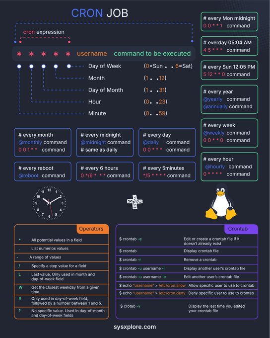

**Source:** [https://twitter.com/i/web/status/1870112992580325532](https://twitter.com/i/web/status/1870112992580325532)
**Original Post Date:** 2025-05-27 23:51:32

# Linux Cron Jobs: Comprehensive Guide to Task Scheduling

## Introduction
Cron jobs are fundamental automation tools in Unix-like systems, enabling precise time-based execution of tasks. This guide provides a comprehensive overview from basic syntax to advanced usage patterns, ensuring developers can effectively schedule scripts and commands with exact timing control. We'll explore the cron expression structure, common scenarios, special keywords, and essential crontab management techniques.

## Cron Expression Structure

The cron expression follows a standardized format to specify execution times:

Each field in the expression represents a specific time component, from minute-level precision up to weekly and monthly intervals.

```bash
* * * * * username command
# Field 1: Minute (0-59)
# Field 2: Hour (0-23)
# Field 3: Day of Month (1-31)
# Field 4: Month (1-12)
# Field 5: Day of Week (0-7)
```

## Common Cron Job Examples

- Every month midnight: `0 0 1 * *`
- Daily execution at noon: `0 12 * * *`
- Weekly on Sundays: `0 0 * * 0`
- Monthly first day: `0 0 1 * *`

## Operators and Special Characters

Cron uses various operators to define flexible scheduling patterns.

1. *: Matches any value in the field
1. ,: Specifies individual values (e.g., 1,15)
1. -: Defines a range of values (e.g., 1-5)
1. /: Sets step intervals (e.g., */5 for every 5 minutes)

## Crontab Management Commands

Managing cron jobs requires understanding the crontab utility's core commands.

- `crontab -e`: Edit user's cron schedule
- `crontab -l`: List current cron entries
- `crontab -r`: Remove all cron jobs

## Permissions and Access Control

System administrators can control who has access to crontab using system files.

> **Note/Tip:** /etc/cron.allow lists permitted users

> **Note/Tip:** /etc/cron.deny blocks specific users

## Key Takeaways

- Master the five-field cron expression structure for precise scheduling
- Use special keywords (@reboot, @daily) for common intervals
- Understand operators (*, -, /) for flexible time patterns
- Manage permissions through system-wide configuration

## Conclusion
Cron jobs offer powerful automation capabilities in Linux systems. By understanding the expression structure and available commands, developers can implement reliable task scheduling solutions. Remember to test cron jobs thoroughly and monitor their execution for optimal system maintenance.

## External References

- [Original Infographic Source](https://sysxsplore.com)


## Media

**Image Description:** This image is a detailed infographic about **Cron Jobs**, a scheduling tool used in Unix-like operating systems to execute commands or scripts at specified intervals. The infographic is visually organized and includes explanations of cron expressions, operators, commands, and related tools like `crontab`. Below is a detailed breakdown:

---

### **Main Subject: Cron Jobs**
The central theme of the image is the structure and usage of **Cron Jobs**, which are used to automate tasks by scheduling commands to run at specific times or intervals.

---

### **Key Sections and Details**

#### 1. **Cron Expression**
- **Structure**: The cron expression is formatted as:
  ```
  * * * * * username command
  ```
  - **Fields**:
    1. **Minute** (`0-59`)
    2. **Hour** (`0-23`)
    3. **Day of Month** (`1-31`)
    4. **Month** (`1-12` or names like `Jan`, `Feb`)
    5. **Day of Week** (`0-7` or names like `Sun`, `Mon`; `0` and `7` both represent Sunday)
    6. **Username** (optional, specifies the user under which the command runs)
    7. **Command** (the command or script to execute)

- **Explanation of Fields**:
  - **Minute**: Specifies the minute of the hour (e.g., `0` for every hour on the hour).
  - **Hour**: Specifies the hour of the day (e.g., `12` for noon).
  - **Day of Month**: Specifies the day of the month (e.g., `15` for the 15th day).
  - **Month**: Specifies the month (e.g., `6` for June).
  - **Day of Week**: Specifies the day of the week (e.g., `1` for Monday).

#### 2. **Common Cron Job Examples**
- The infographic provides examples of cron expressions for common scheduling scenarios:
  - **Every Month Midnight**: `0 0 1 * *`
  - **Every Midnight**: `0 0 * * *`
  - **Every Day**: `0 * * * *`
  - **Every Week**: `0 0 * * 0`
  - **Every Year**: `0 0 1 1 *`
  - **Every Reboot**: `@reboot`
  - **Every 6 Hours**: `0 */6 * * *`
  - **Every 5 Minutes**: `*/5 * * * *`

#### 3. **Special Keywords**
- The infographic lists special keywords that can replace cron expressions for common intervals:
  - `@reboot`: Run the command when the system boots.
  - `@yearly` or `@annually`: Run once a year (same as `0 0 1 1 *`).
  - `@monthly`: Run once a month (same as `0 0 1 * *`).
  - `@weekly`: Run once a week (same as `0 0 * * 0`).
  - `@daily` or `@midnight`: Run once a day (same as `0 0 * * *`).
  - `@hourly`: Run once an hour (same as `0 * * * *`).

#### 4. **Operators**
- The infographic explains operators used in cron expressions:
  - **`*`**: Matches every value in the field (e.g., `*` in the hour field means every hour).
  - **`,`**: Lists specific values (e.g., `1,15` in the day field means the 1st and 15th of the month).
  - **`-`**: Specifies a range of values (e.g., `1-5` in the day field means days 1 through 5).
  - **`/`**: Specifies a step value (e.g., `*/5` in the minute field means every 5 minutes).
  - **`L`**: Last value in the field (e.g., `L` in the day of month field means the last day of the month).
  - **`W`**: Nearest weekday (e.g., `5W` in the day of month field means the nearest weekday to the 5th).
  - **`#`**: Specifies the occurrence of a day in a month (e.g., `3#2` in the day of week field means the second Tuesday of the month).
  - **`?`**: No specific value (used in day of month or day of week fields when the other is specified).

#### 5. **Crontab Commands**
- The infographic provides a list of commands related to managing cron jobs using the `crontab` utility:
  - **`crontab -e`**: Edit or create a crontab file for the current user.
  - **`crontab -l`**: List the crontab file for the current user.
  - **`crontab -r`**: Remove the crontab file for the current user.
  - **`crontab -u username`**: Manage another user's crontab file (e.g., `-u username -e` to edit another user's crontab).
  - **`crontab -v`**: Display the last time the crontab file was edited.

#### 6. **Permissions**
- The infographic mentions files used to control user access to cron jobs:
  - **`/etc/cron.allow`**: Lists users allowed to use cron jobs.
  - **`/etc/cron.deny`**: Lists users denied access to cron jobs.

#### 7. **Visual Elements**
- **Clock**: A clock is included to visually represent the concept of time scheduling.
- **Linux Penguin**: The Linux penguin logo is present, indicating that this is a Unix/Linux-specific tool.
- **Color Coding**: Different sections are color-coded for better readability:
  - **Blue Boxes**: Examples of cron expressions.
  - **Orange Boxes**: Operators and their explanations.
  - **Green Boxes**: Special keywords for common intervals.
  - **White Boxes**: Commands and permissions.

#### 8. **Footer**
- The footer includes the website `sysxsplore.com`, likely the source of the infographic.

---

### **Overall Design**
The infographic is well-organized, using a dark theme with contrasting colors to highlight different sections. It provides a comprehensive overview of cron jobs, from basic syntax to advanced usage, making it a useful reference for both beginners and experienced users.

---

### **Summary**
This image is a detailed and visually appealing guide to understanding and using **Cron Jobs** in Unix-like systems. It covers cron expressions, special keywords, operators, crontab commands, and permissions, making it a valuable resource for automating tasks on Linux or Unix systems.
