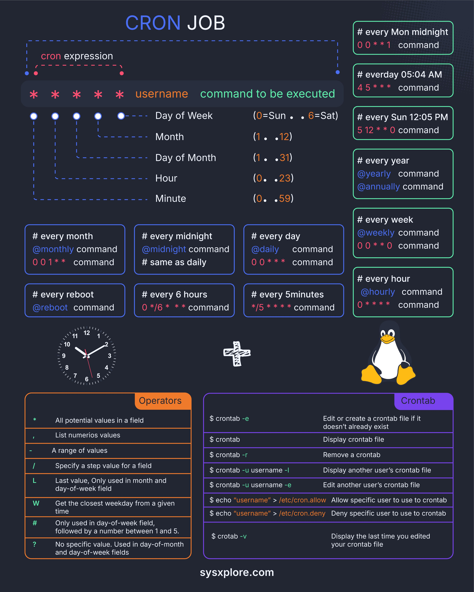

**Source:** [https://twitter.com/i/web/status/1879999010142142618](https://twitter.com/i/web/status/1879999010142142618)
**Original Post Date:** 2025-05-28 05:14:17

# Linux Cron Jobs: Mastering Task Scheduling and Automation

## Introduction
Cron jobs are essential tools for automating repetitive tasks in Linux environments. This guide provides a detailed exploration of the `crontab` utility, focusing on how to effectively schedule commands using Cron expressions. We'll cover everything from basic syntax to advanced scheduling techniques, ensuring you can automate tasks with precision and reliability.

## Cron Expression Syntax

A Cron expression consists of five fields specifying time intervals: minute (0-59), hour (0-23), day of month (1-31), month (1-12), and day of week (0-7, with 0/7 representing Sunday).

Each field uses specific operators to define execution patterns. The expression structure is: MINUTE HOUR DAY MONTH DAY_OF_WEEK COMMAND

_Examples showing wildcard usage, specific time scheduling, and daily task execution_

```cron
* * * * * /path/to/command
5 12 * * * echo 'Good morning!'
0 0 * * * daily_backup.sh
```

## Cron Operators and Special Keywords

Operators provide flexibility in defining complex schedules. The '*' operator specifies 'every' value in a field.

Special keywords like @daily, @weekly simplify common scheduling needs.

_Examples demonstrating special keywords and range operators_

```cron
@daily cleanup_logs
0 5 * * MON-FRI sync_data
*/15 * * * * check_server_status
```

## Crontab Management

The crontab utility allows users to manage scheduled tasks without direct system file editing.

Permissions can be controlled through /etc/cron.allow and /etc/cron.deny files.

- $ crontab -e (Edit or create crontab)
- $ crontab -l (List current tasks)
- $ crontab -r (Remove all tasks)

> **Note/Tip:** Always test cron jobs with specific times before setting to *

> **Note/Tip:** Use full paths in commands for reliability

## Key Takeaways

- Master the five-field Cron syntax and understand operator usage for precise scheduling.
- Leverage special keywords for common schedules (@daily, @weekly) to simplify configuration.
- Implement proper crontab management practices including permissions and testing.

## Conclusion
Understanding Linux cron jobs is crucial for system automation. By mastering the syntax, operators, and management commands, you can effectively schedule tasks with precision and reliability.

## External References

- [man crontab](https://man7.org/linux/man-pages/man1/crontab.1.html)
- [Linux Scheduler Documentation](https://linux.die.net/man/5/crontab)


## Media

**Image Description:** This image is a comprehensive guide to **Cron Jobs** in Linux, detailing how to schedule tasks using the `crontab` utility. Cron jobs are used to automate the execution of commands or scripts at specified intervals. The image is visually organized into sections, each explaining different aspects of Cron expressions, operators, and commands. Below is a detailed breakdown:

---

### **Main Subject: Cron Jobs**
The main subject of the image is the **Cron Job syntax and usage** in Linux. Cron jobs are configured using a `crontab` file, which specifies when and how often a command should run.

---

### **Key Sections in the Image**

#### 1. **Cron Expression Syntax**
   - The image shows the structure of a Cron expression, which consists of **five fields**:
     - **Minute (0-59)**
     - **Hour (0-23)**
     - **Day of Month (1-31)**
     - **Month (1-12)**
     - **Day of Week (0-7, where 0 and 7 both represent Sunday)**
   - Each field is separated by a space, and the syntax is:
     ```
     MINUTE HOUR DAY MONTH DAY_OF_WEEK COMMAND
     ```
   - Wildcards (`*`) are used to specify "every" value in a field.

#### 2. **Cron Expression Examples**
   - The image provides several examples of Cron expressions and their meanings:
     - `0 0 * * *` → Every day at midnight.
     - `0 5 * * *` → Every day at 5:00 AM.
     - `5 12 * * 0` → Every Sunday at 12:05 PM.
     - `0 0 * * 1` → Every Monday at midnight.
     - `@daily` → Every day at midnight.
     - `@weekly` → Every Sunday at midnight.
     - `@monthly` → On the first day of every month at midnight.
     - `@yearly` or `@annually` → On January 1st at midnight.
     - `@reboot` → At system startup.

#### 3. **Cron Special Keywords**
   - The image lists special keywords that can replace the five-field syntax:
     - `@reboot` → Run the command at system startup.
     - `@yearly` or `@annually` → Run once a year.
     - `@monthly` → Run once a month.
     - `@weekly` → Run once a week.
     - `@daily` → Run once a day.
     - `@hourly` → Run once an hour.
     - `@midnight` → Run at midnight (same as `@daily`).

#### 4. **Cron Operators**
   - The image explains the operators used in Cron expressions:
     - `*` → Matches every value in the field.
     - `,` → Lists specific values (e.g., `1,2,3` for days).
     - `-` → Specifies a range of values (e.g., `1-5` for days).
     - `/` → Specifies a step value (e.g., `*/5` for every 5 minutes).
     - `L` → Last value in the field (e.g., `L` in the month field means the last day of the month).
     - `W` → Nearest weekday (e.g., `5W` in the day-of-month field means the nearest weekday to the 5th).
     - `#` → Specifies the nth occurrence of a day (e.g., `5#3` means the third Friday of the month).
     - `?` → No specific value (used in day-of-month or day-of-week fields to avoid conflicts).

#### 5. **Crontab Commands**
   - The image provides a list of commands used to manage `crontab` files:
     - `$ crontab -e` → Edit or create a crontab file for the current user.
     - `$ crontab` → Display the current user's crontab file.
     - `$ crontab -r` → Remove the current user's crontab file.
     - `$ crontab -u username -l` → Display another user's crontab file.
     - `$ crontab -u username -e` → Edit another user's crontab file.
     - `$ echo "username" > /etc/cron.allow` → Allow a specific user to use `crontab`.
     - `$ echo "username" > /etc/cron.deny` → Deny a specific user from using `crontab`.
     - `$ crontab -v` → Display the last time the crontab file was edited.

#### 6. **Visual Elements**
   - The image includes:
     - A clock graphic to represent time-based scheduling.
     - A Linux penguin logo to indicate that this guide is for Linux systems.
     - Color-coded sections for better readability:
       - Blue for Cron expressions and examples.
       - Orange for operators.
       - Purple for `crontab` commands.
     - A plus sign (`+`) and a cross (`x`) symbolizing addition and removal of tasks.

#### 7. **Additional Notes**
   - The image includes comments (`#`) to explain the purpose of each Cron expression.
   - It emphasizes the use of special keywords like `@daily`, `@weekly`, etc., for common scheduling needs.

---

### **Technical Details**
1. **Cron Expression Fields**:
   - **Minute**: 0-59
   - **Hour**: 0-23 (24-hour format)
   - **Day of Month**: 1-31
   - **Month**: 1-12
   - **Day of Week**: 0-7 (0 and 7 both represent Sunday)

2. **Cron Special Keywords**:
   - These keywords simplify common scheduling tasks and are easier to use than writing out full Cron expressions.

3. **Crontab File Management**:
   - The `crontab` utility allows users to manage their scheduled tasks without directly editing system files.
   - Permissions for using `crontab` can be controlled via `/etc/cron.allow` and `/etc/cron.deny`.

4. **Operators**:
   - The use of operators like `*`, `/`, and `-` provides flexibility in specifying complex schedules.

---

### **Overall Purpose**
The image serves as an educational resource for understanding and implementing Cron jobs in Linux. It covers everything from basic syntax to advanced scheduling techniques, making it a comprehensive guide for both beginners and experienced users.

---

### **Conclusion**
This image is a well-organized and visually appealing guide to Cron jobs in Linux, providing clear explanations of syntax, examples, operators, and management commands. It is a valuable resource for anyone looking to automate tasks using Cron.
