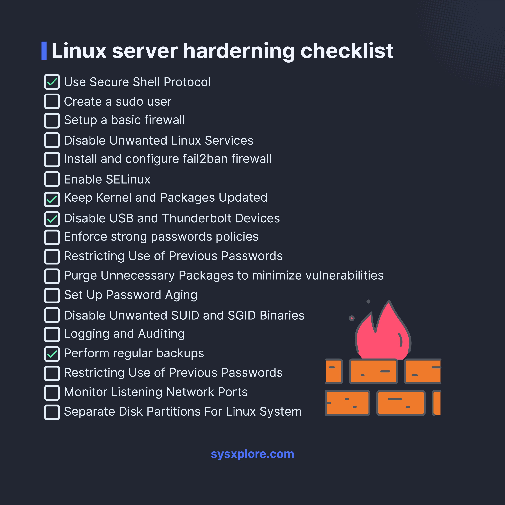

**Source:** [https://twitter.com/i/web/status/1886052013386944616](https://twitter.com/i/web/status/1886052013386944616)
**Original Post Date:** 2025-05-28 04:48:33

# Comprehensive Guide to Linux Server Hardening

## Introduction
Securing a Linux server requires methodical implementation of security measures across multiple layers. This guide provides a comprehensive checklist for implementing robust security controls, minimizing attack surfaces, and ensuring your server's integrity against modern threats.

## Secure Communication and Protocols

SSH is the cornerstone of secure remote administration. Configure SSH to use only version 2 protocol and disable root login.

Implement certificate-based authentication for added security over password-based access.

```bash
# Example sshd_config modifications
Protocol 2
PermitRootLogin no
PasswordAuthentication no
```

## User Management and Access Control

Implement sudo-based privilege management to avoid direct root access. Restrict password policy using PAM configuration.

Disable unused system accounts and services to reduce potential attack vectors.

```bash
# Example /etc/pam.d/common-password
password requisite pam_pwquality.so minlen=12 dcredit=-1 ucredit=-1 ocredit=-1 lcredit=-1
```

## Firewall and Intrusion Prevention

Configure iptables or firewalld to allow only necessary ports. Implement fail2ban for automated brute-force attack prevention.

Monitor firewall logs regularly to detect and respond to suspicious activities.

```bash
# Basic iptables rules
iptables -A INPUT -p tcp --dport 22 -j ACCEPT
iptables -P INPUT DROP
```

## SELinux and Mandatory Access Control

Enable SELinux in enforcing mode to provide additional security layer beyond traditional DAC.

Regularly audit SELinux policies for potential security gaps.

```bash
# Check SELinux status
getenforce
setenforce 1
```

## System Maintenance and Updates

Implement automated update mechanisms for security patches.

Regularly audit installed packages and remove unused components to reduce attack surface.

```bash
# Update system
apt-get update && apt-get upgrade -y
```

## Logging and Monitoring

Configure centralized logging to monitor security events across the server.

Implement automated alerts for suspicious activities through log analysis tools.

```bash
# Configure rsyslog forwarding
*.* @central-logging-server:514
```

## Backup and Recovery

Implement regular automated backups using secure protocols.

Test restore procedures periodically to ensure data recovery capability.

```bash
# Example backup script
rsync -avz /var/www/html user@backup-server:/backups/
```

## Network Security Hardening

Audit open ports and services using tools like nmap.

Implement strict network segmentation to isolate critical components.

```bash
# Scan open ports
nmap -sS localhost
```

## Physical Security Measures

Disable USB and Thunderbolt devices to prevent unauthorized physical access.

Implement BIOS/UEFI password protection.

## Key Takeaways

- Always use certificate-based authentication over passwords for SSH access.
- Regular security audits and updates are crucial for maintaining server integrity.
- Implement multiple layers of security controls including network, application, and system-level measures.
- Monitor and analyze logs continuously to detect potential security incidents early.

## Conclusion
Server hardening is an ongoing process that requires regular evaluation and adjustment. By following this structured approach and implementing the recommended security measures, you can significantly enhance your Linux server's resilience against modern cyber threats.

## External References

- [sysxplore.com](https://www.sysxplore.com)
- [NIST Cybersecurity Framework](https://www.nist.gov/cyberframework)


## Media

**Image Description:** The image is a checklist titled **"Linux server hardening checklist"**, presented in a clean, structured format. The checklist is designed to guide users through various security measures to enhance the security of a Linux server. Below is a detailed description of the image:

### **Main Subject**
The main subject of the image is the **Linux server hardening checklist**, which outlines a series of steps to improve the security posture of a Linux server. The checklist is organized into a list of tasks, each accompanied by a checkbox to mark completion.

### **Technical Details and Checklist Items**
The checklist includes the following items, grouped into categories of security practices:

1. **Secure Communication and Protocols:**
   - **Use Secure Shell (SSH) Protocol:** Ensures secure remote access to the server.

2. **User Management:**
   - **Create a sudo user:** Establishes a user with elevated privileges for administrative tasks.
   - **Disable Unwanted Linux Services:** Reduces the attack surface by disabling unnecessary services.

3. **Firewall Configuration:**
   - **Setup a basic firewall:** Provides a fundamental layer of protection against unauthorized access.
   - **Install and configure fail2ban firewall:** Enhances security by blocking brute-force attacks.

4. **Security Policies:**
   - **Enable SELinux:** Implements a mandatory access control system to enhance security.
   - **Enforce strong passwords:** Ensures that users employ secure password practices.
   - **Restricting Use of Previous Passwords:** Prevents the reuse of old passwords to maintain security.

5. **System Updates and Maintenance:**
   - **Keep Kernel and Packages Updated:** Ensures the system is patched against known vulnerabilities.
   - **Purge Unnecessary Packages:** Removes unused software to minimize potential vulnerabilities.

6. **Device Security:**
   - **Disable USB and Thunderbolt Devices:** Prevents unauthorized data transfer or malicious device usage.

7. **Password Policies:**
   - **Set Up Password Aging:** Enforces periodic password changes to maintain security.
   - **Restricting Use of Previous Passwords:** Prevents the reuse of old passwords.

8. **Privilege Management:**
   - **Disable Unwanted SUID and SGID Binaries:** Reduces the risk of privilege escalation.

9. **Logging and Auditing:**
   - **Logging and Auditing:** Tracks system activities for monitoring and forensic purposes.

10. **Backup and Recovery:**
    - **Perform regular backups:** Ensures data can be restored in case of a security incident or system failure.

11. **Network Security:**
    - **Monitor Listening Network Ports:** Identifies and secures open ports to prevent unauthorized access.

12. **Disk Partitioning:**
    - **Separate Disk Partitions:** Segregates critical system components to enhance security and manageability.

### **Visual Elements**
- **Background:** The background is dark (black or dark gray), providing a high-contrast, professional look.
- **Text:** The text is white, ensuring readability against the dark background.
- **Checkboxes:** Each item in the checklist has a checkbox next to it, allowing users to mark tasks as completed.
- **Icons and Graphics:**
  - A **red flame icon** is present on the right side, symbolizing security or potential threats.
  - A **stack of orange blocks** (possibly representing server or network components) is also visible, adding a visual element to the checklist.

### **Footer**
- The bottom of the image includes the website URL: **sysxplore.com**, indicating the source or creator of the checklist.

### **Overall Design**
The checklist is well-organized, with a clear focus on security best practices. The use of checkboxes and a clean layout makes it easy for users to follow and track their progress. The inclusion of technical terms and practices ensures that the checklist is comprehensive and relevant for system administrators or security professionals working with Linux servers.

### **Purpose**
The primary purpose of this image is to serve as a reference guide for hardening a Linux server, ensuring it is protected against common security threats and vulnerabilities. It provides a structured approach to implementing security measures systematically. 

This checklist is a valuable resource for anyone responsible for maintaining the security of a Linux-based server environment.
