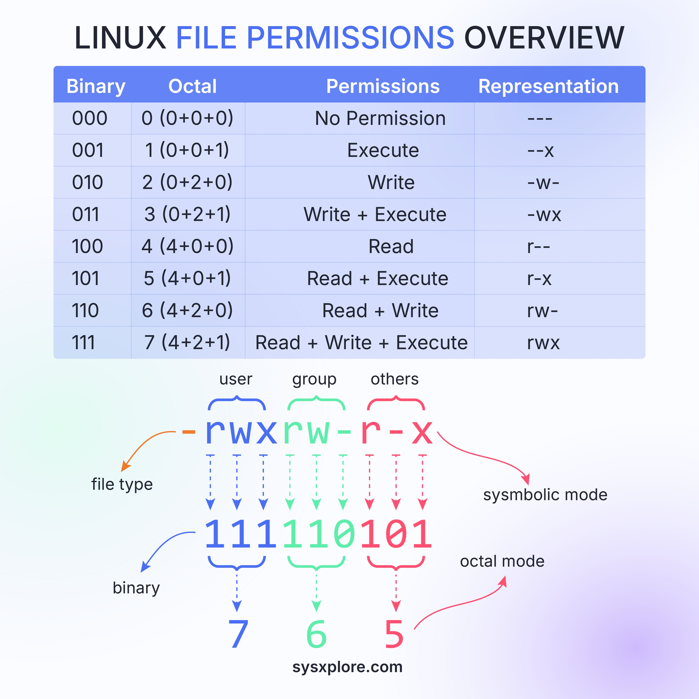

**Source:** [https://twitter.com/i/web/status/1869450507770601891](https://twitter.com/i/web/status/1869450507770601891)
**Original Post Date:** 2025-05-27 19:06:40

# Linux File Permissions: Binary, Octal, and Symbolic Representations

## Introduction
Linux file permissions are fundamental to system security and resource control. This article delves into the intricate relationship between binary, octal, and symbolic representations of permissions, providing a comprehensive understanding for system administrators and developers. We'll explore how these permission types apply to different user groups and demonstrate practical examples using real-world scenarios.

## Understanding Permission Representations

Linux file permissions use three representation systems: binary, octal, and symbolic. Each system serves a unique purpose in understanding and managing file access rights.

- Binary representation uses 0 (no permission) and 1 (permission granted)
- Octal representation condenses binary into single digits for easier manipulation
- Symbolic representation provides a mnemonic way to express permissions

## Permission Combinations

Permissions are grouped in sets of three, representing read (4), write (2), and execute (1) rights. These combinations form the basis for all permission settings.

```bash
# Example permission mapping
0 = ---
1 = --x
2 = -w-
3 = -wx
4 = r--
5 = r-x
6 = rw-
7 = rwx
```

## Group-Based Permissions

Permissions are applied to three distinct groups: user (owner), group members, and others. Each group can have different permission levels.

The example '-rw-rw-r-x' breaks down as:
- File type: Regular file
- User permissions: Read/Write
- Group permissions: Read/Write
- Others permissions: Read/Execute

## Practical Applications

Understanding permission representations enables precise control over system resources. For example, using chmod 755 file.txt sets read/write/execute for owner and read/execute for others.

```bash
# Setting directory permissions
chmod 755 /var/www/html
```

## Key Takeaways

- Binary (0-1) and octal (0-7) representations directly correlate with read, write, execute permissions
- Symbolic notation provides an intuitive way to modify specific permission bits using chmod
- Group-based permission hierarchy allows fine-grained access control across different user classes

## Conclusion
Mastering Linux file permissions is essential for system administration and secure resource management. By understanding binary, octal, and symbolic representations, administrators can precisely control access rights while maintaining system security.

## External References

- [sysxxplore.com](https://www.sysxxplore.com)


## Media

**Image Description:** The image is a detailed infographic explaining **Linux file permissions**, which are a fundamental concept in Unix-like operating systems like Linux. The infographic breaks down the permissions into binary, octal, and symbolic representations, and it also illustrates how these permissions are applied to different user groups (user, group, others). Below is a detailed description of the image:

---

### **Main Title**
- The title at the top reads: **"LINUX FILE PERMISSIONS OVERVIEW"** in bold, with "PERMISSIONS" emphasized in blue.

---

### **Table Section**
The infographic includes a table that explains the relationship between binary, octal, and symbolic representations of file permissions. The table is divided into the following columns:

1. **Binary**: Represents permissions using binary digits (0 or 1).
2. **Octal**: Represents permissions using octal numbers (0–7).
3. **Permissions**: Describes the permission in plain English (e.g., "No Permission," "Read," "Write," "Execute," etc.).
4. **Representation**: Shows the symbolic representation of the permissions using `-`, `r`, `w`, and `x`.

#### **Rows in the Table**
- Each row corresponds to a specific combination of permissions:
  - **000 (0)**: No permissions (---)
  - **001 (1)**: Execute only (---x)
  - **010 (2)**: Write only (-w-)
  - **011 (3)**: Write and Execute (-wx)
  - **100 (4)**: Read only (r--)
  - **101 (5)**: Read and Execute (r-x)
  - **110 (6)**: Read and Write (rw-)
  - **111 (7)**: Read, Write, and Execute (rwx)

#### **Key Points**
- **Binary to Octal Conversion**: Each octal digit corresponds to three binary digits (e.g., `111` in binary is `7` in octal).
- **Symbolic Representation**: 
  - `r`: Read permission
  - `w`: Write permission
  - `x`: Execute permission
  - `-`: No permission

---

### **Visual Breakdown of Permissions**
Below the table, the infographic provides a detailed breakdown of how permissions are applied to different user groups:
1. **User**: Permissions for the file owner.
2. **Group**: Permissions for users in the same group as the file.
3. **Others**: Permissions for all other users on the system.

#### **Example Permissions**
- The permissions are shown as: `-rw-rw-r-x`
  - **File Type**: The first character (`-`) indicates the file type (e.g., `-` for a regular file, `d` for a directory, etc.).
  - **User Permissions**: `rw-` (Read and Write for the user).
  - **Group Permissions**: `rw-` (Read and Write for the group).
  - **Others Permissions**: `r-x` (Read and Execute for others).

#### **Binary, Octal, and Symbolic Mapping**
- The infographic visually maps the binary, octal, and symbolic representations:
  - **Binary**: `1111111100101` (split into three groups of three digits for user, group, and others).
  - **Octal**: `765` (corresponding to the binary groups).
  - **Symbolic**: `-rw-rw-r-x` (corresponding to the octal values).

---

### **Color Coding**
- The infographic uses color coding to differentiate between the three user groups:
  - **User**: Blue
  - **Group**: Green
  - **Others**: Red

This color coding helps in visually distinguishing the permissions for each group.

---

### **Footer**
- At the bottom, the infographic includes a website reference: **sysxxplore.com**, indicating the source of the infographic.

---

### **Overall Purpose**
The infographic serves as an educational tool to help users understand how file permissions work in Linux. It explains the relationship between binary, octal, and symbolic representations and how these permissions are applied to different user groups. The use of color coding and visual breakdowns makes the concept easier to grasp for learners.

--- 

This detailed explanation covers all the key elements of the infographic, focusing on the technical details and the main subject of Linux file permissions.
