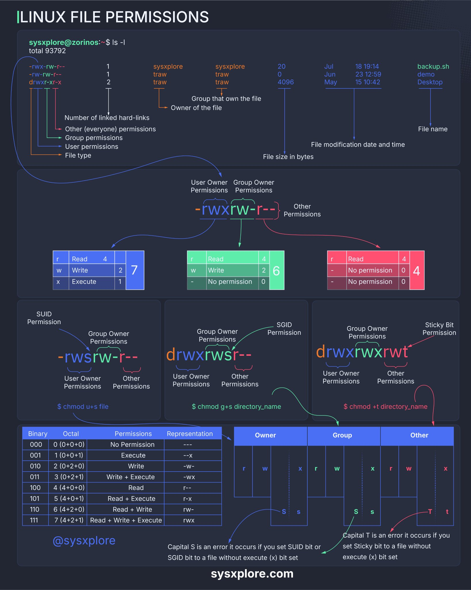

**Source:** [https://twitter.com/i/web/status/1876175649876128049](https://twitter.com/i/web/status/1876175649876128049)
**Original Post Date:** 2025-05-28 09:10:01

# Linux File Permissions: Understanding chmod, Special Bits, and Octal Notation

## Introduction
Linux file permissions are fundamental to system security and user management. They determine how users interact with files and directories through a combination of symbolic (rwx) and numeric (octal) representations. Understanding these permissions is crucial for managing access controls in Unix-like operating systems, from basic file operations to advanced configurations involving SUID, SGID, and sticky bits.

## Understanding ls -l Output

The `ls -l` command reveals the structure of Linux permissions through a 10-character string. The first character indicates file type (- for regular files, d for directories), followed by three triplets representing user (owner), group, and other permissions.

Each permission triplet contains r (read:4), w (write:2), x (execute:1) flags, where '-' means no permission. For example, -rwxrwxr-x grants full access to owner and group, read/execute only to others.

```bash
-rwxrwxr-x 2 user group 4096 Jan 1 12:00 file.txt
```

## Octal Notation and Permission Bits

Permissions can be represented numerically by summing the values of r (4), w (2), x (1) for each triplet. For example, rwx becomes 7 (4+2+1), rw- is 6 (4+2), and r-x is 5 (4+0+1).

The command `chmod 755 file` applies these values to user (7), group (5), and others (5) permissions.

```bash
chmod 755 file
```

## Special Permissions

SUID enables a program to run with its owner's permissions. SGID ensures files inherit the group ownership of their parent directory. Sticky bit prevents users from deleting others' files in shared directories.

```bash
# Set SUID
chmod u+s executable
# Set SGID
groupadd developers
chown :developers /shared
g+ws /shared
```

## Error Cases and Best Practices

Capital letters (S, T) indicate permission errors - typically when special bits are set without execute permissions.

Use chmod with caution as improper permissions can compromise system security.

- Regular files: Use rwxr-x--- (750) for sensitive data
- Directories: Set 755 for public access, 700 for private directories
- Script executables: 755 enables execution by all users

## Key Takeaways

- Master the ls -l output structure to quickly interpret permissions
- Use octal notation (e.g., 755) for precise permission setting with chmod
- Understand special permissions: SUID, SGID, and sticky bit use cases

## Conclusion
Linux file permissions form the foundation of system security. By understanding symbolic and numeric representations, you can effectively manage access controls. Special permissions provide additional security features while careful permission management prevents unauthorized access.

## External References

- [man chmod](https://linux.die.net/man/1/chmod)
- [Linux File Permissions Guide](https://www.linux.com/training-tutorials/basic-linux-permissions-need-know/)


## Media

**Image Description:** This image is a detailed infographic explaining **Linux file permissions**, a fundamental concept in Unix-like operating systems. The infographic is structured to provide a comprehensive understanding of how file and directory permissions work, including their representation, interpretation, and manipulation. Below is a detailed breakdown of the image:

---

### **Main Sections of the Infographic**

#### **1. Header and Command Output**
- **Title**: The infographic is titled **"Linux File Permissions"**.
- **Command Shown**: The command `ls -l` is executed in a terminal, displaying a long listing of files and directories. The output includes:
  - **File type** (e.g., `-` for regular files, `d` for directories).
  - **Permissions** (e.g., `-rwxrwxr-x`).
  - **Number of hard links**.
  - **Owner** and **Group** of the file.
  - **File size** in bytes.
  - **Last modification date and time**.
  - **File name**.

#### **2. Breakdown of `ls -l` Output**
- **Permissions Section**:
  - The permissions are represented as a string of 10 characters:
    - The first character indicates the file type:
      - `-` for regular files.
      - `d` for directories.
      - `l` for symbolic links.
    - The next 9 characters are divided into three groups of three:
      - **User (Owner)** permissions: First set of three characters.
      - **Group** permissions: Second set of three characters.
      - **Other (Everyone)** permissions: Third set of three characters.
    - Each set of three characters represents:
      - `r` (Read): Permission to read the file.
      - `w` (Write): Permission to write to or modify the file.
      - `x` (Execute): Permission to execute the file (if it is a script or program).
      - `-`: No permission for the respective action.

- **Example Permissions**:
  - `-rwxrwxr-x`:
    - User: Read, Write, Execute.
    - Group: Read, Write, Execute.
    - Other: Read, Execute.

#### **3. Permission Bits and Octal Representation**
- **Binary Representation**:
  - Each permission (r, w, x) is assigned a binary value:
    - `r` = 4
    - `w` = 2
    - `x` = 1
  - The sum of these values determines the octal representation for each group (User, Group, Other).
  - Example:
    - `rwx` = 4 + 2 + 1 = 7.
    - `rw-` = 4 + 2 + 0 = 6.
    - `r-x` = 4 + 0 + 1 = 5.

- **Octal Notation**:
  - Permissions can be represented in octal format, e.g., `775` for `-rwxrwxr-x`.

#### **4. Special Permissions**
- **SUID (Set User ID)**:
  - When set, the file runs with the permissions of its owner, not the user who executed it.
  - Represented by `s` or `S` in the User execute bit.
  - Command to set: `chmod u+s file`.
- **SGID (Set Group ID)**:
  - When set, the file runs with the permissions of its group, not the user's group.
  - Represented by `s` or `S` in the Group execute bit.
  - Command to set: `chmod g+s directory_name`.
- **Sticky Bit**:
  - Prevents users from deleting or renaming files in a directory unless they own the file or the directory.
  - Represented by `t` or `T` in the Other execute bit.
  - Command to set: `chmod +t directory_name`.

#### **5. Detailed Permission Table**
- **Binary, Octal, and Permission Representation**:
  - A table shows the binary, octal, and corresponding permission representations:
    - `000` (---): No permissions.
    - `001` (--x): Execute only.
    - `010` (-w-): Write only.
    - `011` (-wx): Write and execute.
    - `100` (r--): Read only.
    - `101` (r-x): Read and execute.
    - `110` (rw-): Read and write.
    - `111` (rwx): Read, write, and execute.

#### **6. Visual Representation of Permissions**
- A grid shows the permissions for Owner, Group, and Other, with:
  - `r` (Read), `w` (Write), and `x` (Execute) permissions.
  - Special permissions (SUID, SGID, Sticky Bit) are highlighted.

#### **7. Error Cases**
- **Capital S and T**:
  - If SUID or SGID is set on a file that does not have the execute bit set, it is represented as `S` or `T` (capital letters), indicating an error.
  - Similarly, the Sticky Bit (`t`) is only meaningful for directories.

#### **8. Commands for Modifying Permissions**
- **chmod Command**:
  - Used to change permissions:
    - `chmod u+s file`: Sets SUID.
    - `chmod g+s directory_name`: Sets SGID.
    - `chmod +t directory_name`: Sets Sticky Bit.

#### **9. Visual Aids**
- Arrows and annotations are used to explain the flow of permissions and their significance.
- Color coding is used to differentiate between User, Group, and Other permissions.

---

### **Key Technical Details**
1. **File Types**:
   - `-`: Regular file.
   - `d`: Directory.
   - `l`: Symbolic link.
2. **Permission Bits**:
   - `r`: Read (4).
   - `w`: Write (2).
   - `x`: Execute (1).
   - `-`: No permission (0).
3. **Special Permissions**:
   - SUID (`s` or `S` in User execute bit).
   - SGID (`s` or `S` in Group execute bit).
   - Sticky Bit (`t` or `T` in Other execute bit).
4. **Octal Notation**:
   - Permissions are often represented in octal format (e.g., `755` for `-rwxr-xr-x`).

---

### **Conclusion**
The infographic provides a comprehensive overview of Linux file permissions, covering:
- The `ls -l` command output and its components.
- Permission bits and their binary and octal representations.
- Special permissions (SUID, SGID, Sticky Bit).
- Commands to modify permissions using `chmod`.
- Visual aids to clarify the flow and significance of permissions.

This resource is highly useful for understanding and managing file permissions in Linux systems.
