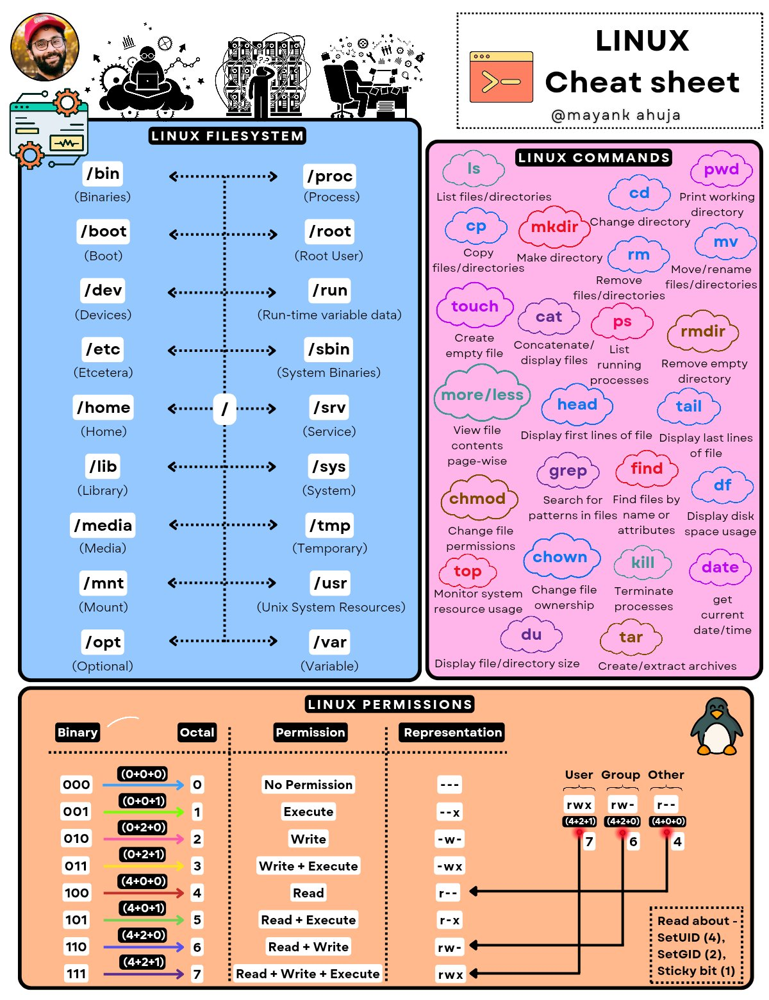

**Source:** [https://twitter.com/i/web/status/1881036704251080733](https://twitter.com/i/web/status/1881036704251080733)
**Original Post Date:** 2025-06-17 10:13:14

# Linux File System Hierarchy and Permissions: Essential Concepts

## Introduction
Understanding the Linux filesystem hierarchy and permissions is fundamental for effective system management. This knowledge base explores how Linux organizes its directory structure, provides critical commands for daily operations, and explains the complex permission system that controls access to files and directories.

## Linux Filesystem Hierarchy

The Linux filesystem is organized hierarchically under a root (/) directory. Each subdirectory serves specific purposes in the overall system architecture, facilitating efficient organization of system resources and user data.

- /bin: Essential binary executables for all users
- /etc: System-wide configuration files
- /home: User-specific directories
- /var: Variable data like logs and spool files
- /dev: Device file system

> **Note/Tip:** Always backup before modifying system-level directories

> **Note/Tip:** Use absolute paths for scripting to avoid ambiguity

## Essential Linux Commands

Frequently used commands can be categorized by their primary functions. Mastering these commands enables efficient system management and navigation.

Process control commands help monitor and manage running programs, while file operations provide tools for data manipulation.

```bash
# File listing with detailed permissions
ls -l /path/to/directory
```

```bash
# Change ownership of a file
cp user:group /path/to/file
```

- ls - List directory contents
- chmod - Modify file permissions
- df - Show disk usage statistics
- ps - Process status listing

## Linux File Permissions System

The Linux permission system uses a combination of binary, octal, and symbolic representations to control access. Understanding these modes is crucial for security and proper resource management.

```bash
# Symbolic representation
chmod u=rwx,g=rx,o=r file.txt
```

```bash
# Octal representation
chmod 755 directory/
```

- 4 (read) = 100 in binary
- 2 (write) = 010 in binary
- 1 (execute) = 001 in binary

> **Note/Tip:** SetUID (SUID) allows executing programs with owner's permissions

> **Note/Tip:** Sticky bit prevents deletion of files by others

## Key Takeaways

- Understand the hierarchical structure for efficient navigation and file organization
- Master essential commands for daily system administration tasks
- Implement proper permission structures using binary, octal, or symbolic modes
- Apply special bits judiciously to manage advanced access control

## Conclusion
Mastery of Linux filesystem hierarchy and permissions is essential for effective system administration. This knowledge enables secure, efficient management of resources while maintaining proper access controls.

## External References

- [Linux Filesystem Hierarchy Standard](https://refspecs.linuxfoundation.org/FHS_3.0/fhs-3.0.pdf)
- [Linux Command Line Basics](https://tldp.org/LDP/intro-linux/html/index.html)


## Media

**Image Description:** This image is a comprehensive and visually engaging cheat sheet for Linux, covering three main sections: **Linux Filesystem**, **Linux Commands**, and **Linux Permissions**. The design is colorful, organized, and includes icons and diagrams to enhance understanding. Below is a detailed breakdown of each section:

---

### **1. Linux Filesystem**
- **Description**: This section provides an overview of the Linux filesystem hierarchy, showing the organization of directories and their purposes.
- **Layout**: The filesystem is depicted as a tree structure with directories connected by arrows, emphasizing their relationships.
- **Key Directories**:
  - **Left Side**:
    - `/bin`: Binaries (essential user commands).
    - `/boot`: Boot loader files.
    - `/dev`: Device files.
    - `/etc`: Configuration files.
    - `/home`: User home directories.
    - `/lib`: Library files.
    - `/media`: Mount points for removable media.
    - `/mnt`: Temporary mount points.
    - `/opt`: Optional software packages.
  - **Right Side**:
    - `/proc`: Process information (virtual filesystem).
    - `/root`: Home directory for the root user.
    - `/run`: Run-time variable data.
    - `/sbin`: System binaries (for system administration).
    - `/srv`: Service data.
    - `/sys`: System information (virtual filesystem).
    - `/tmp`: Temporary files.
    - `/usr`: Unix System Resources (user programs and libraries).
    - `/var`: Variable data (logs, spool files, etc.).
  - **Central Node**: `/` (Root directory), the top-level directory from which all other directories are derived.

---

### **2. Linux Commands**
- **Description**: This section lists commonly used Linux commands, categorized by their functions, with brief explanations.
- **Layout**: Commands are organized in a grid format with a colorful background, making them easy to scan.
- **Commands**:
  - **File and Directory Management**:
    - `ls`: List files/directories.
    - `pwd`: Print working directory.
    - `cd`: Change directory.
    - `cp`: Copy files/directories.
    - `mkdir`: Make directory.
    - `rm`: Remove files/directories.
    - `mv`: Move/rename files/directories.
  - **File Operations**:
    - `touch`: Create empty file.
    - `cat`: Concatenate/display files.
    - `more/less`: View file contents page-wise.
    - `head`: Display first lines of a file.
    - `tail`: Display last lines of a file.
  - **Process Management**:
    - `ps`: List running processes.
    - `top`: Monitor system resource usage.
    - `kill`: Terminate processes.
  - **Search and Find**:
    - `grep`: Search for patterns in files.
    - `find`: Find files by name or attributes.
  - **Permissions and Ownership**:
    - `chmod`: Change file permissions.
    - `chown`: Change file ownership.
  - **Disk and File Size**:
    - `df`: Display disk space usage.
    - `du`: Display file/directory size.
  - **Archiving**:
    - `tar`: Create/extract archives.
  - **Miscellaneous**:
    - `date`: Get current date/time.

---

### **3. Linux Permissions**
- **Description**: This section explains the Linux file permission system, including binary, octal, and symbolic representations.
- **Layout**: The permissions are organized in a table format with explanations and visual diagrams.
- **Key Components**:
  - **Binary Representation**:
    - Permissions are represented as a series of `0`s and `1`s, where:
      - `1` = Permission granted.
      - `0` = Permission denied.
  - **Octal Representation**:
    - Permissions are converted to octal numbers (0–7), where:
      - `0` = No permissions.
      - `1` = Execute only.
      - `2` = Write only.
      - `3` = Write + Execute.
      - `4` = Read only.
      - `5` = Read + Execute.
      - `6` = Read + Write.
      - `7` = Read + Write + Execute.
  - **Symbolic Representation**:
    - Permissions are represented as `r` (read), `w` (write), and `x` (execute).
    - For example:
      - `rwx`: Full permissions (read, write, execute).
      - `r--`: Read-only permissions.
  - **User, Group, and Other**:
    - Permissions are applied to three categories:
      - **User**: Owner of the file.
      - **Group**: Users in the same group as the file.
      - **Other**: All other users.
    - Example: `755` means:
      - User: `rwx` (7).
      - Group: `r-x` (5).
      - Other: `r-x` (5).
  - **Special Bits**:
    - **SetUID (SUID)**: Allows a user to run a program with the permissions of the file owner.
    - **SetGID (SGID)**: Allows a user to run a program with the permissions of the file group.
    - **Sticky Bit**: Prevents users from deleting or renaming files in a directory unless they own the file or directory.

---

### **Additional Design Elements**
- **Header**: The top of the image includes a title ("LINUX Cheat sheet") and a logo with a penguin (representing Linux).
- **Author Attribution**: The top right corner includes the author's name (`@mayankahuja`).
- **Icons and Visuals**:
  - Icons and illustrations are used to represent concepts, such as a penguin, a terminal, and a file structure.
  - Arrows and lines connect related elements, enhancing readability.
- **Color Coding**:
  - Different sections are color-coded for easy differentiation:
    - Blue for the filesystem.
    - Pink for commands.
    - Orange for permissions.

---

### **Overall Purpose**
This cheat sheet serves as a quick reference guide for Linux users, covering essential filesystem knowledge, commonly used commands, and file permission concepts. It is designed to be visually appealing and easy to navigate, making it a valuable resource for both beginners and experienced users.
