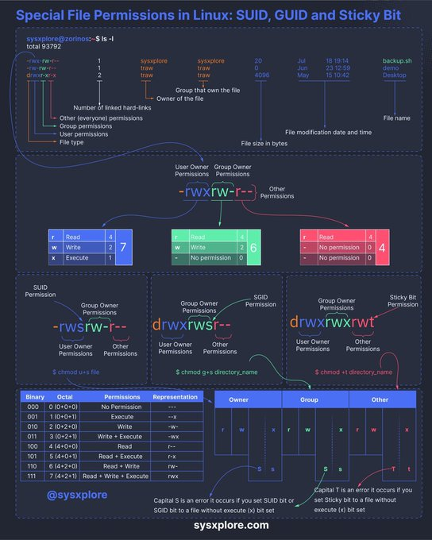

**Source:** [https://twitter.com/i/web/status/1868367746599096542](https://twitter.com/i/web/status/1868367746599096542)
**Original Post Date:** 2025-06-17 15:33:53

# Linux Special File Permissions: SUID, SGID, and Sticky Bit Explained

## Introduction
Linux file permissions form the backbone of system security, with special permissions providing advanced control mechanisms. This article delves into SUID (Set User ID), SGID (Set Group ID), and the Sticky Bit - three critical permission types that modify how files and directories behave when accessed or executed. Understanding these permissions is essential for system administrators and developers implementing secure applications.

## File Permissions Overview

Linux file permissions are displayed in the `ls -l` output using a compact notation that combines type, owner, group, and others' access rights. The format begins with a type indicator followed by nine characters representing read (r), write (w), and execute (x) permissions for three categories: owner, group, and others.

Each permission is represented numerically: 4 for read, 2 for write, and 1 for execute. These values can be combined to create octal representations like 755 (rwxr-xr-x).

```bash
ls -l
-rw-r--r-- 1 user group 0 Jan 1 20:00 file.txt
```

## Special File Permissions Explained

SUID (Set User ID): When executed, the program runs with the permissions of the file owner rather than the executing user.

SGID (Set Group ID): Ensures that when a file or directory is accessed, it inherits group ownership and executes with group privileges.

Sticky Bit: Prevents users from deleting files in a shared directory unless they own those files.

```bash
# Set SUID
chmod u+s file_name
# Set SGID
gchmod g+s file_name
# Set Sticky Bit
chmod +t directory_name
```

## Permission Representation and Implementation

Permissions can be represented in three ways: symbolic notation (rwx), numeric octal values, or binary. Understanding these representations is crucial for effective permission management.

When setting special permissions, proper execution rights must be maintained to avoid errors indicated by uppercase letters.

- SUID: Displayed as 's' or 'S' in owner's execute field
- SGID: Displayed as 's' or 'S' in group's execute field
- Sticky Bit: Displayed as 't' or 'T' in others' execute field

> **Note/Tip:** Capital letters indicate permission errors (e.g., S instead of s for missing execute bit)

> **Note/Tip:** Always verify permissions using `ls -l` after modification

## Common Use Cases

SUID is commonly used with system utilities like 'passwd' to allow password changes without requiring root access.

SGID ensures consistent group ownership in shared work directories and can restrict directory creation permissions.

Sticky Bit protects public directories like /tmp from unauthorized file removal.

## Key Takeaways

- SUID executes files with owner privileges, critical for password management utilities
- SGID maintains group consistency and controls access to shared resources
- Sticky Bit prevents deletion of files in shared directories unless owned by the user
- Proper permission implementation requires understanding both symbolic and octal representations

## Conclusion
Mastering Linux special file permissions is essential for secure system administration. These permissions provide powerful control mechanisms but must be implemented carefully to maintain security without compromising usability.

## External References

- [Linux File Permissions Documentation](https://www.linux.com/training-tutorials/linux-101-intro-file-permissions/)
- [Understanding Linux Permissions and Ownership](https://opensource.com/article/17/6/basic-linux-permissions-handling)


## Media

**Image Description:** This image is a detailed infographic explaining **Special File Permissions in Linux**, specifically focusing on **SUID (Set User ID), GUID (Set Group ID), and Sticky Bit**. The infographic is visually organized with text, diagrams, and color-coded sections to illustrate how these permissions work. Below is a detailed breakdown:

---

### **Main Subject: Special File Permissions**
The infographic explains how special permissions (SUID, GUID, and Sticky Bit) are used in Linux to modify the behavior of files and directories. These permissions are represented by additional bits in the file permission system, which is typically displayed using the `ls -l` command.

---

### **Key Sections and Details:**

#### **1. File Permissions Overview**
- **File Permissions Representation**: The infographic shows how file permissions are displayed in the `ls -l` output.
  - **Example**: `-rwxrwxr-x`
  - **Explanation**:
    - The first character (`-`) indicates the file type (e.g., `-` for a regular file, `d` for a directory).
    - The next three characters (`rwx`) represent the permissions for the **owner**.
    - The next three characters (`rwx`) represent the permissions for the **group**.
    - The last three characters (`r-x`) represent the permissions for **others**.
  - **Permissions**:
    - `r`: Read permission (4)
    - `w`: Write permission (2)
    - `x`: Execute permission (1)
    - `-`: No permission (0)

#### **2. Special Permissions**
The infographic highlights three special permissions:
- **SUID (Set User ID)**: Allows a file to run with the permissions of the file owner, not the user who executed it.
- **GUID (Set Group ID)**: Allows a file or directory to run with the permissions of the file group, not the user's group.
- **Sticky Bit**: Prevents users from deleting or renaming files in a directory unless they own the file or the directory.

---

#### **3. Detailed Explanation of Special Permissions**
- **SUID (Set User ID)**:
  - **Symbol**: `s` or `S` in the owner's execute permission field.
  - **Example**: `-rwsr-xr-x`
  - **Behavior**: When a program with SUID is executed, it runs with the permissions of the file owner, not the user who executed it.
  - **Command to Set**: `chmod u+s file_name`

- **GUID (Set Group ID)**:
  - **Symbol**: `s` or `S` in the group's execute permission field.
  - **Example**: `-rwxr-sr-x`
  - **Behavior**: When a program with GUID is executed, it runs with the permissions of the file group, not the user's group.
  - **Command to Set**: `chmod g+s file_name`

- **Sticky Bit**:
  - **Symbol**: `t` or `T` in the others' execute permission field.
  - **Example**: `-rwxr-xr-t`
  - **Behavior**: Prevents users from deleting or renaming files in a directory unless they own the file or the directory.
  - **Command to Set**: `chmod +t directory_name`

---

#### **4. Binary, Octal, and Permission Representation**
- The infographic includes a table showing the binary, octal, and permission representation for each permission level:
  - **Binary**: Represents permissions as `0` or `1` (e.g., `111` for `rwx`).
  - **Octal**: Represents permissions as a single digit (e.g., `7` for `rwx`).
  - **Permissions**: Describes the meaning of each permission (e.g., `r` for read, `w` for write, `x` for execute).

---

#### **5. Visual Representation**
- The infographic uses color coding and arrows to explain how permissions are applied:
  - **Owner Permissions**: Blue
  - **Group Permissions**: Green
  - **Other Permissions**: Red
  - **Special Permissions**: Highlighted in yellow or orange.

---

#### **6. Examples and Commands**
- The infographic includes examples of how to set these permissions using the `chmod` command:
  - `chmod u+s file_name` (SUID)
  - `chmod g+s file_name` (GUID)
  - `chmod +t directory_name` (Sticky Bit)

---

#### **7. Notes on Errors**
- The infographic mentions that setting SUID or Sticky Bit on a file without execute permissions (`x`) is an error:
  - **SUID**: Capital `S` indicates an error.
  - **Sticky Bit**: Capital `T` indicates an error.

---

### **Visual Layout**
- The infographic is divided into sections with clear headings and subheadings.
- Arrows and lines connect different parts of the explanation for better understanding.
- The use of color coding helps differentiate between owner, group, and other permissions.

---

### **Conclusion**
This infographic is a comprehensive guide to understanding and managing special file permissions in Linux. It provides clear explanations, examples, and visual aids to help users grasp the concepts of SUID, GUID, and Sticky Bit permissions effectively. The use of diagrams, tables, and color coding makes the information accessible and easy to follow.
