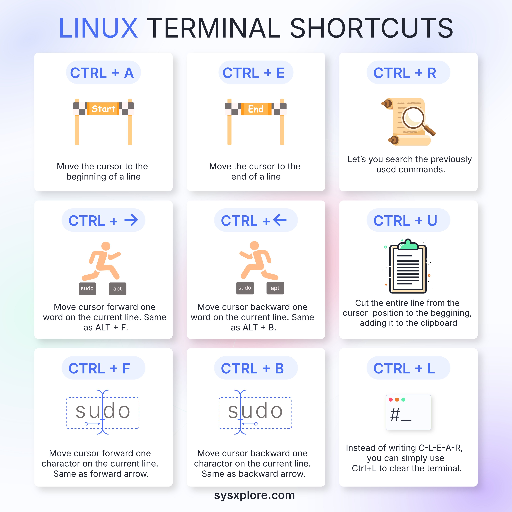

**Source:** [https://twitter.com/i/web/status/1877239527586279527](https://twitter.com/i/web/status/1877239527586279527)
**Original Post Date:** 2025-05-30 10:46:41

# Mastering Linux Terminal Shortcuts: A Comprehensive Guide

## Introduction
Efficient navigation in the Linux terminal is crucial for developers and system administrators. This knowledge base entry provides a comprehensive overview of essential keyboard shortcuts that can significantly enhance your productivity and workflow efficiency. By mastering these shortcuts, you'll be able to navigate quickly through command lines, edit commands efficiently, and manage terminals with precision.

## Cursor Movement Shortcuts

Cursor movement shortcuts are foundational for efficient terminal usage. These allow precise navigation within command lines without relying on arrow keys or mouse input.

The CTRL+A (or Alt-Home) and CTRL+E (or Alt-End) combinations enable instant positioning at the beginning and end of a line respectively, providing quick access to both ends of any command.

1. CTRL+A: Move cursor to start of line
1. CTRL+E: Move cursor to end of line
1. CTRL+R: Reverse search through previously used commands
1. CTRL+U: Cut text before cursor position
1. CTRL+F/Right Arrow: Move forward one character
1. CTRL+B/Left Arrow: Move backward one character

> **Note/Tip:** These shortcuts significantly reduce the need for mouse interaction or arrow key usage, improving efficiency in terminal operations.

## Editing Command Shortcuts

Effective command editing is essential when crafting complex commands. These shortcuts allow you to modify, cut, and paste text within your current line.

The CTRL+W combination is particularly useful for deleting words one at a time, while ALT+D deletes from the cursor to the end of the word.

```bash
CTRL+W
# Deletes previous word
CTRL+U
# Cuts entire line before cursor
ALT+E
# Moves to the last argument
```

```bash
# Example usage:
echo "Hello World"
CTRL+A CTRL+K
echo "New Message" # Reuses first command with modified text
```

## Terminal Management Shortcuts

Managing multiple terminals and sessions efficiently is crucial for productivity. These shortcuts allow you to clear screens, search history, and exit terminals quickly.

- CTRL+L: Clear terminal screen without clearing command history
- ALT+.: Repeats the last argument of previous command
- CTRL+C: Interrupt current process
- CTRL+D or exit: Close terminal session

> **Note/Tip:** Using CTRL+L instead of 'clear' saves time and maintains command history visibility.

> **Note/Tip:** ALT+. is particularly useful when working with long file paths that you've used previously.

## Key Takeaways

- Mastering cursor movement shortcuts reduces the need for arrow keys and mouse interaction, improving terminal efficiency.
- Command editing shortcuts allow precise text manipulation within command lines without losing context.
- Terminal management shortcuts provide quick ways to handle screen clearing and session termination.
- Combining these shortcuts creates powerful workflows that significantly enhance productivity.

## Conclusion
Linux terminal shortcuts are fundamental tools for efficient system administration and development work. By incorporating these shortcuts into your workflow, you'll experience a significant improvement in speed and precision when working in the command line environment. Regular practice with these shortcuts will make them second nature, enabling you to focus more on your tasks rather than navigation.

## External References

- [SysXplore Linux Terminal Shortcuts Infographic](https://sysxplore.com)


## Media

**Image Description:** The image is an infographic titled **"Linux Terminal Shortcuts"**, designed to explain various keyboard shortcuts used in Linux terminal environments. The layout is clean and organized, with a grid of 12 sections, each detailing a specific shortcut. Below is a detailed breakdown of the image:

### **Main Subject**
The main subject of the image is the **Linux Terminal Shortcuts**, which are essential for efficient command-line navigation and editing. The shortcuts are categorized into three groups based on their functions:
1. **Cursor Movement**
2. **Editing Commands**
3. **Terminal Management**

### **Design and Layout**
- **Title**: The title "Linux Terminal Shortcuts" is prominently displayed at the top in bold, with "Linux" in blue and the rest in black.
- **Background**: The background is a gradient of light blue and white, giving a clean and modern look.
- **Sections**: The shortcuts are organized into a 3x4 grid, with each section containing:
  - A **shortcut key combination** in a blue oval.
  - An **icon** representing the action.
  - A **description** of the shortcut's function in black text.

### **Sections and Details**
#### **Row 1: Cursor Movement**
1. **CTRL + A**
   - **Icon**: A start flag with the word "Start."
   - **Description**: "Move the cursor to the beginning of a line."
2. **CTRL + E**
   - **Icon**: An end flag with the word "End."
   - **Description**: "Move the cursor to the end of a line."
3. **CTRL + R**
   - **Icon**: A scroll with a magnifying glass.
   - **Description**: "Let's you search through the previously used commands."

#### **Row 2: Cursor Movement**
4. **CTRL + →**
   - **Icon**: A person running forward.
   - **Description**: "Move cursor forward one word on the current line. Same as ALT + F."
5. **CTRL + ←**
   - **Icon**: A person running backward.
   - **Description**: "Move cursor backward one word on the current line. Same as ALT + B."
6. **CTRL + U**
   - **Icon**: A clipboard with a trash bin.
   - **Description**: "Cut the entire line from the cursor position to the beginning, adding it to the clipboard."

#### **Row 3: Cursor Movement**
7. **CTRL + F**
   - **Icon**: A cursor moving forward.
   - **Description**: "Move cursor forward one character on the current line. Same as forward arrow."
8. **CTRL + B**
   - **Icon**: A cursor moving backward.
   - **Description**: "Move cursor backward one character on the current line. Same as backward arrow."
9. **CTRL + L**
   - **Icon**: A terminal prompt with a clear symbol.
   - **Description**: "Instead of writing 'clear', you can simply use Ctrl+L to clear the terminal."

### **Technical Details**
- **Keyboard Shortcuts**: Each section clearly lists a keyboard shortcut (e.g., `CTRL + A`, `CTRL + E`, etc.).
- **Icons**: Simple, intuitive icons are used to visually represent each action (e.g., a start flag for moving to the beginning of a line, a scroll for searching commands).
- **Descriptions**: Each shortcut is accompanied by a concise explanation of its function, often including alternative shortcuts (e.g., `ALT + F` for `CTRL + →`).

### **Footer**
- At the bottom of the image, there is a website link: **sysxplore.com**, indicating the source of the infographic.

### **Overall Purpose**
The infographic serves as an educational resource for Linux terminal users, providing a quick reference guide to essential shortcuts that enhance productivity and efficiency in the terminal environment. The use of icons and clear descriptions makes it accessible for both beginners and experienced users. 

### **Visual Appeal**
The design is minimalistic and user-friendly, with a focus on readability and clarity. The color scheme (blue and white) is clean and professional, and the icons are simple yet effective in conveying the intended actions. 

This infographic is a valuable tool for anyone looking to improve their Linux terminal skills by leveraging these shortcuts.
