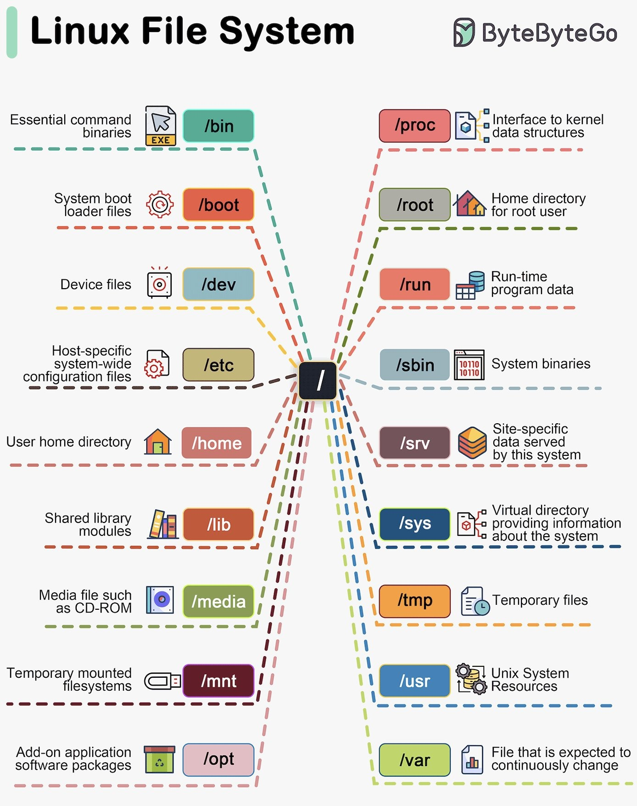

**Source:** [https://twitter.com/i/web/status/1879033206881800532](https://twitter.com/i/web/status/1879033206881800532)
**Original Post Date:** 2025-06-17 12:42:19

# Linux Filesystem Hierarchy: Comprehensive Guide to System Directory Structure

## Introduction
Understanding the Linux filesystem hierarchy is fundamental for systems administration and development. This structure provides a logical organization of system resources, user files, and configuration data. The layout ensures efficient operation while maintaining security and accessibility.

This knowledge base explores each directory's purpose, relationships, and practical implications in system design and maintenance.

## Core System Directories

The left side of the filesystem hierarchy contains essential directories critical for system operation. These directories house core binaries, boot files, and user data storage locations.

The /bin directory stores fundamental commands like ls, cp, and mv that are accessible by both users and administrators. This location ensures basic system functionality even when other areas may be compromised.

- /boot: Contains kernel files (vmlinuz) and bootloader configurations (grub)
- /dev: Virtual directory for device nodes representing hardware interfaces
- /etc: System-wide configuration files organized by service (e.g., /etc/nginx/conf.d/)

> **Note/Tip:** Never manually modify files in /boot without understanding the implications to system boot process

## Virtual Filesystems

The right side of the hierarchy includes virtual filesystems that provide dynamic system information and temporary storage.

/proc offers real-time access to kernel data, process statistics, and system parameters. For example, /proc/cpuinfo displays CPU architecture details.

1. /proc: Interface to kernel and process information
1. /sys: Hardware device tree representation
1. /run: Runtime variables for active system state

## User Management and Data Storage

The filesystem distinguishes between user-specific areas like /home and system-wide resources in /usr. This separation ensures security and prevents conflicts.

/home stores personal configurations, documents, and project files for each user account.

- /root: Administrator's home directory with elevated permissions
- /tmp: Temporary storage for session-specific data

## Key Takeaways

- The root directory (/) serves as the top-level container for all filesystem hierarchy components
- Essential binaries in /bin and /sbin are critical for basic system operation and recovery
- Virtual filesystems like /proc and /sys provide dynamic access to kernel and hardware information

## Conclusion
Mastering the Linux filesystem hierarchy is crucial for effective systems administration. Understanding each directory's purpose enables efficient troubleshooting, security management, and optimal system design.

## External References

- [Linux Filesystem Hierarchy Standard](https://refspecs.linuxfoundation.org/FHS_3.0/fhs-3.0.html)
- [The Linux Documentation Project: Filesystem Hierarchy](http://www.tldp.org/LDP/Linux-Filesystem-Hierarchy/html/)

## Media

**Image Description:** ### Description of the Image

The image is a detailed diagram illustrating the **Linux File System Hierarchy**, which is a structured organization of directories and files in a Linux operating system. The diagram is visually organized into two main sections, with each directory represented by a colored box and connected by dashed lines to indicate their relationships and hierarchy. The title at the top reads **"Linux File File File System System"**, which appears to be a repeated typo. The logo and text **"ByteByteByteGo"** are present in the top-right corner.

#### **Main Components and Their Descriptions:**

---

### **Left Side of the Diagram:**

1. **/bin (Essential Command Binaries)**
   - **Color:** Green
   - **Icon:** A folder with an "EXE" icon.
   - **Description:** Contains essential system binaries (commands) that are necessary for the system to function. These are typically used by both the system and users.

2. **/boot (System Boot Loader Files)**
   - **Color:** Orange
   - **Icon:** A gear with a power symbol.
   - **Description:** Contains files required for the system boot process, including the kernel and boot loader configuration files.

3. **/dev (Device Files)**
   - **Color:** Light Blue
   - **Icon:** A folder with a device icon.
   - **Description:** Contains special files that represent physical and virtual devices (e.g., hard drives, keyboards, etc.).

4. **/etc (Host-Specific System Configuration Files)**
   - **Color:** Beige
   - **Icon:** A folder with a gear icon.
   - **Description:** Contains configuration files for system-wide settings. These files are used to configure various services and applications.

5. **/home (User Home Directory)**
   - **Color:** Pink
   - **Icon:** A house.
   - **Description:** Contains directories for individual user accounts, where users store their personal files and configurations.

6. **/lib (Shared Library Modules)**
   - **Color:** Red
   - **Icon:** A folder with a stack of books.
   - **Description:** Contains shared library files (dynamic link libraries) that are used by various programs.

7. **/media (Media File Mount Points)**
   - **Color:** Light Green
   - **Icon:** A folder with a CD-ROM icon.
   - **Description:** Used as a mount point for removable media such as CD-ROMs, USB drives, etc.

8. **/mnt (Temporary Mount Points)**
   - **Color:** Dark Red
   - **Icon:** A folder with a mount icon.
   - **Description:** A temporary mount point for mounting file systems, typically used for short-term access.

9. **/opt (Add-On Application Packages)**
   - **Color:** Purple
   - **Icon:** A folder with a recycling bin.
   - **Description:** Contains additional software packages that are not part of the standard system distribution.

---

### **Right Side of the Diagram:**

1. **/proc (Kernel Interface)**
   - **Color:** Pink
   - **Icon:** A folder with a database icon.
   - **Description:** A virtual file system that provides an interface to kernel data structures. It contains information about running processes and system parameters.

2. **/root (Home Directory for Root User)**
   - **Color:** Gray
   - **Icon:** A house.
   - **Description:** The home directory for the superuser (root) account.

3. **/run (Run-Time Data)**
   - **Color:** Pink
   - **Icon:** A folder with a database icon.
   - **Description:** Contains run-time variable data, such as system state information and process IDs.

4. **/sbin (System Binaries)**
   - **Color:** Gray
   - **Icon:** A folder with a binary code icon.
   - **Description:** Contains system binaries that are typically used by the system administrator.

5. **/srv (Data Served by the System)**
   - **Color:** Brown
   - **Icon:** A folder with a stack of cubes.
   - **Description:** Contains data that is served by the system, such as web server content or FTP data.

6. **/sys (System Information)**
   - **Color:** Blue
   - **Icon:** A folder with a database icon.
   - **Description:** A virtual file system that provides information about the system's hardware and devices.

7. **/tmp (Temporary Files)**
   - **Color:** Orange
   - **Icon:** A folder with a document icon.
   - **Description:** Contains temporary files that are created and deleted during program execution.

8. **/usr (Unix System Resources)**
   - **Color:** Blue
   - **Icon:** A folder with a gear icon.
   - **Description:** Contains user binaries, libraries, and documentation. It is a large part of the system and is often shared across multiple systems.

9. **/var (Variable Files)**
   - **Color:** Green
   - **Icon:** A folder with a document icon.
   - **Description:** Contains variable data that changes frequently, such as logs, spool files, and temporary email storage.

---

### **Central Node:**
- **/** (Root Directory)
  - **Color:** Black
  - **Icon:** A folder.
  - **Description:** The root directory is the topmost directory in the file system hierarchy. All other directories are subdirectories of the root directory.

---

### **Visual Elements:**
- **Dashed Lines:** Connect the directories to the root directory, illustrating their hierarchical relationship.
- **Icons:** Each directory is accompanied by an icon that visually represents its purpose (e.g., a house for home directories, a gear for configuration files, etc.).
- **Color Coding:** Each directory is represented by a distinct color to differentiate them visually.

---

### **Overall Structure:**
The diagram effectively illustrates the hierarchical structure of the Linux file system, showing how each directory is organized under the root directory (`/`). It provides a clear visual representation of the purpose and contents of each directory, making it easier to understand the organization of a Linux file system.

---

### **Key Technical Details:**
1. **Hierarchical Structure:** The file system is organized in a tree-like structure, with the root directory (`/`) at the top.
2. **Essential Directories:** Directories like `/bin`, `/etc`, `/home`, and `/usr` are fundamental to the system's operation.
3. **Virtual File Systems:** Directories like `/proc`, `/sys`, and `/run` are virtual file systems that provide dynamic information about the system.
4. **User and System Files:** The separation between user files (`/home`) and system files (`/etc`, `/usr`, etc.) ensures a clean and organized file system.

This diagram is a valuable resource for understanding the Linux file system hierarchy and its organization.
