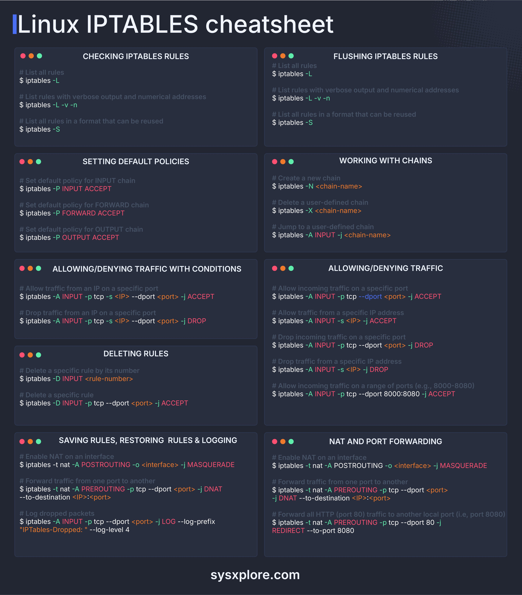

**Source:** [https://twitter.com/i/web/status/1871103360956240242](https://twitter.com/i/web/status/1871103360956240242)
**Original Post Date:** 2025-06-17 14:13:03

# Linux Firewall Configuration Using iptables: Comprehensive Reference

## Introduction
The iptables utility is a fundamental component of Linux firewall configuration, providing granular control over network traffic. This comprehensive cheatsheet serves as an essential reference for system administrators and developers managing Linux-based systems. Understanding iptables commands enables precise traffic control, enhances system security, and ensures efficient network management.

## Checking Existing Rules

Use these commands to inspect the current state of your firewall rules. Essential for debugging and verifying configuration changes.

```bash
# List all rules in human-readable format
iptables -L

# Display detailed information with numeric addresses
iptables -L -v -n

# Output rules in a script-friendly format
iptables -S
```

## Rule Management and Policy Setting

These commands control the fundamental behavior of your firewall through chain manipulation and policy configuration.

```bash
# Configure default policies
iptables -P INPUT ACCEPT
iptables -P FORWARD ACCEPT
iptables -P OUTPUT ACCEPT
```

```bash
# Manage custom chains
iptables -N my_chain
iptables -X my_chain
```

> **Note/Tip:** Always set default policies before adding specific rules to prevent unintended access.

## Traffic Control and Filtering

Implement granular traffic control using port, protocol, and source IP restrictions.

```bash
# Allow specific TCP connection
iptables -A INPUT -p tcp -s 192.168.1.0/24 --dport 80 -j ACCEPT

# Block traffic from specific IP
iptables -A INPUT -s 10.0.0.5 -j DROP
```

> **Note/Tip:** Always test rules in a development environment before applying to production.

> **Note/Tip:** Use 'DROP' for security-critical implementations and 'REJECT' when you need to provide feedback to clients.

## Advanced Features: NAT, Logging, and Port Forwarding

Configure complex networking scenarios using Network Address Translation (NAT), port forwarding, and logging capabilities.

```bash
# Enable NAT
iptables -t nat -A POSTROUTING -o eth0 -j MASQUERADE
```

```bash
# Configure port forwarding
iptables -t nat -A PREROUTING -p tcp --dport 80 -j REDIRECT --to-port 8080
```

## Persistent Configuration Management

Preserve your iptables configuration across system reboots using these commands.

```bash
# Save current rules
iptables-save > /etc/iptables/rules.v4

# Restore saved rules
iptables-restore < /etc/iptables/rules.v4
```

## Key Takeaways

- Always back up existing rules before making changes.
- Use the 'iptables -L' command to verify rule states after modifications.
- Implement logging for critical security events and investigate dropped packets regularly.
- Consider using 'iptables-persistent' package for saving configurations on Debian/Ubuntu systems.
- Test firewall rules in development environment first.

## Conclusion
Mastery of iptables commands is essential for Linux system administrators. This cheatsheet provides a practical reference for common operations, from basic rule management to advanced networking configurations. Regular review and testing of firewall rules ensures robust security posture while maintaining network availability.

## External References

- [Linux man pages](https://man7.org/linux/man-pages/man8/iptables.8.html)
- [iptables Tutorial](http://www.iptables.info/en/)


## Media

**Image Description:** The image is a **Linux iptables cheatsheet**, designed to provide a concise reference for managing firewall rules using the `iptables` command-line tool in Linux. The cheatsheet is organized into sections, each covering a specific aspect of iptables configuration. Below is a detailed breakdown of the image:

---

### **Header**
- **Title**: "Linux IPTABLES cheatsheet"
- **Background**: Dark theme with a subtle grid pattern, making the text stand out.
- **Color Coding**: 
  - **Orange**: Indicates commands or syntax.
  - **Green**: Indicates comments or explanations.
  - **White**: General text and headings.
  - **Red**: Highlights specific keywords or parameters.

---

### **Sections**
The cheatsheet is divided into several sections, each focusing on a different aspect of iptables management. Below is a detailed description of each section:

#### **1. CHECKING IPTABLES RULES**
- **Purpose**: Displaying existing iptables rules.
- **Commands**:
  - `iptables -L`: Lists all rules in a human-readable format.
  - `iptables -L -v -n`: Lists rules with verbose output and numerical addresses (no DNS resolution).
  - `iptables -S`: Lists all rules in a format that can be reused (script-friendly).

#### **2. FLUSHING IPTABLES RULES**
- **Purpose**: Clearing all rules from the iptables configuration.
- **Commands**:
  - `iptables -L`: Lists all rules (same as in the previous section).
  - `iptables -F`: Flushes all rules from the default chains (INPUT, FORWARD, OUTPUT).
  - `iptables -X`: Deletes all user-defined chains.
  - `iptables -Z`: Zeroes the packet and byte counters in all chains.

#### **3. SETTING DEFAULT POLICIES**
- **Purpose**: Setting default policies for the built-in chains (INPUT, FORWARD, OUTPUT).
- **Commands**:
  - `iptables -P INPUT ACCEPT`: Sets the default policy for the INPUT chain to accept all traffic.
  - `iptables -P FORWARD ACCEPT`: Sets the default policy for the FORWARD chain to accept all traffic.
  - `iptables -P OUTPUT ACCEPT`: Sets the default policy for the OUTPUT chain to accept all traffic.

#### **4. WORKING WITH CHAINS**
- **Purpose**: Managing custom chains.
- **Commands**:
  - `iptables -N <chain-name>`: Creates a new user-defined chain.
  - `iptables -X <chain-name>`: Deletes a user-defined chain.
  - `iptables -A INPUT -j <chain-name>`: Jumps to a user-defined chain from the INPUT chain.

#### **5. ALLOWING/DENYING TRAFFIC WITH CONDITIONS**
- **Purpose**: Allowing or denying traffic based on specific conditions.
- **Commands**:
  - `iptables -A INPUT -p tcp -s <IP> --dport <port> -j ACCEPT`: Allows TCP traffic from a specific IP address to a specific port.
  - `iptables -A INPUT -p tcp -s <IP> --dport <port> -j DROP`: Drops TCP traffic from a specific IP address to a specific port.
  - `iptables -A INPUT -s <IP> -j ACCEPT`: Allows traffic from a specific IP address.
  - `iptables -A INPUT -s <IP> -j DROP`: Drops traffic from a specific IP address.

#### **6. ALLOWING/DENYING TRAFFIC**
- **Purpose**: Allowing or denying traffic on specific ports or ranges.
- **Commands**:
  - `iptables -A INPUT -p tcp --dport <port> -j ACCEPT`: Allows incoming TCP traffic on a specific port.
  - `iptables -A INPUT -p tcp --dport <port> -j DROP`: Drops incoming TCP traffic on a specific port.
  - `iptables -A INPUT -p tcp --dport 8000:8080 -j ACCEPT`: Allows incoming TCP traffic on a range of ports (8000-8080).

#### **7. DELETING RULES**
- **Purpose**: Deleting specific rules from the iptables configuration.
- **Commands**:
  - `iptables -D INPUT <rule-number>`: Deletes a specific rule by its number in the INPUT chain.
  - `iptables -D INPUT -p tcp --dport <port> -j ACCEPT`: Deletes a specific rule that allows TCP traffic on a specific port.

#### **8. SAVING RULES, RESTORING RULES & LOGGING**
- **Purpose**: Saving and restoring iptables rules, as well as logging dropped packets.
- **Commands**:
  - `iptables-save`: Saves the current iptables rules to a file.
  - `iptables-restore`: Restores iptables rules from a file.
  - `iptables -A INPUT -p tcp --dport <port> -j LOG --log-prefix "IPTables-Dropped: " --log-level 4`: Logs dropped packets with a custom prefix and log level.

#### **9. NAT AND PORT FORWARDING**
- **Purpose**: Configuring Network Address Translation (NAT) and port forwarding.
- **Commands**:
  - `iptables -t nat -A POSTROUTING -o <interface> -j MASQUERADE`: Enables NAT for outgoing traffic on a specific interface.
  - `iptables -t nat -A PREROUTING -p tcp --dport <port> -j DNAT --to-destination <IP>:<port>`: Forwards incoming traffic on a specific port to another IP and port.
  - `iptables -t nat -A PREROUTING -p tcp --dport 80 -j REDIRECT --to-port 8080`: Redirects all HTTP traffic (port 80) to another local port (e.g., 8080).

---

### **Design and Layout**
- **Grid Layout**: The content is organized into a grid of six sections, making it easy to navigate.
- **Color Coding**: Differentiates between commands, comments, and parameters for better readability.
- **Consistent Formatting**: Each section follows a similar structure, with comments explaining the purpose of the commands and the commands themselves.

---

### **Footer**
- **Website Attribution**: The bottom of the image includes the website "sysxplore.com," indicating the source of the cheatsheet.

---

### **Overall Purpose**
This cheatsheet serves as a quick reference guide for system administrators and developers working with Linux iptables. It covers essential tasks such as checking, flushing, setting default policies, managing chains, allowing/denying traffic, deleting rules, saving/restoring rules, logging, and configuring NAT and port forwarding.

---

This detailed breakdown ensures that the image is thoroughly understood, focusing on both the technical content and the visual organization.
