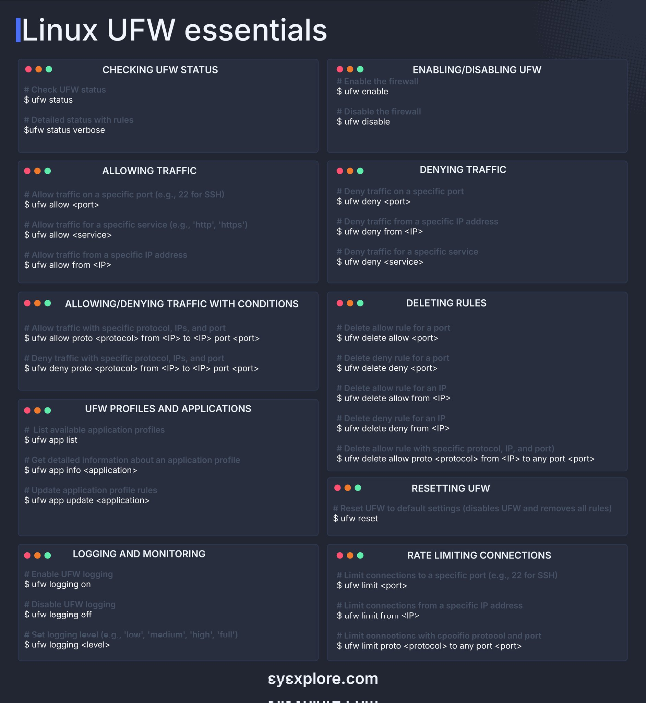

**Source:** [https://twitter.com/i/web/status/1868545230452240559](https://twitter.com/i/web/status/1868545230452240559)
**Original Post Date:** 2025-06-17 12:02:21

# Linux Uncomplicated Firewall (UFW): Comprehensive Guide

## Introduction
Uncomplicated Firewall (UFW) serves as a user-friendly command-line interface for managing iptables/nftables on Linux systems. This comprehensive guide covers all aspects of UFW administration, from basic status checks to advanced traffic manipulation and logging configurations.

## Basic Status Management

The foundation of effective firewall management begins with understanding the current state of your system. UFW provides straightforward commands for checking and modifying its operational status.

```bash
$ ufw status
$ ufw status verbose
```

## Traffic Rule Configuration

UFW offers granular control over network traffic through port-based, service-based, and IP-based rules. These configurations are essential for maintaining security while allowing necessary communications.

```bash
$ ufw allow 22
$ ufw deny http
$ ufw allow from 192.168.1.0/24
```

```bash
$ ufw allow proto tcp from any to any port 8080
$ ufw deny proto udp from 10.0.0.1 to any port 53
```

## Advanced Features and Logging

UFW's advanced features include rate limiting, detailed logging, and application profile management.

```bash
$ ufw limit 22
$ ufw logging on
$ ufw app info ssh
```

- Use 'ufw limit' to prevent brute-force attacks
- Enable logging with specific levels (low/medium/high/full)
- Manage application profiles for consistent rule management

## System Reset and Maintenance

Regular maintenance includes checking rule integrity and having the ability to reset configurations when necessary.

```bash
$ ufw reset
```

## Key Takeaways

- UFW simplifies complex iptables/nftables rules into intuitive commands
- Always verify rule changes with 'ufw status verbose' to ensure correct implementation
- Implement rate limiting and logging for enhanced security monitoring
- Application profiles help maintain consistent firewall configurations

## Conclusion
Mastering UFW is crucial for Linux administrators seeking efficient network traffic control. By following these guidelines, you can effectively manage your system's firewall while maintaining robust security measures.

## External References

- [UFW Official Documentation](https://help.ubuntu.com/community/UFW)
- [Linux UFW Essentials Reference Sheet](http://syexplore.com/linux-ufw-reference/)


## Media

**Image Description:** The image is a reference sheet titled **"Linux UFW Essentials"**, which provides a concise overview of the **Uncomplicated Firewall (UFW)**, a user-friendly command-line interface for managing firewall rules on Linux systems. The content is organized into a grid of sections, each detailing specific commands and functionalities of UFW. Below is a detailed breakdown of the image:

---

### **Main Subject: Linux UFW Essentials**
The image serves as a quick reference guide for managing UFW, covering essential commands for enabling, disabling, configuring, and monitoring firewall rules. The content is structured into multiple sections, each with a heading, description, and corresponding command examples.

---

### **Sections and Details:**

#### **1. Checking UFW Status**
- **Purpose**: Displays the current status of the UFW firewall.
- **Commands**:
  - `$ ufw status`: Shows whether UFW is active or inactive.
  - `$ ufw status verbose`: Provides a detailed status, including rules and services.

#### **2. Enabling/Disabling UFW**
- **Purpose**: Turns the UFW firewall on or off.
- **Commands**:
  - `$ ufw enable`: Activates the firewall.
  - `$ ufw disable`: Deactivates the firewall.

#### **3. Allowing Traffic**
- **Purpose**: Configures rules to allow traffic on specific ports, services, or IP addresses.
- **Commands**:
  - `$ ufw allow <port>`: Allows traffic on a specific port (e.g., `22` for SSH).
  - `$ ufw allow <service>`: Allows traffic for a specific service (e.g., `http`, `https`).
  - `$ ufw allow from <IP>`: Allows traffic from a specific IP address.

#### **4. Denying Traffic**
- **Purpose**: Configures rules to deny traffic on specific ports, services, or IP addresses.
- **Commands**:
  - `$ ufw deny <port>`: Denies traffic on a specific port.
  - `$ ufw deny <service>`: Denies traffic for a specific service.
  - `$ ufw deny from <IP>`: Denies traffic from a specific IP address.

#### **5. Allowing/Denying Traffic with Conditions**
- **Purpose**: Configures rules with specific conditions, such as protocol, IP addresses, and ports.
- **Commands**:
  - `$ ufw allow proto <protocol> from <IP> to <IP> port <port>`: Allows traffic with specific protocol, IP range, and port.
  - `$ ufw deny proto <protocol> from <IP> to <IP> port <port>`: Denies traffic with specific protocol, IP range, and port.

#### **6. Deleting Rules**
- **Purpose**: Removes existing firewall rules.
- **Commands**:
  - `$ ufw delete allow <port>`: Deletes an allow rule for a specific port.
  - `$ ufw delete deny <port>`: Deletes a deny rule for a specific port.
  - `$ ufw delete allow from <IP>`: Deletes an allow rule for a specific IP address.
  - `$ ufw delete deny from <IP>`: Deletes a deny rule for a specific IP address.
  - `$ ufw delete allow proto <protocol> from <IP> to any port <port>`: Deletes an allow rule with specific protocol, IP, and port.

#### **7. UFW Profiles and Applications**
- **Purpose**: Manages application profiles and their associated rules.
- **Commands**:
  - `$ ufw app list`: Lists available application profiles.
  - `$ ufw app info <application>`: Displays detailed information about a specific application profile.
  - `$ ufw app update <application>`: Updates the rules for a specific application profile.

#### **8. Logging and Monitoring**
- **Purpose**: Configures logging levels and enables/disables logging.
- **Commands**:
  - `$ ufw logging on`: Enables logging.
  - `$ ufw logging off`: Disables logging.
  - `$ ufw logging <level>`: Sets the logging level (e.g., `low`, `medium`, `high`, `full`).

#### **9. Rate Limiting Connections**
- **Purpose**: Limits the number of connections to specific ports or IP addresses.
- **Commands**:
  - `$ ufw limit <port>`: Limits connections to a specific port.
  - `$ ufw limit from <IP>`: Limits connections from a specific IP address.
  - `$ ufw limit proto <protocol> to any port <port>`: Limits connections with specific protocol and port.

#### **10. Resetting UFW**
- **Purpose**: Resets UFW to its default settings, disabling it and removing all rules.
- **Commands**:
  - `$ ufw reset`: Resets UFW to default settings.

---

### **Design and Layout**
- **Background**: Dark theme with a subtle grid pattern.
- **Sections**: Organized into a grid of 10 sections, each with a heading, description, and command examples.
- **Color Coding**:
  - **Orange and Green Dots**: Likely indicate progress or status markers.
  - **Command Syntax**: Commands are written in a monospace font for clarity.
- **Footer**: Contains the URL `syexplore.com`, suggesting the source of the reference sheet.

---

### **Key Technical Details**
1. **UFW**: A front-end for iptables or nftables, simplifying firewall rule management.
2. **Commands**: All commands are prefixed with `ufw`, making it easy to identify the tool being used.
3. **Flexibility**: Supports a wide range of rules, including port-based, service-based, IP-based, and protocol-based configurations.
4. **Logging**: Provides options to enable or disable logging and set logging levels.
5. **Rate Limiting**: Helps prevent abuse by limiting the number of connections.

---

### **Purpose**
This reference sheet is designed for Linux administrators or users who need a quick guide to managing UFW. It covers essential commands for configuring, monitoring, and maintaining firewall rules, making it a valuable resource for both beginners and experienced users.

---

### **Overall Impression**
The image is clean, well-organized, and easy to follow, making it an effective quick reference for UFW commands. The use of a dark theme and clear formatting enhances readability, and the inclusion of detailed command examples ensures practical usability.
