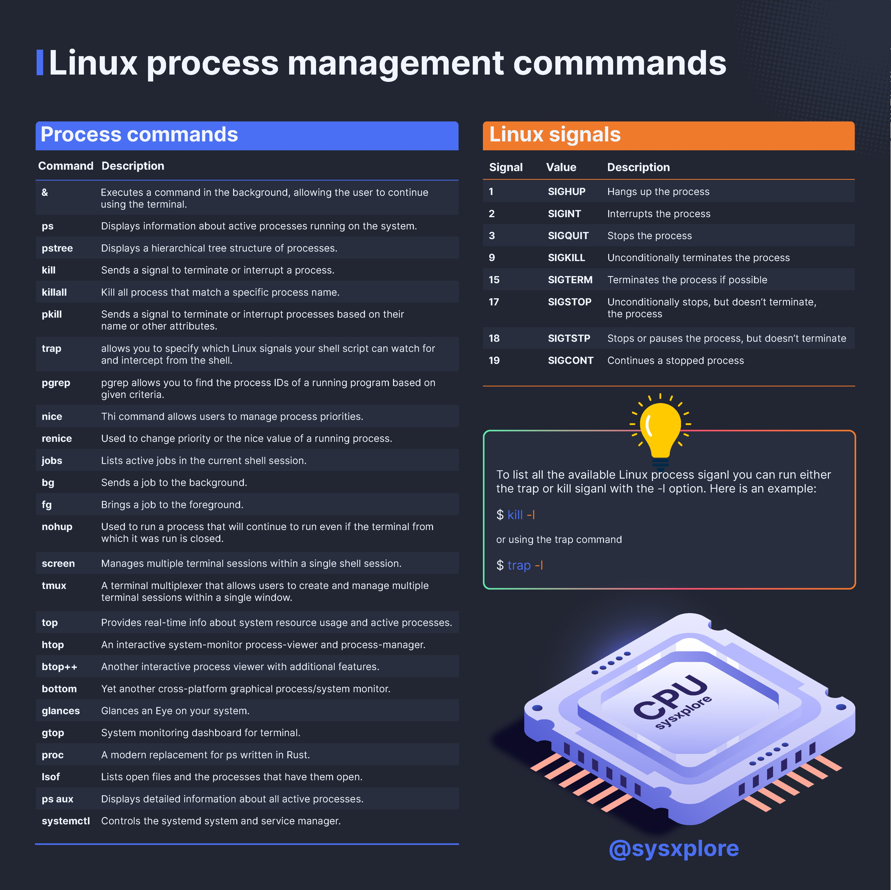

**Source:** [https://twitter.com/i/web/status/1873820461366124772](https://twitter.com/i/web/status/1873820461366124772)
**Original Post Date:** 2025-06-17 15:02:30

# Linux Process Management: Commands, Signals, and Monitoring Tools

## Introduction
Process management is a fundamental aspect of Linux systems administration that enables control over running processes. This article provides an in-depth exploration of core process management concepts, including command-line utilities, signal handling mechanisms, and advanced monitoring tools. Understanding these components is crucial for efficient system administration, application deployment, and performance optimization.

## Process Management Commands

Linux provides a rich set of commands for process management, ranging from basic to advanced use cases. These commands offer granular control over running processes and their execution environment.

Common operations include background processing with & operator, job control using fg/bg, and priority management via nice/renice.

_Executes a script in background, redirects outputs to log file, and saves process ID_

```bash
nohup ./long_running_script.sh > output.log 2>&1 &
echo $! >> pidfile.txt
```

- Process listing and monitoring: ps, pstree, top, htop
- Signal handling: kill, pkill, killall
- Job control: fg, bg, jobs
- Background execution: &, nohup, screen/tmux

## Linux Signals System

Signals are asynchronous messages that notify processes of significant events. Understanding signal behavior is crucial for robust application design.

Different signals serve distinct purposes: SIGTERM allows graceful shutdown, while SIGKILL forces immediate termination.

_Example of signal trapping in shell scripts_

```bash
trap 'echo "Caught SIGINT"; exit 0' SIGINT
trap 'kill -STOP $$' SIGTSTP
```

1. 1 (SIGHUP): Terminal session terminated
1. 2 (SIGINT): Interrupt request from keyboard
1. 9 (SIGKILL): Immediate process termination
1. 15 (SIGTERM): Graceful process termination

## Monitoring Tools and Visualization

Modern Linux systems offer sophisticated monitoring tools that provide real-time process information.

These tools enhance system observability and help identify performance bottlenecks.

- top/htop: Real-time process monitoring
- glances: Cross-platform system monitoring dashboard
- btop++: Modern terminal-based process viewer

## Key Takeaways

- Signal handling is critical for robust application design and graceful shutdowns
- Modern monitoring tools provide essential insights into process behavior and resource usage
- Understanding background processes, job control, and signal semantics is vital for system administration

## Conclusion
Mastering Linux process management commands, signals, and monitoring tools is essential for effective system administration. This knowledge enables efficient troubleshooting, performance optimization, and robust application deployment strategies.

## External References

- [Linux Signals Documentation](https://man7.org/linux/man-pages/man7/signal.7.html)
- [Process Management Best Practices](https://www.kernel.org/doc/Documentation/process-management.txt)


## Media

**Image Description:** ### Image Description

The image is an infographic titled **"Linux process process management management management management management commands"**, which appears to be a humorous or repetitive title. The infographic is divided into two main sections: **Process commands** and **Linux signals**, along with a visual representation of a CPU at the bottom right. The background is dark, and the text is presented in a clean, organized format with color-coded sections for clarity.

---

### **1. Process Commands Section**

This section lists various Linux commands used for managing processes. Each command is accompanied by a brief description. The commands are organized in a table format with two columns: **Command** and **Description**.

#### **Commands Listed:**
- **&**: Executes a command in the background, allowing the user to continue using the terminal.
- **ps**: Displays information about active processes running on the system.
- **pstree**: Displays a hierarchical tree structure of processes.
- **kill**: Sends a signal to terminate or interrupt a process.
- **killall**: Kills all processes that match a specific process name.
- **pkill**: Sends a signal to terminate or interrupt processes based on their name or other attributes.
- **trap**: Allows you to specify which Linux signals your shell script can watch for and intercept from the shell.
- **pgrep**: Finds process IDs of a running program based on given criteria.
- **nice**: Allows users to manage process priorities.
- **renice**: Used to change the priority or nice value of a running process.
- **jobs**: Lists active jobs in the current shell session.
- **bg**: Sends a job to the background.
- **fg**: Brings a job to the foreground.
- **nohup**: Runs a process that will continue to run even if the terminal is closed.
- **screen**: Manages multiple terminal sessions within a single shell session.
- **tmux**: A terminal multiplexer that allows users to create and manage multiple terminal sessions within a single window.
- **top**: Provides real-time information about system resource usage and active processes.
- **htop**: An interactive system monitor, process viewer, and process manager.
- **btop++**: Another interactive cross-platform process viewer with additional features.
- **bottom**: Yet another interactive cross-platform process viewer.
- **glances**: A cross-platform graphical system monitor.
- **gtop**: A system monitoring dashboard for the terminal.
- **proc**: A modern replacement for `ps` written in Rust.
- **lsof**: Lists open files and the processes that have them open.
- **ps aux**: Displays detailed information about all active processes.
- **systemctl**: Controls the systemd system and service manager.

---

### **2. Linux Signals Section**

This section explains Linux signals, which are used to send messages to processes. The table lists various signals along with their numeric values, signal names, and descriptions.

#### **Signals Listed:**
- **1 (SIGHUP)**: Hangs up the process.
- **2 (SIGINT)**: Interrupts the process.
- **3 (SIGQUIT)**: Stops the process.
- **9 (SIGKILL)**: Unconditionally terminates the process.
- **15 (SIGTERM)**: Terminates the process if possible.
- **17 (SIGSTOP)**: Unconditionally stops the process but does not terminate it.
- **18 (SIGTSTP)**: Stops or pauses the process but does not terminate it.
- **19 (SIGCONT)**: Continues a stopped process.

#### **Additional Information:**
- The section includes instructions on how to list all available Linux process signals:
  - Using the `kill` command with the `-l` option: `$ kill -l`
  - Using the `trap` command with the `-l` option: `$ trap -l`

---

### **3. Visual Elements**

- **CPU Illustration**: At the bottom right of the image, there is a 3D illustration of a CPU with the text **"CPU"** and **"sysxplore"** on it. The CPU is depicted with a glowing blue light, giving it a modern and technical appearance.
- **Lightbulb Icon**: Above the CPU, there is a yellow lightbulb icon with a glowing effect, symbolizing an idea or tip. This is associated with the instructions on listing all available Linux signals.

---

### **4. Footer**

- The bottom of the image includes the handle **"@sysxplore"**, likely indicating the creator or source of the infographic.

---

### **Overall Design and Style**

- **Color Scheme**: The background is dark, with text in white and light blue for readability. The sections are color-coded: the **Process commands** section has a blue header, and the **Linux signals** section has an orange header.
- **Typography**: The text is clean and organized, using a monospace font for consistency.
- **Visual Hierarchy**: The infographic uses headers, tables, and icons to structure the information logically and make it easy to navigate.

---

### **Summary**

The image is a comprehensive infographic that provides a detailed overview of Linux process management commands and Linux signals. It is visually appealing, well-organized, and includes practical tips for listing available signals. The inclusion of a CPU illustration and a lightbulb icon adds a technical and informative touch to the design. The humorous repetition in the title adds a light-hearted element to the otherwise technical content.
