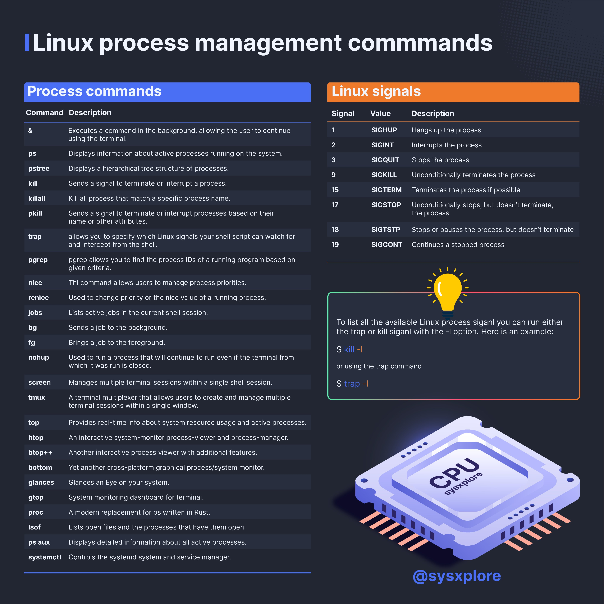

**Source:** [https://twitter.com/i/web/status/1876960312282271771](https://twitter.com/i/web/status/1876960312282271771)
**Original Post Date:** 2025-07-23 06:36:42

# Linux Process Management: Commands, Signals, and Tools

## Introduction
Linux process management is crucial for effective system administration and resource optimization. This guide covers essential commands, signals, and tools used in Linux process management, providing a structured approach to understanding and utilizing these features.

Process management involves monitoring, controlling, and manipulating processes running on the system. It includes commands for background execution, process termination, priority adjustment, and job control. Additionally, Linux signals are used to send messages to processes, enabling better control over their behavior.

## Process Commands

Linux provides a variety of commands for managing processes, allowing users to execute tasks in the background, monitor active processes, and control process execution. These commands are essential for efficient system administration and resource management.

The `&` command allows users to execute a task in the background, freeing up the terminal for other operations. The `ps` command displays information about active processes, while `pstree` shows a hierarchical tree structure of processes.

Process termination commands like `kill`, `killall`, and `pkill` are used to send signals to processes, enabling users to terminate or interrupt them as needed. The `trap` command allows shell scripts to watch for and intercept specific Linux signals.

- &: Executes a command in the background.
- ps: Displays information about active processes.
- pstree: Shows a hierarchical tree structure of processes.
- kill: Sends a signal to terminate or interrupt a process.
- killall: Kills all processes that match a specific process name.
- pkill: Terminates processes based on their name or other attributes.
- trap: Allows shell scripts to watch for and intercept signals.
- pgrep: Finds process IDs of a running program based on criteria.
- nice: Manages process priorities.
- renice: Changes the priority or nice value of a running process.
- jobs: Lists active jobs in the current shell session.
- bg: Sends a job to the background.
- fg: Brings a job to the foreground.
- nohup: Runs a process that continues even if the terminal is closed.
- screen: Manages multiple terminal sessions within a single shell session.
- tmux: A terminal multiplexer for managing multiple terminal sessions.
- top: Provides real-time information about system resource usage and active processes.
- htop: An interactive system monitor, process viewer, and manager.
- btop++: Another interactive cross-platform process viewer with additional features.
- bottom: Yet another interactive cross-platform process viewer.
- glances: A cross-platform graphical system monitor.
- gtop: A terminal-based system monitoring dashboard.
- proc: A modern replacement for `ps` written in Rust.
- lsof: Lists open files and the processes that have them open.
- ps aux: Displays detailed information about all active processes.
- systemctl: Controls the systemd system and service manager.

> **Note/Tip:** Use `&` to run commands in the background for better terminal efficiency.

> **Note/Tip:** The `ps` command is essential for monitoring process health and resource usage.

> **Note/Tip:** `pstree` provides a clear visual representation of process relationships.

## Linux Signals

Linux signals are messages sent to processes to notify them of specific events or conditions. These signals enable better control over process behavior and resource management.

The `SIGHUP` signal hangs up the process, while `SIGINT` interrupts it. The `SIGKILL` signal unconditionally terminates a process, whereas `SIGTERM` requests termination gracefully.

`SIGSTOP` stops a process without terminating it, and `SIGTSTP` pauses it. The `SIGCONT` signal continues a stopped process.

- SIGHUP (1): Hangs up the process.
- SIGINT (2): Interrupts the process.
- SIGQUIT (3): Stops the process.
- SIGKILL (9): Unconditionally terminates the process.
- SIGTERM (15): Terminates the process if possible.
- SIGSTOP (17): Unconditionally stops the process but does not terminate it.
- SIGTSTP (18): Stops or pauses the process but does not terminate it.
- SIGCONT (19): Continues a stopped process.

> **Note/Tip:** Use `kill -l` to list all available Linux signals.

> **Note/Tip:** `trap -l` also provides a comprehensive list of signals.

## Visual Elements and Design

The infographic includes visual elements such as a CPU illustration at the bottom right, symbolizing the core of process management. A lightbulb icon above the CPU represents tips or ideas related to Linux signals.

The design uses a dark background with white and light blue text for readability. Sections are color-coded: blue for Process Commands and orange for Linux Signals.

- CPU illustration at the bottom right symbolizes process management.
- Lightbulb icon represents tips or ideas related to Linux signals.
- Dark background with white and light blue text enhances readability.
- Color-coded sections for easy navigation.

> **Note/Tip:** The CPU illustration emphasizes the technical aspect of process management.

> **Note/Tip:** The lightbulb icon serves as a visual cue for additional tips or insights.

## Conclusion

Linux process management commands and signals are essential tools for system administrators and developers. They provide the necessary control over processes, ensuring efficient resource usage and system stability.

Understanding these commands and signals enables better process monitoring, termination, and priority management, leading to improved system performance and reliability.

## Key Takeaways

- Linux process management involves using specific commands for background execution, monitoring, and control.
- Linux signals are crucial for sending messages to processes, enabling better behavior control.
- Tools like `top`, `htop`, and `glances` provide real-time system resource usage information.
- Understanding these concepts leads to improved system performance and reliability.

## Conclusion
In summary, Linux process management commands and signals are essential for effective system administration. They enable better control over processes, ensuring efficient resource usage and system stability. Understanding these tools and techniques is crucial for maintaining optimal system performance.

## External References

- [Linux Process Management Guide](https://www.linux.com/tutorials/linux-process-management/)
- [Understanding Linux Signals](https://www.geeksforgeeks.org/understanding-linux-signals/)

## Media

**Image Description:** ### Image Description

The image is an infographic titled **"Linux process process management management management management commands"**, which appears to be a humorous or repetitive title. The infographic is divided into two main sections: **Process commands** and **Linux signals**, along with a visual representation of a CPU at the bottom right. The background is dark, and the text is presented in a clean, organized format with color-coded sections for clarity.

---

### **1. Process Commands Section**

This section lists various Linux commands used for managing processes. Each command is accompanied by a brief description. The commands are organized in a table format with two columns: **Command** and **Description**.

#### **Commands Listed:**
- **&**: Executes a command in the background, allowing the user to continue using the terminal.
- **ps**: Displays information about active processes running on the system.
- **pstree**: Displays a hierarchical tree structure of processes.
- **kill**: Sends a signal to terminate or interrupt a process.
- **killall**: Kills all processes that match a specific process name.
- **pkill**: Sends a signal to terminate or interrupt processes based on their name or other attributes.
- **trap**: Allows you to specify which Linux signals your shell script can watch for and intercept.
- **pgrep**: Finds process IDs of a running program based on given criteria.
- **nice**: Allows users to manage process priorities.
- **renice**: Used to change the priority or nice value of a running process.
- **jobs**: Lists active jobs in the current shell session.
- **bg**: Sends a job to the background.
- **fg**: Brings a job to the foreground.
- **nohup**: Runs a process that will continue to run even if the terminal is closed.
- **screen**: Manages multiple terminal sessions within a single shell session.
- **tmux**: A terminal multiplexer that allows users to create and manage multiple terminal sessions within a single window.
- **top**: Provides real-time information about system resource usage and active processes.
- **htop**: An interactive system monitor, process viewer, and process manager.
- **btop++**: Another interactive cross-platform process viewer with additional features.
- **bottom**: Yet another interactive cross-platform process viewer.
- **glances**: A cross-platform graphical system monitor.
- **gtop**: A system monitoring dashboard for the terminal.
- **proc**: A modern replacement for `ps` written in Rust.
- **lsof**: Lists open files and the processes that have them open.
- **ps aux**: Displays detailed information about all active processes.
- **systemctl**: Controls the systemd system and service manager.

---

### **2. Linux Signals Section**

This section explains various Linux signals, which are used to send messages to processes. The signals are listed in a table format with three columns: **Signal**, **Value**, and **Description**.

#### **Signals Listed:**
- **SIGHUP (1)**: Hangs up the process.
- **SIGINT (2)**: Interrupts the process.
- **SIGQUIT (3)**: Stops the process.
- **SIGKILL (9)**: Unconditionally terminates the process.
- **SIGTERM (15)**: Terminates the process if possible.
- **SIGSTOP (17)**: Unconditionally stops the process but does not terminate it.
- **SIGTSTP (18)**: Stops or pauses the process but does not terminate it.
- **SIGCONT (19)**: Continues a stopped process.

#### **Additional Information:**
- The section includes a note explaining how to list all available Linux process signals using the `kill` or `trap` commands with the `-l` option. Examples are provided:
  - `$ kill -l`
  - `$ trap -l`

---

### **3. Visual Elements**

- **CPU Illustration**: At the bottom right of the image, there is a 3D illustration of a CPU with the text **"CPU"** and **"sysxplore"** on it. The CPU is depicted with a glowing effect, giving it a modern and technical appearance.
- **Lightbulb Icon**: Above the CPU illustration, there is a lightbulb icon with a yellow glow, symbolizing an idea or tip. This is associated with the note about listing all available Linux signals.

---

### **4. Footer**

- The footer includes the handle **"@sysxplore"**, indicating the creator or source of the infographic.

---

### **Overall Design and Style**

- **Color Scheme**: The background is dark, with text in white and light blue for readability. The sections are color-coded: the **Process commands** section has a blue header, and the **Linux signals** section has an orange header.
- **Typography**: The text is clean and organized, using a sans-serif font for clarity.
- **Layout**: The information is presented in a structured, table-like format, making it easy to scan and understand.

---

### **Summary**

The image is an informative infographic about Linux process management commands and Linux signals. It provides a comprehensive list of commands and signals, along with brief descriptions. The visual elements, such as the CPU illustration and lightbulb icon, add a technical and engaging touch to the design. The humorous repetition in the title adds a light-hearted tone to the otherwise technical content.
