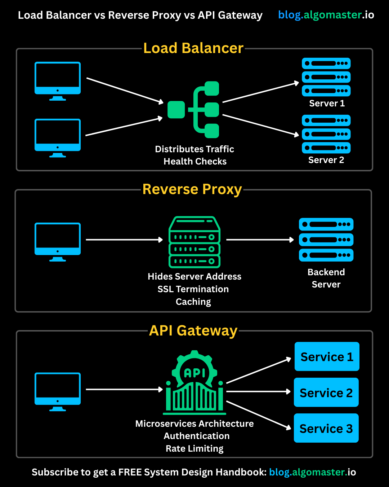

**Source:** [https://twitter.com/i/web/status/1921781985569345995](https://twitter.com/i/web/status/1921781985569345995)
**Original Post Date:** 2025-05-28 04:04:15

# Load Balancer vs. Reverse Proxy vs. API Gateway: Architectural Components Comparison

## Introduction
Modern distributed systems rely on several architectural components to ensure scalability, security, and performance. This article examines three critical components: Load Balancers, Reverse Proxies, and API Gateways. Understanding the unique characteristics, functions, and appropriate use cases of each component is essential for designing robust and efficient web architectures.

## Load Balancer Fundamentals

A Load Balancer acts as a traffic distributor between multiple servers to optimize resource utilization. It intelligently routes client requests based on predefined algorithms, ensuring even distribution across available servers and preventing any single server from becoming overwhelmed.

The load balancer performs continuous health checks on all backend servers, dynamically removing unhealthy instances from the rotation. This proactive approach ensures high availability and reliability of the system.

- Primary purpose: Traffic distribution across multiple servers
- Key feature: Health monitoring and server load optimization

## Reverse Proxy Characteristics

A Reverse Proxy serves as an intermediary between clients and backend servers, providing enhanced security and performance features. It masks the actual backend infrastructure from external clients, acting as a single point of contact.

Through SSL termination and caching capabilities, reverse proxies significantly improve application performance while reducing direct exposure of backend systems to potential threats.

1. Provides security through IP address masking
1. Handles SSL/TLS encryption for encrypted traffic management
1. Implements caching strategies for improved response times

## API Gateway Functionality

The API Gateway serves as a unified entry point for clients interacting with multiple microservices. It handles cross-cutting concerns such as authentication, rate limiting, and routing, simplifying client interactions with complex service architectures.

By managing communication between clients and microservices, the API gateway abstracts the complexity of distributed systems while maintaining security and performance requirements.

- Manages authentication and authorization policies
- Implements rate limiting to prevent service abuse
- Provides centralized routing for microservices

## Key Takeaways

- Load Balancers focus on traffic distribution and server health monitoring across multiple instances.
- Reverse Proxies enhance security, performance through caching, and SSL management while hiding backend details.
- API Gateways orchestrate microservice interactions by providing a unified entry point with security and rate limiting features.

## Conclusion
Understanding the distinct roles of Load Balancers, Reverse Proxies, and API Gateways is crucial for designing efficient web architectures. Each component addresses specific requirements in distributed systems: load balancing ensures resource optimization, reverse proxies enhance security and performance, while API gateways manage complex service interactions.

## External References

- [System Design Handbook](https://blog.algomastermaster.io)

## Media

**Image Description:** The image is an infographic comparing three key components in modern web and application architecture: **Load Balancer**, **Reverse Proxy**, and **API Gateway**. Each component is illustrated with a diagram and a brief description of its primary functions. Below is a detailed breakdown of the image:

---

### **1. Load Balancer**
- **Diagram**:
  - **Client Devices**: Represented by three blue computer monitors on the left.
  - **Load Balancer**: A green box with a branching icon in the center, symbolizing traffic distribution.
  - **Servers**: Two groups of blue server stacks labeled "Server 1" and "Server 2" on the right.
  - **Connections**: Arrows show how client requests are distributed across the servers.

- **Key Features**:
  - **Distributes Traffic**: The load balancer evenly distributes incoming client requests across multiple servers to prevent any single server from becoming overwhelmed.
  - **Health Checks**: The load balancer monitors the health of the servers and ensures that only healthy servers receive traffic.

- **Purpose**: The primary goal is to optimize resource utilization, maximize throughput, and minimize response time.

---

### **2. Reverse Proxy**
- **Diagram**:
  - **Client Devices**: Represented by two blue computer monitors on the left.
  - **Reverse Proxy**: A green box with a server-like icon in the center.
  - **Backend Servers**: A group of blue server stacks labeled "Backend Server" on the right.
  - **Connections**: Arrows show how client requests pass through the reverse proxy to the backend servers.

- **Key Features**:
  - **Hides Server Address**: The reverse proxy acts as an intermediary, hiding the actual IP addresses and locations of the backend servers from clients.
  - **SSL Termination**: The reverse proxy can handle SSL/TLS encryption, decrypting incoming HTTPS requests and forwarding them to the backend servers.
  - **Caching**: The reverse proxy can cache frequently accessed resources, reducing the load on backend servers and improving response times for repeated requests.

- **Purpose**: The reverse proxy enhances security, performance, and scalability by acting as a single point of contact for clients.

---

### **3. API Gateway**
- **Diagram**:
  - **Client Devices**: Represented by two blue computer monitors on the left.
  - **API Gateway**: A green box with a gear and "API" icon in the center.
  - **Microservices**: Three blue boxes labeled "Service 1," "Service 2," and "Service 3" on the right.
  - **Connections**: Arrows show how client requests pass through the API gateway to the respective microservices.

- **Key Features**:
  - **Microservices Architecture**: The API gateway manages communication between clients and multiple microservices, providing a unified entry point.
  - **Authentication**: The API gateway enforces authentication and authorization policies, ensuring that only authorized clients can access specific services.
  - **Rate Limiting**: The API gateway can control the rate of incoming requests to prevent abuse or overload of the microservices.
  - **Routing**: It routes requests to the appropriate microservices based on the API endpoint.

- **Purpose**: The API gateway simplifies the client's interaction with a complex microservices architecture by providing a single point of entry and managing cross-cutting concerns like security and rate limiting.

---

### **Overall Layout and Design**
- The infographic is structured in a vertical layout, with each component (Load Balancer, Reverse Proxy, and API Gateway) presented in its own section.
- Each section includes:
  - A title in bold yellow text.
  - A diagram illustrating the flow of requests.
  - A brief description of the component's key features and purpose.
- The color scheme uses:
  - **Blue**: For client devices and servers/microservices.
  - **Green**: For the central components (Load Balancer, Reverse Proxy, API Gateway).
  - **White text**: For labels and descriptions.

### **Footer**
- The footer includes a call-to-action to subscribe for a free system design handbook, with a link to the website: `blog.algomastermaster.io`.

---

### **Summary**
The image effectively compares the roles and functionalities of Load Balancers, Reverse Proxies, and API Gateways in modern web architectures. Each component is illustrated with a clear diagram and described in terms of its primary technical features and purposes. This visual comparison helps readers understand the distinct roles these components play in enhancing scalability, security, and performance in distributed systems.
