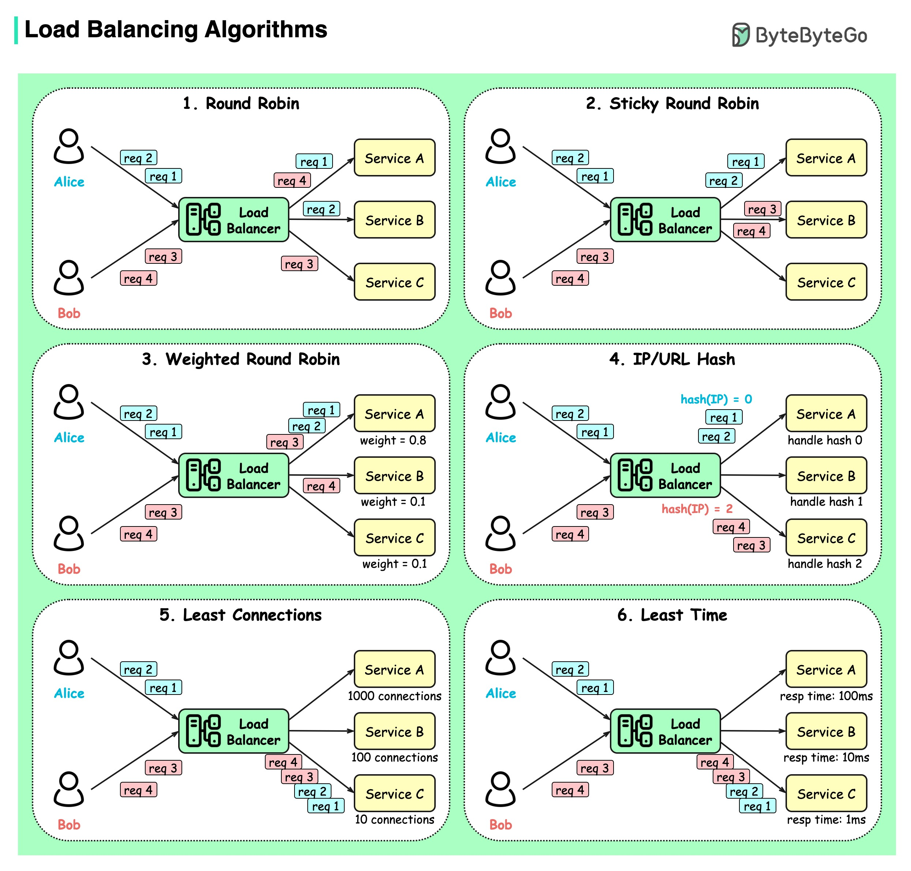

**Source:** [https://twitter.com/i/web/status/1878489954265035149](https://twitter.com/i/web/status/1878489954265035149)
**Original Post Date:** 2025-05-28 04:08:25

# Load Balancing Algorithms: A Comprehensive Guide

## Introduction
In modern distributed systems architecture, effective load balancing is crucial for maintaining high availability and optimal performance. This guide explores six fundamental load balancing algorithms, each designed to address specific challenges in request distribution across multiple services. Understanding these algorithms helps engineers make informed decisions about traffic management, ensuring efficient resource utilization and consistent user experience.

## Round Robin Load Balancing

The Round Robin algorithm distributes incoming requests sequentially to available services in a circular fashion. When the load balancer receives client requests (from Alice and Bob), it processes them one at a time, sending request 1 to Service A, request 2 to Service B, and so on.

This straightforward approach ensures an even distribution of traffic across all services but doesn't account for differences in service capacity or current workload.

> **Note/Tip:** Best suited for environments with uniform service capabilities

> **Note/Tip:** Simple implementation makes it ideal for basic load balancing needs

## Sticky Round Robin

Building on the Round Robin concept, Sticky Round Robin ensures client requests are consistently routed to the same service based on their IP address or session information. For example, all of Alice's requests (req 1, req 2) go to Service A, while Bob's requests route to Service B.

This maintains session consistency across multiple requests from the same user.

> **Note/Tip:** Essential for applications requiring stateful processing

> **Note/Tip:** May lead to uneven load distribution over time

## Weighted Round Robin

This algorithm assigns weights (e.g., 0.8, 0.1, 0.1) to services based on their capacity or performance characteristics. The load balancer distributes requests proportionally according to these weights.

For instance, a service with weight 0.8 receives approximately 80% of incoming traffic.

> **Note/Tip:** Provides flexible resource utilization

> **Note/Tip:** Requires careful weight configuration based on service capabilities

## IP/URL Hash Algorithm

This deterministic approach uses a hash function of the client's IP address or requested URL to consistently route requests to specific services. If Alice's IP hash maps to 0, her all requests go to Service A.

Ensures predictable request routing for consistent session handling.

> **Note/Tip:** Guarantees consistency across service nodes

> **Note/Tip:** Can lead to uneven load distribution with certain hash patterns

## Least Connections Algorithm

This dynamic algorithm directs new requests to the service with the fewest active connections. If Service C has 10 connections while others have hundreds, it receives the next request.

Ensures efficient resource utilization by balancing current load across services.

> **Note/Tip:** Adapts well to varying traffic patterns

> **Note/Tip:** May not account for processing time differences

## Least Time Algorithm

Requests are routed to the service with the lowest current response time. In a scenario where Service C processes requests in 1ms while others take longer, it receives priority.

Focuses on minimizing user-perceived latency.

> **Note/Tip:** Optimizes for quick response times

> **Note/Tip:** Requires real-time monitoring of service performance

## Key Takeaways

- Choose Round Robin when services have similar capabilities and simple load distribution is sufficient.
- Implement Sticky Round Robin or IP/URL Hash when session consistency is crucial.
- Use Weighted Round Robin for environments with diverse service capacities.
- Consider Least Connections for real-time load balancing across variable workloads.
- Deploy Least Time when minimizing user response time is the primary goal.

## Conclusion
Selecting the appropriate load balancing algorithm depends on specific system requirements, including traffic patterns, session state needs, and performance objectives. Understanding these algorithms enables architects to design robust, scalable systems that efficiently handle distributed workloads.

## External References

- [AWS Elastic Load Balancing Documentation](https://docs.aws.amazon.com/elasticloadbalancing/latest/)
- [Kubernetes Service Load Balancing](https://kubernetes.io/docs/concepts/services-networking/service/#load-balancer)

## Media

**Image Description:** The image is a detailed infographic that explains six different load balancing algorithms used in distributed systems. The main subject of the image is the **Load Balancer**, which is depicted as a central component that distributes incoming requests across multiple services (Service A, Service B, and Service C). Each algorithm is illustrated with a diagram showing how requests are handled and distributed. Below is a detailed breakdown of each section:

---

### **1. Round Robin**
- **Description**: This algorithm distributes incoming requests to services in a sequential, circular manner.
- **Diagram**:
  - The Load Balancer receives requests from users (Alice and Bob).
  - Requests are distributed in a cyclic order: `req 1` to Service A, `req 2` to Service B, `req 3` to Service C, and so on.
  - Each service processes one request in sequence before the next request is sent to the next service in the cycle.
- **Key Points**:
  - Simple and fair distribution.
  - No consideration of service capacity or load.

---

### **2. Sticky Round Robin**
- **Description**: This algorithm is an extension of Round Robin, where the Load Balancer ensures that requests from the same client (based on IP or session) are consistently sent to the same service.
- **Diagram**:
  - Alice's requests (`req 1`, `req 2`, etc.) are consistently sent to Service A.
  - Bob's requests (`req 3`, `req 4`, etc.) are consistently sent to Service B.
  - The Load Balancer uses a "sticky" mechanism to maintain consistency for each client.
- **Key Points**:
  - Maintains session consistency for clients.
  - Useful for applications requiring stateful services.

---

### **3. Weighted Round Robin**
- **Description**: This algorithm assigns weights to each service, allowing the Load Balancer to distribute requests based on the relative capacity or performance of each service.
- **Diagram**:
  - Service A has a weight of `0.8`.
  - Service B has a weight of `0.1`.
  - Service C has a weight of `0.1`.
  - Requests are distributed such that Service A receives the majority of the load (80%), while Services B and C share the remaining 20%.
- **Key Points**:
  - Allows for prioritization based on service capacity or performance.
  - More flexible than standard Round Robin.

---

### **4. IP/URL Hash**
- **Description**: This algorithm uses a hash function on the client's IP address or URL to determine which service should handle the request. The hash ensures that requests from the same client are consistently sent to the same service.
- **Diagram**:
  - Alice's IP hash is `hash(IP) = 0`, so all her requests (`req 1`, `req 2`) are sent to Service A.
  - Bob's IP hash is `hash(IP) = 2`, so all his requests (`req 3`, `req 4`) are sent to Service C.
- **Key Points**:
  - Ensures consistent routing for the same client.
  - Useful for applications requiring session persistence.

---

### **5. Least Connections**
- **Description**: This algorithm directs incoming requests to the service with the fewest active connections at the time of request.
- **Diagram**:
  - Service A has `1000 connections`.
  - Service B has `100 connections`.
  - Service C has `10 connections`.
  - The Load Balancer sends new requests to Service C, as it has the fewest active connections.
- **Key Points**:
  - Dynamically balances load based on current connection counts.
  - Ensures that no single service is overwhelmed.

---

### **6. Least Time**
- **Description**: This algorithm directs incoming requests to the service with the lowest response time, ensuring that requests are handled as quickly as possible.
- **Diagram**:
  - Service A has a response time of `100ms`.
  - Service B has a response time of `10ms`.
  - Service C has a response time of `1ms`.
  - The Load Balancer sends new requests to Service C, as it has the lowest response time.
- **Key Points**:
  - Prioritizes services with faster response times.
  - Ensures optimal performance for users.

---

### **Overall Layout and Design**
- The infographic is divided into six sections, each representing a different load balancing algorithm.
- Each section includes:
  - A title describing the algorithm.
  - A diagram illustrating how the algorithm works.
  - Labels for users (Alice and Bob), requests (`req 1`, `req 2`, etc.), and services (Service A, Service B, Service C).
  - The Load Balancer is consistently depicted as a central component distributing requests.
- The color scheme uses light green for the Load Balancer and yellow for services, making the flow easy to follow.

---

### **Conclusion**
The image provides a clear and concise explanation of six common load balancing algorithms, each with its own strengths and use cases. The visual representation helps in understanding how requests are distributed and managed in distributed systems, making it an effective educational tool for developers and system architects.
