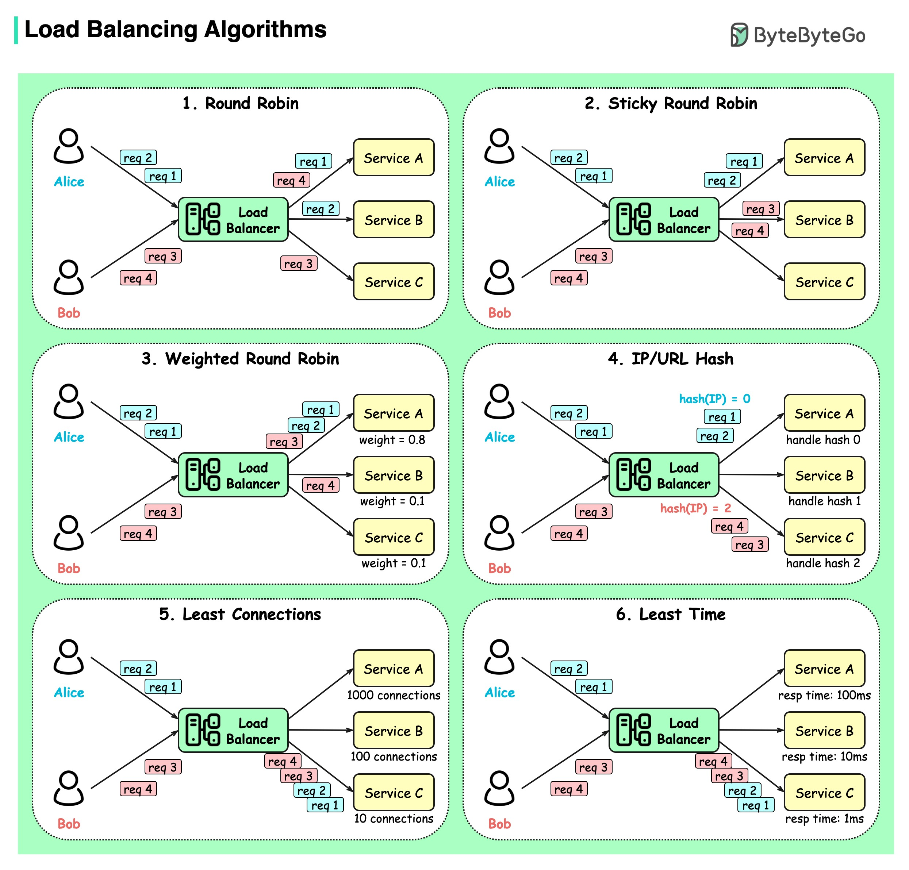

Load balancing algorithms are crucial for distributing incoming traffic across multiple servers to ensure efficient resource utilization, high availability, and scalability. This entry provides an in-depth look at six key load balancing algorithms, including their features, characteristics, and use cases.

#### Technical Content
Load balancing algorithms play a vital role in modern system design, particularly in cloud computing, content delivery networks (CDNs), and large-scale web applications. The following sections delve into the details of each algorithm:

##### 1. Round Robin Algorithm
The Round Robin algorithm directs incoming requests to the next available server in a rotation. This approach ensures that each server receives an equal number of requests, promoting fairness and preventing any single server from becoming overwhelmed.

*Example:*

| Request Number | Server Assignment |
| --- | --- |
| req 1 | Server A |
| req 2 | Server B |
| req 3 | Server C |
| req 4 | Server A |

##### 2. Sticky Round Robin Algorithm
The Sticky Round Robin algorithm is a variation of the Round Robin approach, where requests from the same client are consistently routed to the same server. This ensures session persistence and is particularly useful for applications that require user authentication or shopping cart functionality.

*Example:*

| Request Number | Client IP | Server Assignment |
| --- | --- | --- |
| req 1 | 192.168.1.100 | Server A |
| req 2 | 192.168.1.101 | Server B |
| req 3 | 192.168.1.100 | Server A |

##### 3. Weighted Round Robin Algorithm
The Weighted Round Robin algorithm assigns weights to each server based on their capacity or performance. Servers with higher weights receive a greater number of requests, allowing for more efficient resource utilization.

*Example:*

| Server | Weight |
| --- | --- |
| Server A | 2 |
| Server B | 1 |
| Server C | 3 |

In this example, Server C would receive three times the number of requests as Server B.

##### 4. IP/URL Hash Algorithm
The IP/URL Hash algorithm maps each incoming request to a specific server based on its IP address or URL. This approach ensures that clients are consistently directed to the same server, promoting session persistence and reducing the need for redundant data storage.

*Example:*

| Client IP | Server Assignment |
| --- | --- |
| 192.168.1.100 | Server A (based on hash of IP address) |

##### 5. Least Connections Algorithm
The Least Connections algorithm directs requests to servers with the fewest active connections, ensuring efficient resource utilization and preventing server overload.

*Example:*

| Server | Active Connections |
| --- | --- |
| Server A | 10 |
| Server B | 5 |
| Server C | 20 |

In this example, incoming requests would be directed to Server B, as it has the fewest active connections.

##### 6. Least Time Algorithm
The Least Time algorithm prioritizes servers based on their response times, directing requests to the fastest available server. This approach ensures that clients experience optimal performance and minimal latency.

*Example:*

| Server | Response Time |
| --- | --- |
| Server A | 100ms |
| Server B | 50ms |
| Server C | 200ms |

In this example, incoming requests would be directed to Server B, as it has the fastest response time.

#### Key Takeaways and Best Practices
When selecting a load balancing algorithm, consider the following key takeaways and best practices:

*   **Understand your application requirements**: Different applications have unique needs, such as session persistence or high availability. Choose an algorithm that aligns with your application's specific requirements.
*   **Monitor server performance**: Continuously monitor server performance and adjust the algorithm as needed to ensure optimal resource utilization.
*   **Implement a hybrid approach**: Consider combining multiple algorithms to create a hybrid approach that leverages the strengths of each.

#### References
For further information on load balancing algorithms and their implementation, refer to the following resources:

*   [NGINX Load Balancing](https://www.nginx.com/resources/glossary/load-balancing/)
*   [HAProxy Load Balancing](https://www.haproxy.org/)
*   [AWS Elastic Load Balancer](https://aws.amazon.com/elasticloadbalancer/)
## Source

- Original Tweet: [https://twitter.com/i/web/status/1878489954265035149](https://twitter.com/i/web/status/1878489954265035149)
- Date: 2025-02-24 12:17:15

## Media

### Media 1

**Description:** The infographic showcases a comprehensive collection of six Load Balancing Algorithms, each presented in a distinct section with its own unique features and characteristics.

**Algorithm Overview:**

*   **Round Robin:** Each incoming request is directed to the next available server in the rotation.
*   **Sticky Round Robin:** Requests from the same client are consistently routed to the same server.
*   **Weighted Round Robin:** Servers with higher weights receive a greater number of requests than those with lower weights.
*   **IP/URL Hash:** Each incoming request is mapped to a specific server based on its IP address or URL.
*   **Least Connections:** Requests are directed to servers with the fewest active connections, ensuring efficient resource utilization.
*   **Least Time:** Servers are prioritized based on their response times, directing requests to the fastest available server.

**Key Features:**

*   Each algorithm is accompanied by a flowchart illustrating its operation and highlighting key components such as load balancers, servers, and clients.
*   The flowcharts feature simple stick figures representing individuals, with each figure labeled with a request number (e.g., "req 1") to facilitate understanding of the algorithm's logic.

**Visual Representation:**

The infographic employs a clean design aesthetic, utilizing white backgrounds with green borders surrounding each section. This layout effectively organizes and presents the information, making it easy for viewers to follow along and comprehend the algorithms' operations.

*Last updated: 2025-02-24 12:17:15*